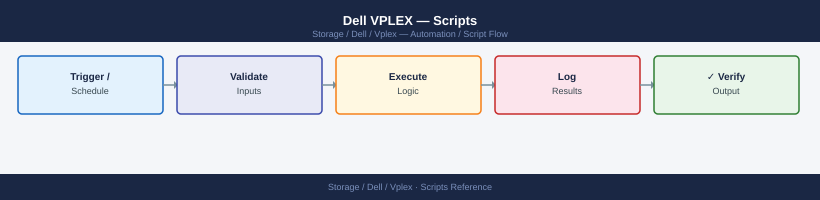
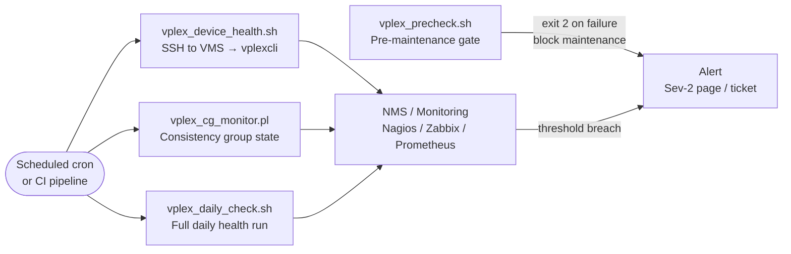

---
tags:
  - dell
  - operations
---
# Dell VPLEX — Scripts

<div class="kb-summary">
Dell VPLEX automation scripts: `vplexcli` and Python REST API examples for distributed device status, cluster health polling, and migration task management.

*Applies to: VPLEX*
</div>




---

## Before you begin

- **Access:** Storage admin credentials (cluster admin or equivalent)
- **Timing:** safe to run during business hours unless a step is marked ⚠ (causes interruption)
- **Dependencies:** no active upgrades or migrations on the same infrastructure
- **Logging:** capture command output — paste into the change record on completion

---

## Distributed Device Health Check

SSH to a VPLEX management server and runs vplexcli commands to check cluster health indications, distributed device health, and director hardware state. Reports any health-state value that is not "ok" and exits non-zero if issues are found.

```bash
#!/bin/bash
# vplex_device_health.sh — Distributed device and director health check for Dell VPLEX
# Usage: VPLEX_HOST=vplex-mgmt.example.com VPLEX_USER=service ./vplex_device_health.sh

set -euo pipefail

VPLEX_HOST="${VPLEX_HOST:-}"
VPLEX_USER="${VPLEX_USER:-service}"
ISSUES=0

if [[ -z "$VPLEX_HOST" ]]; then
  echo "ERROR: VPLEX_HOST is not set." >&2
  exit 1
fi

vplex_cmd() {
  local cmd="$1"
  ssh -o StrictHostKeyChecking=no -o BatchMode=yes \
      "${VPLEX_USER}@${VPLEX_HOST}" "vplexcli -q -e '${cmd}'" 2>&1
}

section() {
  echo ""
  echo "========================================"
  echo "  $1"
  echo "========================================"
}

echo "########################################"
echo "  VPLEX Health Check"
echo "  Host : $VPLEX_HOST"
echo "  Date : $(date '+%Y-%m-%d %H:%M:%S')"
echo "########################################"

section "CLUSTER HEALTH INDICATIONS"
CLUSTER_HEALTH=$(vplex_cmd "ll /clusters/*/health-indications/")
echo "$CLUSTER_HEALTH"
if echo "$CLUSTER_HEALTH" | grep -qi "health-state.*[^ok]"; then
  echo ">>> ISSUE: Non-OK cluster health indication detected."
  ISSUES=$((ISSUES + 1))
fi

section "DISTRIBUTED DEVICE HEALTH"
DD_HEALTH=$(vplex_cmd "ll /distributed-storage/distributed-devices/*/health-indications/")
echo "$DD_HEALTH"
BAD_DEVICES=$(echo "$DD_HEALTH" | grep -i "health-state" | grep -iv "value:.*ok" || true)
if [[ -n "$BAD_DEVICES" ]]; then
  echo ">>> ISSUE: One or more distributed devices are NOT in 'ok' health state:"
  echo "$BAD_DEVICES"
  ISSUES=$((ISSUES + 1))
fi

section "DIRECTOR HARDWARE STATUS"
DIR_HEALTH=$(vplex_cmd "ll /engines/*/directors/*/hardware/")
echo "$DIR_HEALTH"
BAD_DIRS=$(echo "$DIR_HEALTH" | grep -i "health-state" | grep -iv "value:.*ok" || true)
if [[ -n "$BAD_DIRS" ]]; then
  echo ">>> ISSUE: One or more directors have non-OK hardware state:"
  echo "$BAD_DIRS"
  ISSUES=$((ISSUES + 1))
fi

echo ""
echo "========================================"
echo "  SUMMARY"
echo "========================================"
if [[ "$ISSUES" -gt 0 ]]; then
  echo "STATUS: DEGRADED — $ISSUES issue category/categories found. Review output above."
  exit 1
else
  echo "STATUS: OK — All VPLEX health checks passed."
  exit 0
fi
```

**Usage:**
```text
VPLEX_HOST=192.168.1.20 VPLEX_USER=service ./vplex_device_health.sh
```

---

## Metro Consistency Group Monitor

SSH to a VPLEX Metro system and queries consistency group operational status. Parses for any CG that is not in `in-sync` state and emits a Nagios-compatible PASS/WARNING/CRITICAL result. Alerts on split-brain or out-of-sync state.

```perl
#!/usr/bin/env perl
# vplex_cg_monitor.pl — Metro consistency group monitor for Dell VPLEX
# Usage: VPLEX_HOST=vplex-mgmt.example.com VPLEX_USER=service ./vplex_cg_monitor.pl

use strict;
use warnings;

my $host   = $ENV{VPLEX_HOST}  or die "ERROR: VPLEX_HOST not set\n";
my $user   = $ENV{VPLEX_USER} || 'service';

my %crit_states = map { lc($_) => 1 } qw(
    split-brain split_brain out-of-sync out_of_sync degraded faulted error
);

my %warn_states = map { lc($_) => 1 } qw(
    transitioning resyncing partial unknown
);

my $cmd    = qq{ssh -o StrictHostKeyChecking=no -o BatchMode=yes ${user}\@${host} }
           . q{"vplexcli -q -e 'll /distributed-storage/consistency-groups/'" 2>&1};
my $output = qx{$cmd};
if ($? != 0) {
    print "UNKNOWN: SSH/vplexcli failed for $host\n$output\n";
    exit 3;
}

my @cgs;
my $worst = 0;
my %current;
for my $line (split /\n/, $output) {
    $line =~ s/^\s+|\s+$//g;
    next unless $line;
    if ($line =~ /^Name:\s+(.+)$/i) {
        push @cgs, {%current} if %current;
        %current = (name => $1, status => 'unknown', visibility => 'unknown');
        next;
    }
    if ($line =~ /operational-status:\s*(.+)$/i) { $current{status} = lc($1); next; }
    if ($line =~ /visibility:\s*(.+)$/i) { $current{visibility} = lc($1); next; }
}
push @cgs, {%current} if %current;

if (!@cgs) { print "UNKNOWN: No consistency groups found in output\n"; exit 3; }

printf "%-30s  %-20s  %-15s  %s\n", 'CG NAME', 'STATUS', 'VISIBILITY', 'RESULT';
printf "%s\n", '-' x 80;

for my $cg (@cgs) {
    my $status = lc($cg->{status} // 'unknown');
    my $result = 'OK';
    if ($crit_states{$status}) { $result = 'CRITICAL'; $worst = 2 if $worst < 2; }
    elsif ($warn_states{$status} || $status ne 'in-sync') { $result = 'WARNING'; $worst = 1 if $worst < 1; }
    printf "%-30s  %-20s  %-15s  %s\n", $cg->{name}, $cg->{status}, $cg->{visibility}, $result;
}

print "\n";
if ($worst == 2) { print "CRITICAL: One or more consistency groups are in a split-brain or out-of-sync state.\n"; exit 2; }
elsif ($worst == 1) { print "WARNING: One or more consistency groups require attention.\n"; exit 1; }
else { print "OK: All consistency groups are in-sync.\n"; exit 0; }
```

**Usage:**
```text
VPLEX_HOST=192.168.1.20 VPLEX_USER=service perl vplex_cg_monitor.pl
```

---

## Daily Check Script

SSHes to the VPLEX Management Server and runs health-check, lists clusters and engines, checks consistency group states, and prints PASS/FAIL for each check.

```bash
#!/bin/bash
# vplex_daily_check.sh — Daily operations check for Dell VPLEX
# Usage: SSH_USER=service VPLEX_HOST=vplex-mgmt.example.com ./vplex_daily_check.sh

set -uo pipefail

SSH_USER="${SSH_USER:-service}"
VPLEX_HOST="${VPLEX_HOST:-}"

if [[ -z "$VPLEX_HOST" ]]; then
  echo "ERROR: VPLEX_HOST is not set." >&2
  exit 1
fi

PASS=0
FAIL=0

vplex() {
  ssh -o BatchMode=yes -o ConnectTimeout=10 "$SSH_USER@$VPLEX_HOST" "vplexcli -q -e \"$1\""
}

check() {
  local label="$1"
  local result="$2"
  if [[ "$result" -eq 0 ]]; then
    printf "  %-45s  PASS\n" "$label"
    PASS=$((PASS + 1))
  else
    printf "  %-45s  FAIL\n" "$label"
    FAIL=$((FAIL + 1))
  fi
}

echo "========================================"
echo "  VPLEX Daily Check — $VPLEX_HOST"
echo "  $(date '+%Y-%m-%d %H:%M:%S')"
echo "========================================"

HC=$(vplex "health-check" 2>&1)
echo "$HC"
echo "$HC" | grep -qi "error\|failed\|fault" && HC_RC=1 || HC_RC=0
check "health-check" "$HC_RC"

CL=$(vplex "ls /clusters" 2>&1)
echo "$CL"
[[ -n "$CL" ]] && CL_RC=0 || CL_RC=1
check "ls /clusters" "$CL_RC"

EN=$(vplex "ls /engines" 2>&1)
echo "$EN"
[[ -n "$EN" ]] && EN_RC=0 || EN_RC=1
check "ls /engines" "$EN_RC"

CG=$(vplex "ls /consistency-groups" 2>&1)
echo "$CG"
echo "$CG" | grep -qi "out-of-sync\|split-brain\|degraded\|faulted" && CG_RC=1 || CG_RC=0
check "consistency-groups (no degraded)" "$CG_RC"

echo "========================================"
echo "  PASS: $PASS   FAIL: $FAIL"
[[ "$FAIL" -eq 0 ]] && echo "  STATUS: OK" && exit 0 || echo "  STATUS: DEGRADED" && exit 1
```

---

## Pre-Change Validation Script

Confirms VPLEX health-check returns OK, all engines are running, no consistency groups are degraded, and all directors are online before a maintenance window — exits 2 on any failure.

```bash
#!/bin/bash
# vplex_precheck.sh — Pre-change validation for Dell VPLEX
# Usage: SSH_USER=service VPLEX_HOST=vplex-mgmt.example.com ./vplex_precheck.sh

set -uo pipefail

SSH_USER="${SSH_USER:-service}"
VPLEX_HOST="${VPLEX_HOST:-}"

if [[ -z "$VPLEX_HOST" ]]; then echo "ERROR: VPLEX_HOST is not set." >&2; exit 1; fi

ISSUES=0

vplex() {
  ssh -o BatchMode=yes -o ConnectTimeout=10 "$SSH_USER@$VPLEX_HOST" "vplexcli -q -e \"$1\""
}

fail() { echo "  FAIL: $1"; ISSUES=$((ISSUES + 1)); }
pass() { echo "  PASS: $1"; }

echo "========================================"
echo "  VPLEX Pre-Change Check — $VPLEX_HOST"
echo "  $(date '+%Y-%m-%d %H:%M:%S')"
echo "========================================"

HC=$(vplex "health-check" 2>&1)
echo "$HC" | grep -qi "error\|failed\|fault" && fail "health-check reports errors" || pass "health-check clean"

EN=$(vplex "ls /engines" 2>&1)
echo "$EN" | grep -qi "fault\|error\|down" && fail "engine(s) not running" || pass "all engines running"

CG=$(vplex "ls /consistency-groups" 2>&1)
echo "$CG" | grep -qi "out-of-sync\|split-brain\|degraded\|faulted" \
  && fail "degraded consistency group(s) found" \
  || pass "all consistency groups healthy"

DIR=$(vplex "ls /directors" 2>&1)
echo "$DIR" | grep -qi "offline\|fault\|error\|down" \
  && fail "director(s) not online" \
  || pass "all directors online"

echo "========================================"
if [[ "$ISSUES" -gt 0 ]]; then
  echo "  PRE-CHECK FAILED — $ISSUES issue(s). Do not proceed."
  exit 2
fi
echo "  PRE-CHECK PASSED — Safe to proceed."
exit 0
```

---

## Verify

- Confirm the operation completed without errors in the log or management UI
- Verify the expected state change is visible (service running, object created, config applied)
- Document the outcome in the change record

---

## See also

- [Vplex — Procedures](../procedures/)
- [Vplex — CLI Reference](../cli-reference/)
- [Vplex — Health Checks](../health-checks/)
