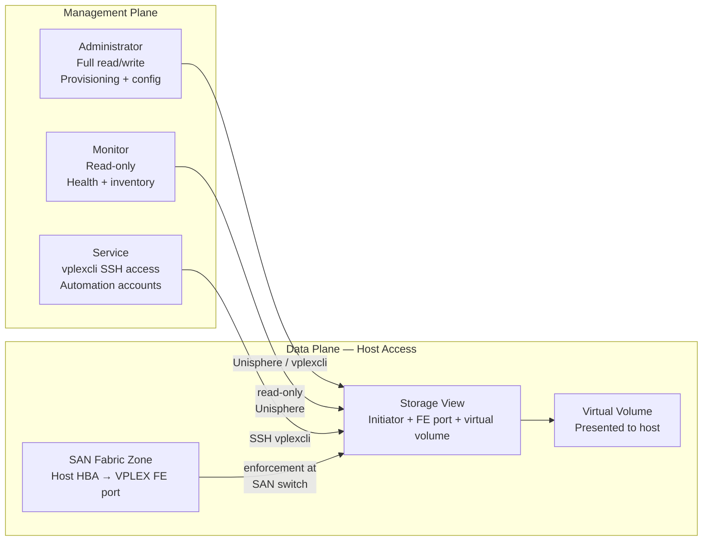
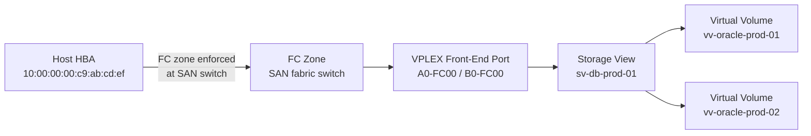

# Dell VPLEX — Access Control


<div class="kb-summary">
VPLEX access control operates at two layers: management plane access (who can change configuration) and data plane access (which hosts can access which volumes).
</div>
```
┌───────────────────────────────────── Dell VPLEX — Access Control ─────────────────────────────────────┐
│                                                                                                       │
│   ┌───────────────────────────────────────────────────────────────────────────────────────────────┐   │
│   │          VPLEX access control: RBAC roles, least-privilege, and access audit logging          │   │
│   │        Roles: admin (full), operator (read/modify), read-only (view); map to AD groups        │   │
│   │       Authentication: local accounts, LDAP/AD integration, and MFA for privileged users       │   │
│   │          Audit: log all admin actions; review access logs monthly; rotate credentials         │   │
│   └───────────────────────────────────────────────────────────────────────────────────────────────┘   │
│                                                                                                       │
│    Identify user → assign role → enforce MFA → audit → review quarterly                               │
│                                                                                                       │
│                  ▼                                ▼                                ▼                  │
│                                                                                                       │
│   ┌─────────────────────────────┐  ┌─────────────────────────────┐  ┌─────────────────────────────┐   │
│   │            Layer            │  │          Component          │  │            Notes            │   │
│   │        Virtualisation       │  │         Backend LUNs        │  │      Abstracted to VVs      │   │
│   │            Metro            │  │         Sync stretch        │  │        <5ms RTT sites       │   │
│   │             Geo             │  │      Async replication      │  │         Any distance        │   │
│   │          Clustering         │  │        Active-active        │  │       Shared namespace      │   │
│   │            Quorum           │  │          Witness VM         │  │      Split-brain guard      │   │
│   └─────────────────────────────┘  └─────────────────────────────┘  └─────────────────────────────┘   │
│                                                                                                       │
│                          ▼                                                 ▼                          │
│                                                                                                       │
│   ┌───────────────────────────────────────────────────────────────────────────────────────────────┐   │
│   │       Role       │   Permissions    │       Scope       │       Auth       │   Review cycle   │   │
│   │      Admin       │    Full CRUD     │       Global      │   MFA required   │     Monthly      │   │
│   │     Operator     │   Read/modify    │      Assigned     │   MFA required   │    Quarterly     │   │
│   │    Read-only     │    View only     │      Assigned     │     Password     │    Quarterly     │   │
│   │   Service acct   │     API only     │    Specific API   │    Token/cert    │      Annual      │   │
│   └───────────────────────────────────────────────────────────────────────────────────────────────┘   │
│                                                                                                       │
│    Physical: VPLEX VS2/VS6 appliance · FC fabric · backend arrays · WAN link (Metro/Geo)              │
│                                                                                                       │
│    Key terms:                                                                                         │
│                                                                                                       │
│    VPLEX              = Dell storage federation; aggregates arrays into virtual volumes across vendors│
│    Virtual volume     = VPLEX-abstracted LUN presented to hosts; backend is array LUNs                │
│    VPLEX Metro        = synchronous active-active stretch cluster; same VV served from two sites      │
│    VPLEX Geo          = asynchronous active-active replication; higher RPO, no distance constraint    │
│    Distributed VV     = virtual volume spanning two sites for Metro active-active host access         │
│    Witness            = third-site quorum arbiter for Metro; prevents split-brain island scenarios    │
│    WAN-COM            = WAN communication module in VPLEX Geo; manages inter-site replication traffic │
│    Management Server  = embedded Linux VM in VPLEX engine; serves web UI and vplex CLI                │
│    Consistency group  = set of virtual volumes that failover together maintaining write order         │
│    Backend volume     = LUN from underlying array presented to VPLEX engine for virtualisation        │
│    Local device       = RAID device or extent of backend volumes on a single VPLEX cluster            │
│    Cluster            = single VPLEX installation; Metro topology requires exactly two clusters       │
│                                                                                                       │
└───────────────────────────────────────────────────────────────────────────────────────────────────────┘
```




## Management Plane Roles

VPLEX management roles govern what operations each user can perform through Unisphere for VPLEX and `vplexcli`.

| Role | Access Level | Typical Assignee |
|---|---|---|
| Administrator | Full read/write access to all VPLEX configuration, provisioning, and lifecycle operations | Storage administrators |
| Monitor | Read-only access to cluster health, volumes, storage views, and configuration | Operations teams, NOC, monitoring |
| Service | SSH-based `vplexcli` access for CLI management; used for automation and scripted operations | Automation service accounts |

**Least-privilege principle**: assign Monitor role to any account that does not need to make configuration changes. Reserve Administrator role for accounts that actively provision or modify VPLEX objects.

### Role Assignment in Unisphere

1. Log in to Unisphere as an Administrator.
2. Navigate to **Settings → Users and Roles**.
3. Create a new local user or map an LDAP group to a role.
4. Verify the assigned role by logging in as the new account and confirming expected access.

```bash
# From vplexcli, list management users (if supported by the GeoSynchrony version)
vplexcli -q -e "ls /management/accounts"
vplexcli -q -e "ll /management/accounts/<username>/"
```

## Data Plane Access Control — Storage Views

Host access to VPLEX virtual volumes is exclusively controlled via storage views. A host can only see volumes that are:

1. Present in a storage view the host's HBA WWN is registered in, **and**
2. Presented through a VPLEX front-end port that is also in that storage view, **and**
3. Zoned (at the SAN fabric level) between the host HBA and the VPLEX front-end port.

### Storage View Access Model

```text
Host HBA (WWN)
    → FC Zone (SAN fabric)
        → VPLEX Front-End Port
            → Storage View
                → Virtual Volume(s) presented to this host
```



All three layers must be aligned for a host to access a volume. Missing any layer results in the host not seeing the volume.

### Creating a Storage View (Step-by-Step)

```bash
# Step 1: Confirm the host HBA WWN
# (Obtain from host: cat /sys/class/fc_host/host*/port_name  or  systool -c fc_host -v)

# Step 2: Register the host initiator port with VPLEX
vplexcli -q -e "initiator-port register \
  --cluster /clusters/cluster-1 \
  --port-wwn 10:00:00:00:c9:ab:cd:ef \
  --name db_prod_01_hba0"

# Step 3: Create the storage view
vplexcli -q -e "storage-view create \
  --name sv_db_prod_01 \
  --cluster /clusters/cluster-1"

# Step 4: Add VPLEX front-end ports to the view
# Identify available front-end ports:
vplexcli -q -e "ls /clusters/cluster-1/exports/ports"

vplexcli -q -e "storage-view add-ports \
  --storage-view /clusters/cluster-1/exports/storage-views/sv_db_prod_01 \
  --ports /clusters/cluster-1/exports/ports/A0-FC00,/clusters/cluster-1/exports/ports/B0-FC00"

# Step 5: Add the host initiator port to the view
vplexcli -q -e "storage-view add-initiator-ports \
  --storage-view /clusters/cluster-1/exports/storage-views/sv_db_prod_01 \
  --initiator-ports /clusters/cluster-1/exports/initiator-ports/db_prod_01_hba0"

# Step 6: Add virtual volumes to the view
vplexcli -q -e "storage-view add-virtual-volumes \
  --storage-view /clusters/cluster-1/exports/storage-views/sv_db_prod_01 \
  --virtual-volumes /virtual-volumes/vv_oracle_prod_01,/virtual-volumes/vv_oracle_prod_02"

# Verify the completed storage view
vplexcli -q -e "ll /clusters/cluster-1/exports/storage-views/sv_db_prod_01/"
```

### Storage View Design Principles

| Principle | Detail |
|---|---|
| One storage view per host | Create individual storage views per host rather than shared views; this prevents one host from accessing another's volumes |
| Minimum volume membership | Only include volumes that the host actually needs; do not add spare or shared volumes speculatively |
| Port balance | Assign front-end ports from both directors in the pair to each storage view; ensures path redundancy if one director fails |
| Document immediately | Record storage view name, initiator WWNs, front-end ports, and virtual volumes in the CMDB after every change |
| Review on host decommission | Remove the host's storage view and unregister its initiators when the host is decommissioned; orphaned initiators consume VPLEX resources |

### Storage View Audit and Cleanup

```bash
# List all storage views on all clusters
vplexcli -q -e "ll /clusters/*/exports/storage-views/"

# List all registered initiator ports (check for orphaned/unrecognised WWNs)
vplexcli -q -e "ls /clusters/cluster-1/exports/initiator-ports"
vplexcli -q -e "ll /clusters/cluster-1/exports/initiator-ports/<initiator_name>/"

# Unregister an orphaned initiator port
vplexcli -q -e "initiator-port unregister \
  --cluster /clusters/cluster-1 \
  --initiator-port /clusters/cluster-1/exports/initiator-ports/<initiator_name>"

# Remove a virtual volume from a storage view (before decommissioning the volume)
vplexcli -q -e "storage-view remove-virtual-volumes \
  --storage-view /clusters/cluster-1/exports/storage-views/sv_db_prod_01 \
  --virtual-volumes /virtual-volumes/vv_oracle_prod_01"

# Destroy a storage view when a host is decommissioned
vplexcli -q -e "storage-view destroy \
  --storage-view /clusters/cluster-1/exports/storage-views/sv_db_prod_01 --force"
```

**Quarterly review task**: list all storage views and cross-reference initiator WWNs against the CMDB. Remove any views for decommissioned hosts and unregister their initiators.

## SAN Fabric Zoning

SAN fabric zoning is the enforcement layer at the fibre channel switch level, separate from VPLEX storage views. Both layers must be correctly configured for host-to-volume access.

### Zoning Design Rules

| Rule | Rationale |
|---|---|
| Single-initiator zoning | Zone each host HBA to target ports individually; prevents one host's HBA from seeing another host's target ports |
| Zone hosts to VPLEX front-end ports only | Hosts must never be zoned directly to back-end array ports; all host access must go through VPLEX |
| Zone VPLEX back-end ports to array ports separately | Back-end zones (VPLEX → array) should be entirely separate from front-end zones (host → VPLEX) |
| Dual-fabric redundancy | Each host HBA should be zoned on a separate fabric to a separate VPLEX director for full redundancy |
| Do not over-zone | Only include the VPLEX front-end ports relevant to the host's storage view; no catch-all zones |

### Verifying Zoning

```bash
# On the SAN switch (Brocade example): show active zone configuration
zoneshow --active

# On the SAN switch: show zones containing a specific WWN
zoneshow --name <zone_name>

# On a Linux host: verify visible VPLEX paths
multipath -ll

# On a Linux host (Device Mapper): check path count and status
multipathd show paths

# On VMware ESXi: list storage adapters and paths
esxcli storage nmp path list -d <naa_id>

# On a host using EMC PowerPath: list all paths
powermt display dev=all
```

## Privileged Access Management

For production environments handling sensitive workloads:

| Control | Implementation |
|---|---|
| PAM vault for VMS credentials | Store the `service` account credentials in a PAM vault (e.g., CyberArk, HashiCorp Vault); require checkout before use |
| Just-in-time access | Grant elevated VMS access only during active maintenance windows; revoke automatically after the window closes |
| Session recording | Record interactive vplexcli sessions using a session recording proxy or PAM session recording capability |
| Dual approval for destructive operations | Require a second administrator to approve storage-view deletions or virtual-volume destruction in production |
| Change management integration | Require a change record number before granting VMS access for non-routine operations |
