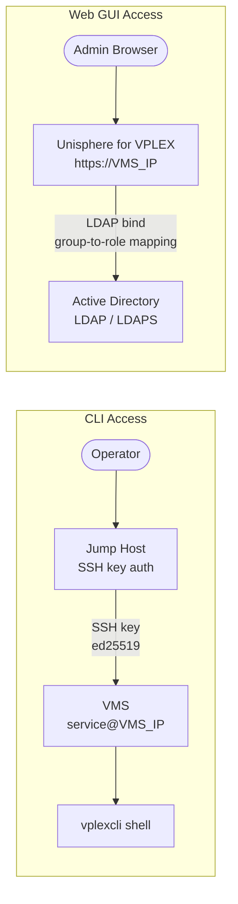

---
tags:
  - dell
  - security
---
# Dell VPLEX — Authentication


<div class="kb-summary">
Authentication for VPLEX management is split across two interfaces: SSH-based `vplexcli` access (local VMS accounts only) and the Unisphere for VPLEX web GUI (local accounts or LDAP/AD-integrated accounts).
</div>
```text
┌───────────────────────────────────── Dell VPLEX — Authentication ─────────────────────────────────────┐
│                                                                                                       │
│   ┌───────────────────────────────────────────────────────────────────────────────────────────────┐   │
│   │          VPLEX authentication: local accounts, LDAP/AD, RADIUS, and SAML SSO options          │   │
│   │        MFA: time-based OTP or hardware token required for all privileged admin accounts       │   │
│   │         Service accounts: dedicated accounts for automation; API tokens/keys preferred        │   │
│   │       Session: idle timeout enforced; concurrent session limits for admin role accounts       │   │
│   └───────────────────────────────────────────────────────────────────────────────────────────────┘   │
│                                                                                                       │
│    Login → authenticate LDAP/SAML/local → MFA → authorise role → session                              │
│                                                                                                       │
│                  ▼                                ▼                                ▼                  │
│                                                                                                       │
│   ┌─────────────────────────────┐  ┌─────────────────────────────┐  ┌─────────────────────────────┐   │
│   │            Layer            │  │          Component          │  │            Notes            │   │
│   │        Virtualisation       │  │         Backend LUNs        │  │      Abstracted to VVs      │   │
│   │            Metro            │  │         Sync stretch        │  │        <5ms RTT sites       │   │
│   │             Geo             │  │      Async replication      │  │         Any distance        │   │
│   │          Clustering         │  │        Active-active        │  │       Shared namespace      │   │
│   │            Quorum           │  │          Witness VM         │  │      Split-brain guard      │   │
│   └─────────────────────────────┘  └─────────────────────────────┘  └─────────────────────────────┘   │
│                                                                                                       │
│                          ▼                                                 ▼                          │
│                                                                                                       │
│   ┌───────────────────────────────────────────────────────────────────────────────────────────────┐   │
│   │      Method      │     Use case     │  Config location  │       MFA        │     Priority     │   │
│   │     LDAP/AD      │  Staff accounts  │   Auth settings   │     Required     │     Primary      │   │
│   │     SAML SSO     │    Federated     │    SSO settings   │   IdP-enforced   │    Preferred     │   │
│   │      Local       │   Break-glass    │    Local users    │     Required     │  Emergency only  │   │
│   │    API token     │    Automation    │  Service account  │   N/A (token)    │    Automation    │   │
│   └───────────────────────────────────────────────────────────────────────────────────────────────┘   │
│                                                                                                       │
│    Physical: VPLEX VS2/VS6 appliance · FC fabric · backend arrays · WAN link (Metro/Geo)              │
│                                                                                                       │
│    Key terms:                                                                                         │
│                                                                                                       │
│    VPLEX              = Dell storage federation; aggregates arrays into virtual volumes across vendors│
│    Virtual volume     = VPLEX-abstracted LUN presented to hosts; backend is array LUNs                │
│    VPLEX Metro        = synchronous active-active stretch cluster; same VV served from two sites      │
│    VPLEX Geo          = asynchronous active-active replication; higher RPO, no distance constraint    │
│    Distributed VV     = virtual volume spanning two sites for Metro active-active host access         │
│    Witness            = third-site quorum arbiter for Metro; prevents split-brain island scenarios    │
│    WAN-COM            = WAN communication module in VPLEX Geo; manages inter-site replication traffic │
│    Management Server  = embedded Linux VM in VPLEX engine; serves web UI and vplex CLI                │
│    Consistency group  = set of virtual volumes that failover together maintaining write order         │
│    Backend volume     = LUN from underlying array presented to VPLEX engine for virtualisation        │
│    Local device       = RAID device or extent of backend volumes on a single VPLEX cluster            │
│    Cluster            = single VPLEX installation; Metro topology requires exactly two clusters       │
│                                                                                                       │
└───────────────────────────────────────────────────────────────────────────────────────────────────────┘
```




## Before you begin

- **Access:** Storage admin credentials (cluster admin or equivalent)
- **Change management:** security changes require CAB approval in most environments
- **Rollback plan:** document current state before any security control change
- **Testing:** validate in a non-production environment first where possible

---

## Local Accounts

VPLEX management access is provided through local accounts on the VPLEX Management Server (VMS).

| Account | Purpose | Access Method |
|---|---|---|
| `service` | Primary CLI management account; used for `vplexcli` access | SSH to VMS, then `vplexcli` |
| `admin` | VMS OS-level administrative access | SSH to VMS OS shell; restrict to break-glass use |
| Custom automation accounts | Named accounts for scripts and monitoring | SSH key authentication; no interactive login |

### Password Policy

- Change all default passwords immediately after initial VPLEX deployment.
- Enforce minimum password length of 16 characters for VMS local accounts.
- Rotate the `service` account password after any personnel change for staff with access.
- Store credentials in a privileged access management (PAM) system or secrets manager — not in plain-text runbooks.
- Do not share the `service` account interactively; use named accounts for individual operators where possible.

### SSH Key Authentication

Configure SSH key authentication for the `service` account and any automation accounts:

```bash
# On the operator/automation host: generate an SSH key pair (if not already done)
ssh-keygen -t ed25519 -C "vplex-automation@example.com" -f ~/.ssh/vplex_ed25519

# Copy the public key to the VMS (first-time setup requires password authentication)
ssh-copy-id -i ~/.ssh/vplex_ed25519.pub service@<VMS_IP>

# Verify key-based login works
ssh -i ~/.ssh/vplex_ed25519 service@<VMS_IP> "vplexcli -q -e 'health-check'"
```

After SSH key authentication is confirmed to work for all operators and automation accounts, disable password-based SSH authentication on the VMS:

```bash
# On VMS (as admin): edit /etc/ssh/sshd_config
PasswordAuthentication no
ChallengeResponseAuthentication no

# Restart sshd to apply
systemctl restart sshd
```

Verify the change does not lock out any account before closing the session.

## LDAP / Active Directory Integration

VPLEX supports LDAP and Active Directory integration for authentication to the Unisphere for VPLEX web GUI. `vplexcli` via SSH always uses local VMS accounts regardless of LDAP configuration.

### Supported Configurations

| Configuration | Support |
|---|---|
| Active Directory (via LDAP) | Supported for Unisphere web GUI |
| OpenLDAP | Supported for Unisphere web GUI |
| LDAPS (LDAP over TLS) | Recommended; requires the AD/LDAP server certificate to be trusted by VMS |
| SAML / SSO | Not natively supported; manage access via LDAP group mapping |

### Configuring LDAP in Unisphere

1. Log in to Unisphere for VPLEX (`https://<VMS_IP>/`) with a local administrator account.
2. Navigate to **Settings → Authentication → Directory Services**.
3. Click **Add** and enter:

| Field | Value |
|---|---|
| Directory service type | Active Directory or LDAP |
| Server address | FQDN or IP of domain controller / LDAP server |
| Port | 389 (LDAP) or 636 (LDAPS) |
| Base DN | e.g., `DC=example,DC=com` |
| Bind DN | Service account DN, e.g., `CN=vplex-bind,OU=ServiceAccounts,DC=example,DC=com` |
| Bind password | Service account password |
| User search base | OU containing VPLEX users |
| User attribute | `sAMAccountName` (AD) or `uid` (OpenLDAP) |
| Group search base | OU containing VPLEX groups |

4. Test the LDAP connection before saving.
5. Map LDAP groups to VPLEX roles under **Settings → Authentication → Roles**.

### Group-to-Role Mapping

| LDAP Group | VPLEX Role | Permissions |
|---|---|---|
| `vplex-admins` | Administrator | Full read/write access |
| `vplex-operators` | Monitor | Read-only; no configuration changes |
| `vplex-automation` | Service | CLI access via local account only |

**Recommendation**: maintain at least one local administrator account that is not dependent on LDAP, for break-glass access when AD is unavailable.

## Audit Logging

All VPLEX management actions are logged on the VMS. These logs are the authoritative audit trail for change management and incident investigation.

| Log | Path | Content |
|---|---|---|
| vplexcli command history | `/var/log/VPlex/cli/vplexcli.log` | Every CLI command with timestamp and result |
| VPLEX management events | `/var/log/VPlex/vplexmanagement.log` | Configuration changes, director events, health state changes |
| Unisphere web access | `/var/log/VPlex/` | HTTP access log including authenticated user |
| VMS OS auth log | `/var/log/secure` or `/var/log/auth.log` | SSH login attempts, PAM events |

### Forwarding Logs to SIEM

Configure syslog forwarding from VMS to the centralised SIEM immediately after deployment:

```bash
# On VMS (as admin), create /etc/rsyslog.d/vplex-siem.conf:
# Forward all VPLEX logs to the SIEM
if $programname == 'vplexcli' then @<SIEM_IP>:514
if $programname == 'vplexmanagement' then @<SIEM_IP>:514
*.* @<SIEM_IP>:514

# Apply the configuration
systemctl restart rsyslog
```

Verify log ingestion in the SIEM within 24 hours of configuration. Set up SIEM alerts for:

- Multiple failed SSH login attempts to VMS (brute-force indicator)
- Storage view creation or deletion (host access changes)
- Consistency group detach or suspend events (potential I/O impact)
- Director hardware fault events

## Session Management

| Setting | Recommendation |
|---|---|
| SSH session timeout | Configure `ClientAliveInterval 300` and `ClientAliveCountMax 3` in `/etc/ssh/sshd_config` to terminate idle sessions after 15 minutes |
| Unisphere session timeout | Configure via Unisphere → Settings → Session; set to 15–30 minutes for production |
| Concurrent sessions | Limit concurrent SSH sessions to VMS to reduce exposure; enforce via PAM if required |
| MFA for SSH | Configure if the PAM infrastructure supports it (e.g., Duo PAM module); not natively provided by VPLEX |
---

## Related Reference

- [Standard LDAP Integration](../../../../../security/ldap-integration/index.md) — field reference, service account standards, TLS requirements, and connectivity testing
- [Standard SAML Configuration](../../../../../security/saml-configuration/index.md) — SP/IdP setup, Azure AD and Okta steps, attribute mapping, and security requirements
