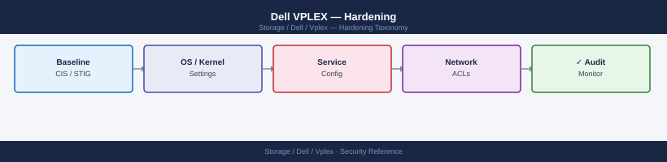
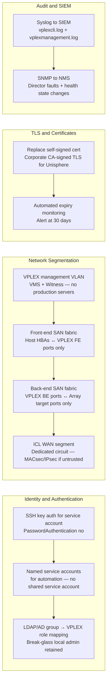

---
tags:
  - dell
  - security
---
# Dell VPLEX — Hardening

<div class="kb-summary">
Security baseline for VPLEX deployments. Apply all items before production go-live and validate against this checklist after any significant configuration change or GeoSynchrony upgrade.

*Applies to: VPLEX*
</div>




## Before you begin

- **Access:** Storage admin credentials (cluster admin or equivalent)
- **Change management:** security changes require CAB approval in most environments
- **Rollback plan:** document current state before any security control change
- **Testing:** validate in a non-production environment first where possible

---

## Hardening Checklist

### Identity and Authentication

- [ ] Change all default VMS local account passwords immediately after deployment; store in a PAM vault
- [ ] Configure SSH key authentication for the `service` account; disable password-based SSH (`PasswordAuthentication no` in `/etc/ssh/sshd_config`)
- [ ] Disable root SSH login (`PermitRootLogin no`)
- [ ] Create named service accounts for automation and monitoring; do not use the shared `service` account for scripted operations
- [ ] Map LDAP/AD groups to VPLEX management roles in Unisphere; maintain at least one local admin account as break-glass
- [ ] Enable Unisphere session timeout (15–30 minutes)

### Network and Management Access

- [ ] Restrict VMS management access to the dedicated management VLAN; block all traffic from production or guest VLANs to the VMS management IP
- [ ] Restrict SSH access to VMS to specific management jump hosts or subnets (`AllowUsers service@<MGMT_SUBNET>` in sshd_config)
- [ ] Block direct internet access to the VMS; all outbound access for CloudIQ telemetry must route through an authenticated proxy
- [ ] Ensure the Witness VM is on a management network segment isolated from both VPLEX cluster sites; the Witness must be reachable from both clusters but must not share a failure domain with either

### TLS and Certificate Management

- [ ] Replace the default self-signed TLS certificate on Unisphere for VPLEX with a corporate CA-signed certificate before production use
- [ ] Configure automated monitoring for Unisphere TLS certificate expiry; alert at 30 days before expiry
- [ ] Store TLS private keys in a secrets management system; do not leave private keys in `/tmp` or home directories

### Host Access Control

- [ ] Implement single-initiator SAN zoning; zone each host HBA only to the VPLEX front-end ports required for its storage views
- [ ] Never zone hosts directly to back-end array ports; all host access must pass through VPLEX
- [ ] Create individual storage views per host; do not create catch-all views
- [ ] Only include required volumes in each storage view; remove volumes no longer needed by the host
- [ ] Review and clean up storage views quarterly; unregister initiators for decommissioned hosts

### Audit and Monitoring

- [ ] Forward VMS syslog to the centralised SIEM; include `/var/log/VPlex/vplexcli.log` and `/var/log/VPlex/vplexmanagement.log`
- [ ] Configure SIEM alerts for: failed SSH attempts to VMS, storage view deletions, consistency group suspend/detach events, director hardware faults
- [ ] Enable SNMP traps or API-based alerting to the NMS for VPLEX health state changes
- [ ] Verify VPLEX logs are being received in the SIEM monthly

### Software and Patching

- [ ] Maintain GeoSynchrony firmware on a supported release; refer to the version matrix in [Install & Upgrade](../operations/install-upgrade.md)
- [ ] Subscribe to Dell security advisories for VPLEX; review advisories before host OS or back-end array firmware upgrades
- [ ] Upgrade GeoSynchrony and back-end array firmware in separate maintenance windows; do not combine changes that could interact
- [ ] Test GeoSynchrony upgrades in a non-production environment or staging cluster before applying to production

### Backup and Recovery

- [ ] Take a VMS VM snapshot before every configuration change and at a minimum weekly
- [ ] Verify VMS snapshot or backup restorability quarterly by restoring to a test VM
- [ ] Maintain an export of the storage view inventory and distributed device mapping in the CMDB after every provisioning change

---

## SSH Hardening — Reference Configuration

Apply the following to `/etc/ssh/sshd_config` on the VMS:

```bash
# Disable password and empty-password authentication
PasswordAuthentication no
ChallengeResponseAuthentication no
PermitEmptyPasswords no

# Disable root login
PermitRootLogin no

# Restrict to management hosts
AllowUsers service@<MGMT_JUMP_HOST_IP>

# Use strong algorithms only
KexAlgorithms curve25519-sha256,diffie-hellman-group-exchange-sha256
Ciphers aes256-gcm@openssh.com,chacha20-poly1305@openssh.com,aes128-gcm@openssh.com
MACs hmac-sha2-256-etm@openssh.com,hmac-sha2-512-etm@openssh.com

# Idle session timeout (5 minutes × 3 intervals = 15 minutes)
ClientAliveInterval 300
ClientAliveCountMax 3

# Disable X11 forwarding and agent forwarding (unnecessary on VMS)
X11Forwarding no
AllowAgentForwarding no
```


```text title="Expected output"
(no output — command completes silently)
```

!!! warning "Common errors"
    **`sshd[12847]: Invalid user service from 192.168.1.50 port 54321`** — Ensure the service account exists on the VPLEX system with `useradd service` before applying these settings.
    **`sshd: no hostkeys available -- exiting.`** — Verify SSH host keys exist in `/etc/ssh/` (ssh_host_rsa_key, ssh_host_ed25519_key) and regenerate with `ssh-keygen -A` if missing.
    **`sshd[12847]: fatal: kex_exchange_identification: Connection closed by remote host`** — Replace `<MGMT_JUMP_HOST_IP>` with the actual management host IP address (e.g., `AllowUsers service@10.20.30.40`) before restarting sshd.
After editing, test the configuration and restart:

```bash
# Test sshd config for syntax errors
sshd -t

# Restart sshd (keep existing session open until confirmed)
systemctl restart sshd

# Verify new session can authenticate with key before closing existing session
ssh -i ~/.ssh/vplex_ed25519 service@<VMS_IP> "vplexcli -q -e 'health-check'"
```


```text title="Expected output"
(no output — command completes silently)
(no output — command completes silently)
VPLEX CLI Version 6.2.1.0.0 (Build 6.2.1.0.0-20231015)
Connected to VPLEX cluster: vplex-prod-01
Health Status: HEALTHY
  Storage Array: HEALTHY
  Engines: HEALTHY (2/2 online)
  Directors: HEALTHY (4/4 online)
  Witness: HEALTHY
  Network: HEALTHY
```

!!! warning "Common errors"
    **`sshd: no hostkeys available -- exiting.`** — Regenerate SSH host keys with `ssh-keygen -A` or restore from backup before restarting sshd.
    **`Permission denied (publickey).`** — Verify the vplex_ed25519 private key has 600 permissions and the public key is in service@<VMS_IP>'s ~/.ssh/authorized_keys file.
    **`Connection refused`** — Confirm sshd restarted successfully with `systemctl status sshd` and that <VMS_IP> is reachable before attempting the key authentication test.
---

## Network Segmentation

| Segment | Contents | Access |
|---|---|---|
| VPLEX management VLAN | VMS, Witness VM management interface | Jump hosts, storage admins only; no production servers |
| VPLEX front-end SAN fabric | Host HBAs, VPLEX FE ports | Strictly zoned per storage view; no back-end array ports |
| VPLEX back-end SAN fabric | VPLEX BE ports, back-end array target ports | No host HBAs; VPLEX BE ports only |
| ICL WAN segment | VPLEX ICL ports (Metro) | Dedicated WAN circuit or VLAN; no other traffic; encrypt if traversing untrusted carrier |

Separation of the front-end and back-end SAN fabrics is critical. If a host HBA were accidentally zoned to a back-end array port, the host could bypass VPLEX and access the raw LUN without VPLEX access controls.

---

## Compliance Alignment

| Control | Applicable Standard | VPLEX Implementation |
|---|---|---|
| Encryption at rest | PCI DSS 3.4, ISO 27001 A.10.1 | Enable D@RE on PowerMax / Unity back-end arrays |
| Access control | PCI DSS 7, SOC 2 CC6 | Role-based access in Unisphere; storage views for host access |
| Audit logging | PCI DSS 10, SOC 2 CC7 | vplexcli logs forwarded to SIEM |
| Patch management | PCI DSS 6, CIS Controls | GeoSynchrony on supported release; Dell advisories subscribed |
| Network segmentation | PCI DSS 1, CIS Controls | Separate management, FE, BE, ICL segments as above |
| Privileged access management | SOC 2 CC6, ISO 27001 A.9.2 | PAM vault for VMS credentials; SSH key auth; named accounts |

---

## Validation Checks After Hardening

Run these after applying the hardening configuration to confirm nothing has broken:

```bash
# Confirm SSH key authentication works (from management jump host)
ssh -i ~/.ssh/vplex_ed25519 service@<VMS_IP> "vplexcli -q -e 'health-check'"

# Confirm Unisphere HTTPS is using the corporate CA certificate
echo | openssl s_client -connect <VMS_IP>:443 2>/dev/null \
  | openssl x509 -noout -subject -issuer -enddate

# Confirm all directors healthy post-hardening
vplexcli -q -e "ll /engines/*/directors/*/hardware/"

# Confirm Witness connectivity intact
vplexcli -q -e "ll /clusters/cluster-1/cluster-witness/"
vplexcli -q -e "ll /clusters/cluster-2/cluster-witness/"

# Confirm storage views and initiator memberships unchanged
vplexcli -q -e "ll /clusters/*/exports/storage-views/"

# Run full health check
vplexcli -q -e "health-check --full"
```


```text title="Expected output"
service@10.48.12.15's password:
health-check: PASSED
subject=CN=vplex-vms-01.corp.local,O=Acme Corp,C=US
issuer=CN=Acme Corporate CA,O=Acme Corp,C=US
notAfter=Mar 15 12:34:56 2026 GMT
/engines/engine-1/directors/director-1/hardware/
  operational-status: OK
  temperature-sensors: OK
  power-supplies: OK
/engines/engine-2/directors/director-1/hardware/
  operational-status: OK
  temperature-sensors: OK
  power-supplies: OK
/clusters/cluster-1/cluster-witness/
  connectivity-status: CONNECTED
  witness-ip: 10.48.10.88
  last-heartbeat: 2024-01-15T09:23:41Z
/clusters/cluster-2/cluster-witness/
  connectivity-status: CONNECTED
  witness-ip: 10.48.10.88
  last-heartbeat: 2024-01-15T09:23:42Z
/clusters/cluster-1/exports/storage-views/
  sv-prod-esx-01: 6 initiators
  sv-prod-esx-02: 6 initiators
/clusters/cluster-2/exports/storage-views/
  sv-prod-esx-03: 6 initiators
health-check --full: PASSED (completed in 47 seconds)
```

!!! warning "Common errors"
    **`Permission denied (publickey).`** — Verify the SSH key path is correct and the service account public key is installed on the VMS with `ssh-copy-id -i ~/.ssh/vplex_ed25519.pub service@<VMS_IP>`.
    **`unable to load certificate`** — Ensure the corporate CA certificate is properly installed in the VMS trust store by running `vplexcli -q -e "certificate-import --ca-cert /path/to/ca.pem"`.
    **`Witness connectivity-status: DISCONNECTED`** — Confirm network connectivity to the witness server at 10.48.10.88 and verify firewall rules allow port 7225 bidirectionally.
---

## See also

- [Vplex — Authentication](../authentication/)
- [Vplex — Access Control](../access-control/)
- [Vplex — Encryption](../encryption/)
