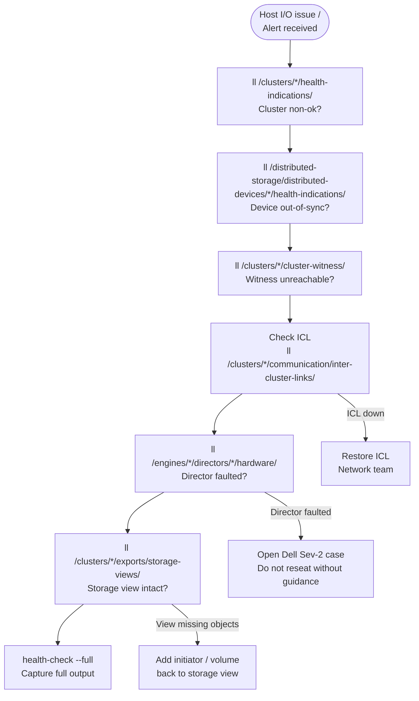

# Dell VPLEX — Common Issues


<div class="kb-summary">
Common Issues reference covering Incident Triage, Issue Reference, Common Issues — Quick Reference.
</div>

## Incident Triage

When hosts report I/O suspension, a distributed device is out-of-sync, or a director is unreachable, work through this sequence first.



- [ ] Run `ll /clusters/*/health-indications/` immediately — identify which cluster has entered a non-ok health state and note when the state change occurred
- [ ] Check distributed device sync state: `ll /distributed-storage/distributed-devices/*/health-indications/` — an `out-of-sync` device means one leg of the distributed device is not being written to; identify which cluster leg is affected
- [ ] Check Witness status for Metro deployments: `ll /clusters/*/cluster-witness/` — if Witness is unreachable from one cluster and the ICL is also interrupted, VPLEX suspends I/O on consistency groups to preserve write-order consistency
- [ ] Check director health: `ll /engines/*/directors/*/hardware/` — a director in a faulted state reduces redundancy and may cause host path failures
- [ ] Verify ICL connectivity between Metro clusters — an ICL interruption is the most common cause of distributed device out-of-sync events; check the WAN or dark fibre connection between sites
- [ ] Check consistency group state: `ll /distributed-storage/consistency-groups/` — identify any groups that have suspended I/O and determine the cause before resuming
- [ ] Verify storage views are intact: `ll /clusters/*/exports/storage-views/` — a missing or corrupted storage view can cause a specific host to lose access to its volumes
- [ ] Run `health-check --full` to get a system-wide view of all faults; use this output when opening a Dell Support case

| Question | Answer |
|---|---|
| Which cluster shows non-ok health-state? | |
| Which distributed devices are out-of-sync? | |
| Is the Witness connected and reachable from both clusters? | |
| Is the ICL between Metro clusters up? | |
| Which directors or director components are faulted? | |
| When did the issue start? | |
| What changed recently? | |

## Issue Reference

### Host Loses Access to All VPLEX Volumes

**Likely causes:**
- Both directors in a pair have failed (director pair failure)
- Storage view was deleted or its front-end ports were removed
- All FC zones between the host and VPLEX front-end ports have been disrupted (fabric issue)

**Diagnostic steps:**

```bash
# Check director health on the cluster serving this host
vplexcli -q -e "ll /engines/*/directors/*/hardware/"

# Check that the storage view exists and contains the expected volumes and ports
vplexcli -q -e "ll /clusters/cluster-1/exports/storage-views/<view_name>/"

# Confirm the host initiator is registered
vplexcli -q -e "ll /clusters/cluster-1/exports/initiator-ports/"
```

On the host:

```bash
# Linux: check that FC HBAs can see any VPLEX ports
systool -c fc_host -v | grep -i "port_state\|port_name"

# EMC PowerPath: check path states
powermt display dev=all

# VMware ESXi: rescan and check adapter status
esxcli storage core adapter rescan --all
esxcli storage nmp path list | grep -i "state\|transport"
```

**Resolution:** Replace failed director hardware (engage Dell Support). Recreate the storage view if it was accidentally deleted. Restore SAN zoning if the fabric was disrupted.

---

### Distributed Device Out-of-Sync

**Likely cause:** ICL interruption between Metro clusters during a write — one leg did not receive the write, setting the dirty bit on the distributed device.

**Diagnostic steps:**

```bash
# Confirm which device is out-of-sync and which leg is affected
vplexcli -q -e "ll /distributed-storage/distributed-devices/*/health-indications/"
vplexcli -q -e "ll /distributed-storage/distributed-devices/<device_name>/"

# Check ICL status
vplexcli -q -e "ll /clusters/cluster-1/communication/inter-cluster-links/"
vplexcli -q -e "ll /clusters/cluster-2/communication/inter-cluster-links/"
```

**Resolution:**

1. Restore the ICL if it is still interrupted.
2. Once the ICL is healthy, VPLEX begins automatic resync. Monitor:

```bash
vplexcli -q -e "ll /distributed-storage/distributed-devices/<device_name>/" \
  | grep -i "health-state\|rebuild-progress"
```

3. If resync does not start automatically within 10 minutes of ICL recovery, initiate manually:

```bash
vplexcli -q -e "device rebuild \
  --device /distributed-storage/distributed-devices/<device_name>"
```

4. Do not perform maintenance on the out-of-sync cluster leg during rebuild.

---

### I/O Suspended on Consistency Group Volumes

**Likely cause:** The ICL failed while the Witness was also unreachable, or the Witness was not configured. VPLEX suspends I/O on consistency groups to prevent split-brain data divergence.

**Diagnostic steps:**

```bash
# Confirm CG suspension
vplexcli -q -e "ll /distributed-storage/consistency-groups/"

# Check Witness status from both clusters
vplexcli -q -e "ll /clusters/cluster-1/cluster-witness/"
vplexcli -q -e "ll /clusters/cluster-2/cluster-witness/"

# Check ICL status
vplexcli -q -e "ll /clusters/cluster-1/communication/inter-cluster-links/"
```

**Resolution:**

1. Restore ICL connectivity first.
2. Restore Witness connectivity (check Witness VM is running and reachable on the management network).
3. Once both ICL and Witness are healthy, VPLEX typically resumes I/O automatically.
4. If manual resume is required after verifying the active cluster with Dell Support:

```bash
vplexcli -q -e "device resume \
  --device /distributed-storage/distributed-devices/<device_name>"
```

**Do not manually resume without understanding which cluster leg holds the most recent data.** Incorrect manual resume risks undetected data divergence.

---

### Single Host Loses Access to One or More Volumes

**Likely causes:**
- Storage view membership changed (volume or initiator removed accidentally)
- Host HBA failed or was replaced with a new WWN that is not registered
- SAN zone disrupted between host HBA and VPLEX front-end port

**Diagnostic steps:**

```bash
# Confirm storage view still has the host initiator and the target volume
vplexcli -q -e "ll /clusters/cluster-1/exports/storage-views/<view_name>/"

# Confirm the initiator is registered
vplexcli -q -e "ll /clusters/cluster-1/exports/initiator-ports/<initiator_name>/"
```

On the host:

```bash
# Linux: show all FC paths
multipath -ll

# VMware ESXi: list paths for the affected datastore device
esxcli storage nmp path list -d <naa_id>
```

Check SAN fabric zoning for the host HBA → VPLEX FE port zone.

**Resolution:** Add the initiator back to the storage view if it was removed. Register the new HBA WWN if the HBA was replaced. Restore SAN zoning if the zone was deleted or modified.

---

### Director Shows `major-failure` in Health Indications

**Likely cause:** Hardware fault on the director — failed component (fan, PSU, cache module, FC port, or the director board itself).

**Diagnostic steps:**

```bash
# Identify the specific failed component
vplexcli -q -e "ll /engines/engine-1-1/directors/director-1-1-A/hardware/"

# Check all ports on the faulted director for port-level faults
vplexcli -q -e "ll /engines/engine-1-1/directors/director-1-1-A/hardware/ports/"
```

**Immediate actions:**

1. Confirm the surviving director in the pair is healthy — I/O continues on the surviving director.
2. Verify that all host paths to the surviving director are active: `powermt display dev=all` or `multipath -ll` on affected hosts.
3. Open a Dell Support case (Severity 2 — degraded system) and attach the support bundle.
4. Do not attempt to remove or reseat the faulted director without Dell Support guidance — incorrect handling can impact the surviving director's cache.

---

### Witness Not Reachable from One Cluster

**Likely causes:**
- Witness VM is powered off or crashed
- Management network between a VPLEX cluster and the Witness VM is disrupted
- Witness IP address changed without updating VPLEX configuration

**Diagnostic steps:**

```bash
# Check Witness status from both clusters
vplexcli -q -e "ll /clusters/cluster-1/cluster-witness/"
vplexcli -q -e "ll /clusters/cluster-2/cluster-witness/"

# Ping the Witness VM from the VMS management interface
ping -c 5 <witness_VM_IP>
```

**Resolution:**

1. If the Witness VM is powered off, power it on and wait for the Witness service to start.
2. If it is a network issue, restore management network connectivity between the affected cluster and the Witness network segment.
3. Once the Witness is reachable, verify the VPLEX Witness configuration reflects the correct IP.

**Risk while Witness is unreachable:** If an ICL failure occurs while the Witness is unreachable, VPLEX cannot arbitrate and will suspend I/O on consistency groups. Treat Witness unreachability as a Severity 2 condition — resolve immediately.

---

### `health-check --full` Reports Warnings

**Approach:** Review each warning individually. `health-check --full` output groups warnings by component type.

```bash
# Capture full health check output to a file for review
vplexcli -q -e "health-check --full" > /tmp/vplex_healthcheck_$(date +%Y%m%d_%H%M).txt

# Common warning patterns and their meaning:
# "health-state: minor-failure" on a director component — check the specific component
# "rebuild-allowed: false" on a distributed device — a rebuild is blocked; find and fix the blocking condition
# "operational-status: degraded" on a CG — one or more member volumes are not in-sync
```

For each flagged component, drill into the component path for detail:

```bash
# If a specific engine/director is flagged:
vplexcli -q -e "ll /engines/<engine_name>/directors/<director_name>/hardware/"

# If a specific distributed device is flagged:
vplexcli -q -e "ll /distributed-storage/distributed-devices/<device_name>/"

# If a specific CG is flagged:
vplexcli -q -e "ll /distributed-storage/consistency-groups/<cg_name>/"
```

---

### RecoverPoint CLI Commands Hang

**Likely cause:** RecoverPoint–VPLEX communication timeout is blocking the vplexcli session.

**Resolution:**

1. Press `Ctrl+C` to interrupt the hanging vplexcli command.
2. Exit vplexcli and start a new session.
3. Check RecoverPoint appliance status from the RecoverPoint management interface.
4. Verify IP connectivity between VPLEX directors and RecoverPoint appliances.
5. If RecoverPoint is unhealthy, engage the RecoverPoint support process first; VPLEX management will stabilise once the RecoverPoint session is restored.

---

## Common Issues — Quick Reference

| Symptom | Likely Cause | First Action |
|---|---|---|
| Host loses access to all VPLEX volumes | Director pair failure or all zones disrupted | Check `ll /engines/*/directors/*/hardware/`; verify storage views |
| Distributed device out-of-sync | ICL interruption between Metro clusters | Restore ICL; monitor auto-resync |
| I/O suspended on CG volumes | ICL down + Witness unreachable (split-brain protection) | Restore ICL and Witness; do not manually resume without understanding which leg is current |
| Single host loses access to volumes | Storage view issue or HBA path failure | Check storage view initiator membership; verify FC zones; rescan host |
| Director shows `major-failure` | Director hardware fault | Confirm surviving director is healthy; open Dell Sev-2 case |
| Witness not reachable from one cluster | Witness VM down or management network issue | Start Witness VM; restore management network path |
| `health-check` reports warnings | Various component-level issues | Drill into the specific flagged component for detail |
| RecoverPoint vplexcli commands hang | RP–VPLEX communication timeout | Interrupt the command; check RecoverPoint appliance health |
| Volume not visible to host after zoning | Initiator WWN not registered in storage view | Register the WWN and add to the storage view; rescan host |
| High write latency on Metro volumes | ICL latency approaching or exceeding 5ms | Measure ICL RTT; investigate network path; check ICL utilisation |
