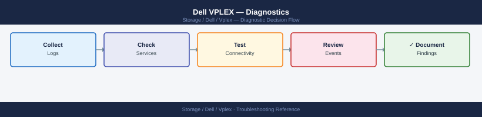

---
tags:
  - dell
  - troubleshooting
search:
  boost: 1.5
---
# Dell VPLEX — Diagnostics

<div class="kb-summary">
VPLEX diagnostic commands: run health-check --full and ll /clusters/*/health-indications/ for a fast system-wide health view, inspect distributed device sync state and rebuild progress for Metro out-of-sync scenarios, check director hardware with ll /engines/*/directors/*/hardware/, verify Witness and ICL connectivity for Metro quorum health, confirm storage view and initiator-port configuration when hosts lose access, and collect the support bundle with collect-support-log for Dell GSS escalation.

*Applies to: VPLEX VS2 / VS6*
</div>


```d2
direction: right

B: "B" {shape: rectangle}
C: "health-check --full\nll /clusters/*/health-indications/" {shape: rectangle}
D: "ll /clusters/*/exports/storage-views/\nll /virtual-volumes/ device name" {shape: rectangle}
E: "ll /distributed-storage/distributed-devices/*/health-indications/\nCheck rebuild-progress attribute" {shape: rectangle}
F: "ll /engines/*/directors/*/hardware/\nCheck director health state" {shape: rectangle}
G: "ll /clusters/*/cluster-witness/\nping cluster-2-mgmt-IP from VMS" {shape: rectangle}
H: "ll /distributed-storage/consistency-groups/\nCheck CG state and suspension reason" {shape: rectangle}
I: "I" {shape: rectangle}
J: "Drill to affected cluster\nll /clusters/cluster-N/health-indications/" {shape: rectangle}
K: "Check distributed device sync state\nll /distributed-storage/distributed-devices/*/" {shape: rectangle}
L: "L" {shape: rectangle}
M: "Confirm HBA WWN: ll /clusters/*/exports/initiator-ports/\nAdd missing initiator or VV to view" {shape: rectangle}
N: "Host: multipath -ll or powermt display dev=all\nESXi: esxcli storage core adapter rescan --all" {shape: rectangle}
O: "O" {shape: rectangle}
P: "Monitor rebuild-progress until 100%\nDo not interrupt rebuild" {shape: rectangle}
Q: "Check ICL: ll /clusters/*/communication/inter-cluster-links/\nCheck director health on affected cluster" {shape: rectangle}
R: "DANGER: confirm active leg with Dell Support\nbefore device resume command" {shape: rectangle}
S: "Check director pair health state\nminor-failure or major-failure needs TAC" {shape: rectangle}
T: "Restore ICL if interrupted\nVerify Witness reachable from both clusters" {shape: rectangle}
U: "Do not resume CG without understanding cause\nCheck ICL and Witness first" {shape: rectangle}
V: "Collect support bundle and open Dell case" {shape: rectangle}
W: "collect-support-log -f /var/log/support_bundle.tar.gz\nscp bundle to jump host and attach to Dell GSS SR" {shape: rectangle}
A: "VPLEX Issue" {shape: rectangle}

B -> C
B -> D
B -> E
B -> F
B -> G
B -> H
I -> J
I -> K
L -> M
L -> N
O -> P
O -> Q
O -> R
F -> S
G -> T
H -> U
J -> V
K -> V
M -> V
N -> V
P -> V
Q -> V
R -> V
S -> V
T -> V
U -> V
V -> W
```

```d2
direction: down

symptom: Identify Symptom {shape: diamond}
step_1_initial_triage_sequence: "Step 1 — Initial triage sequence" {shape: rectangle}
step_2_distributed_device_diagnostic: "Step 2 — Distributed device diagnostics" {shape: rectangle}
step_3_director_diagnostics: "Step 3 — Director diagnostics" {shape: rectangle}
step_4_icl_diagnostics_metro: "Step 4 — ICL diagnostics (Metro)" {shape: rectangle}
step_5_storage_view_diagnostics: "Step 5 — Storage view diagnostics" {shape: rectangle}
step_6_log_analysis: "Step 6 — Log analysis" {shape: rectangle}
resolution: Resolve or Escalate {shape: oval}

symptom -> step_1_initial_triage_sequence: investigate
symptom -> step_2_distributed_device_diagnostic: investigate
symptom -> step_3_director_diagnostics: investigate
symptom -> step_4_icl_diagnostics_metro: investigate
symptom -> step_5_storage_view_diagnostics: investigate
symptom -> step_6_log_analysis: investigate
step_1_initial_triage_sequence -> resolution
step_2_distributed_device_diagnostic -> resolution
step_3_director_diagnostics -> resolution
step_4_icl_diagnostics_metro -> resolution
step_5_storage_view_diagnostics -> resolution
step_6_log_analysis -> resolution
```

## Before you begin

- **Access:** SSH to VMS as `service` user (`ssh service@<VMS_IP>`); vplexcli is available from the VMS shell; Unisphere for VPLEX web UI credentials; host-side access (SSH to Linux host or vSphere for ESXi)
- **Gather first:** the specific symptom (health-check output, affected virtual volume name, director health state, CG name), which cluster is affected (cluster-1 or cluster-2), and the approximate time the issue started
- **Scope:** confirm whether the issue affects one virtual volume, one cluster, or a full Metro topology — `health-check --full` gives a system-wide view in seconds; always run this first

---

## Step 1 — Initial triage sequence

Run these commands in order at the start of any VPLEX investigation:

```bash
# SSH to VMS
ssh service@<VMS_IP>

# 1. Overall system health — quickest way to identify faulted components
vplexcli -q -e "health-check --full"

# 2. Cluster health indications — which cluster has entered a non-ok state
vplexcli -q -e "ll /clusters/*/health-indications/"

# 3. Distributed device sync state — identifies Metro out-of-sync or degraded devices
vplexcli -q -e "ll /distributed-storage/distributed-devices/*/health-indications/"

# 4. Director hardware health — identifies hardware faults on specific directors
vplexcli -q -e "ll /engines/*/directors/*/hardware/"

# 5. Witness status (Metro) — identifies quorum risk
vplexcli -q -e "ll /clusters/cluster-1/cluster-witness/"
vplexcli -q -e "ll /clusters/cluster-2/cluster-witness/"

# 6. Consistency group state — identifies suspended or faulted CGs
vplexcli -q -e "ll /distributed-storage/consistency-groups/"

# 7. Storage view integrity — confirms host access objects are intact
vplexcli -q -e "ll /clusters/*/exports/storage-views/"
```

Record the output of each command with a timestamp before making any changes.

---

## Step 2 — Distributed device diagnostics

### Out-of-sync distributed device

An out-of-sync distributed device means one leg is not receiving writes — the most common cause is an ICL interruption between Metro clusters.

```bash
# Show all distributed devices and their sync states
vplexcli -q -e "ll /distributed-storage/distributed-devices/*/health-indications/"

# Show full detail of the affected device (note: active-leg, rebuild-progress)
vplexcli -q -e "ll /distributed-storage/distributed-devices/<device_name>/"

# Check inter-cluster link status
vplexcli -q -e "ll /clusters/cluster-1/communication/inter-cluster-links/"
vplexcli -q -e "ll /clusters/cluster-2/communication/inter-cluster-links/"

# Monitor resync progress (repeat until rebuild-progress: 100%)
vplexcli -q -e "ll /distributed-storage/distributed-devices/<device_name>/" \
  | grep -i "health-state\|rebuild-progress\|service-status"
```

**Resolution sequence:**

1. Confirm the ICL is healthy (see Step 4 — ICL Diagnostics).
2. Once the ICL is restored, VPLEX begins automatic resync — monitor `rebuild-progress: 0% → 100%`.
3. Do not interrupt a rebuild in progress.
4. If the device does not begin resyncing automatically after the ICL is restored, initiate manually:

```bash
vplexcli -q -e "device rebuild \
  --device /distributed-storage/distributed-devices/<device_name>"
```

### Degraded distributed device (one leg unreachable)

A degraded device means one cluster leg is unreachable — I/O continues on the surviving leg only.

```bash
# Identify which leg is unreachable
vplexcli -q -e "ll /distributed-storage/distributed-devices/<device_name>/"

# Check the affected cluster's health
vplexcli -q -e "ll /clusters/<affected_cluster>/health-indications/"

# Check director health on the affected cluster
vplexcli -q -e "ll /engines/*/directors/*/hardware/"
```

If the cluster is unreachable due to a site failure and the Witness has granted quorum to the surviving cluster, I/O continues normally. After site recovery: restore ICL, confirm Witness connectivity, then allow the distributed device to rebuild automatically.

### Suspended distributed device (I/O halted)

A suspended device indicates VPLEX could not determine a safe winner — typically ICL down with Witness also unreachable.

```bash
# Confirm the device is suspended and identify the cause
vplexcli -q -e "ll /distributed-storage/distributed-devices/<device_name>/"

# Check Witness status from both clusters
vplexcli -q -e "ll /clusters/cluster-1/cluster-witness/"
vplexcli -q -e "ll /clusters/cluster-2/cluster-witness/"

# Check ICL status
vplexcli -q -e "ll /clusters/cluster-1/communication/inter-cluster-links/"
```

**Do not manually resume I/O until the cause of suspension is understood.** Resuming a suspended distributed device without verifying which leg has the most recent writes risks data divergence.

Recovery procedure:
1. Restore the ICL (if interrupted).
2. Restore Witness connectivity.
3. Once both ICL and Witness are healthy, VPLEX typically resumes automatically.
4. If manual resume is required (only after confirming the active leg with Dell Support):

```bash
vplexcli -q -e "device resume \
  --device /distributed-storage/distributed-devices/<device_name>"
```

---

## Step 3 — Director diagnostics

```bash
# List all engines and their directors
vplexcli -q -e "ll /engines/*/directors/"

# Show hardware detail for a specific engine
vplexcli -q -e "ll /engines/engine-1-1/directors/"

# Show all hardware components on a director (fans, PSU, cache module, ports)
vplexcli -q -e "ll /engines/engine-1-1/directors/director-1-1-A/hardware/"

# List and show status of all FE/BE ports on a director
vplexcli -q -e "ll /engines/engine-1-1/directors/director-1-1-A/hardware/ports/"

# Show a specific port's status and WWN
vplexcli -q -e "ll /engines/engine-1-1/directors/director-1-1-A/hardware/ports/A0-FC00/"
```

### Director health states

| State | Meaning | Action |
|---|---|---|
| `ok` | Director fully operational | Normal |
| `minor-failure` | A component is degraded but director is operational | Investigate the specific component; plan replacement |
| `major-failure` | Director is impaired; redundancy reduced | Escalate to Dell Support; plan director replacement |
| `unknown` | Director is not responding to management queries | Check management network; escalate |

A single director failure within a pair does not interrupt I/O — the surviving director continues serving hosts. However, the pair is now in a degraded state with no fault tolerance until the failed director is replaced.

---

## Step 4 — ICL diagnostics (Metro)

```bash
# Show inter-cluster link status and latency
vplexcli -q -e "ll /clusters/cluster-1/communication/inter-cluster-links/"
vplexcli -q -e "ll /clusters/cluster-2/communication/inter-cluster-links/"

# Ping between cluster management interfaces (from VMS)
ping -c 10 <cluster-2-mgmt-IP>

# Measure ICL RTT
ping -c 100 -i 0.1 <cluster-2-ICL-IP>
```

**ICL RTT threshold**: Metro requires ≤5ms round-trip latency. If RTT consistently exceeds this:

1. Check for network congestion on the WAN or dark fibre segment.
2. Check for ICL port errors: `ll /engines/*/directors/*/hardware/ports/` — look for ICL ports.
3. Engage the WAN/network team to investigate the carrier circuit.
4. If RTT exceeds 5ms during sustained high write I/O, check ICL bandwidth — the circuit may be saturated.

---

## Step 5 — Storage view diagnostics

```bash
# Confirm the storage view exists for this host
vplexcli -q -e "ls /clusters/cluster-1/exports/storage-views"

# Show the specific storage view's initiators, ports, and volumes
vplexcli -q -e "ll /clusters/cluster-1/exports/storage-views/<view_name>/"

# Confirm the host's HBA WWN is registered as an initiator port
vplexcli -q -e "ls /clusters/cluster-1/exports/initiator-ports"
vplexcli -q -e "ll /clusters/cluster-1/exports/initiator-ports/<initiator_name>/"

# Confirm the expected volume is in the storage view
vplexcli -q -e "ll /clusters/cluster-1/exports/storage-views/<view_name>/" \
  | grep -i "virtual-volumes"

# Check virtual volume operational status
vplexcli -q -e "ll /virtual-volumes/<volume_name>/"
```

### Host-side verification

```bash
# Linux: list all known paths (Device Mapper Multipath)
multipath -ll

# Linux: rescan for new volumes after storage view changes
for host in /sys/class/scsi_host/host*/; do echo "- - -" > ${host}scan; done

# VMware ESXi: rescan storage adapters
esxcli storage core adapter rescan --all

# EMC PowerPath: display all known device paths
powermt display dev=all
```

---

## Step 6 — Log analysis

```bash
# SSH to VMS and review recent management log events
ssh service@<VMS_IP>
tail -200 /var/log/VPlex/vplexmanagement.log

# Search for recent health state change events
grep -i "health-state\|major-failure\|degraded\|suspended" \
  /var/log/VPlex/vplexmanagement.log | tail -50

# Search for recent storage view modifications
grep -i "storage-view\|initiator" /var/log/VPlex/cli/vplexcli.log | tail -50

# Identify who ran recent vplexcli commands
grep -i "$(date +%Y-%m-%d)" /var/log/VPlex/cli/vplexcli.log | tail -100
```

---

## Step 7 — Collect support bundle

Always collect a support bundle before Dell Support engagement and before any invasive recovery action.

```bash
# From within vplexcli (interactive session)
collect-support-log -f /var/log/support_bundle.tar.gz

# From VMS OS shell (one-shot)
ssh service@<VMS_IP> "vplexcli -q -e 'collect-support-log -f /var/log/support_bundle.tar.gz'"

# Copy the bundle off the VMS to a jump host
scp service@<VMS_IP>:/var/log/support_bundle.tar.gz \
  admin@<jump_host>:/tmp/vplex_support_$(date +%Y%m%d_%H%M).tar.gz
```

### Pre-support-call data collection checklist

Gather all of the following before opening a Dell Support case:

- [ ] GeoSynchrony version: `ll /clusters/cluster-1/system-volumes/version/`
- [ ] Full health check output: `health-check --full`
- [ ] Cluster health indications: `ll /clusters/*/health-indications/`
- [ ] Distributed device health: `ll /distributed-storage/distributed-devices/*/health-indications/`
- [ ] Director hardware health: `ll /engines/*/directors/*/hardware/`
- [ ] Witness status: `ll /clusters/*/cluster-witness/`
- [ ] CG state: `ll /distributed-storage/consistency-groups/`
- [ ] ICL status: `ll /clusters/*/communication/inter-cluster-links/`
- [ ] Storage view list: `ll /clusters/*/exports/storage-views/`
- [ ] Support bundle: `collect-support-log -f /var/log/support_bundle.tar.gz`
- [ ] Host-side path output: `powermt display dev=all` or `multipath -ll` from affected hosts
- [ ] VMS management log excerpt covering the incident timeframe
- [ ] Approximate time the issue started (UTC) and description of any recent changes

---

## Log locations

| Log | Path | What to look for |
|---|---|---|
| vplexcli command history | `/var/log/VPlex/cli/vplexcli.log` | All CLI commands with timestamps — recent config changes |
| Management events | `/var/log/VPlex/vplexmanagement.log` | Health state changes, director events, configuration updates |
| VMS OS auth log | `/var/log/secure` or `/var/log/auth.log` | SSH login events |
| Support bundle | `/var/log/support_bundle.tar.gz` | All-in-one — required for Dell GSS SR |

---

## See also

- [VPLEX — Common Issues](../common-issues/)
- [VPLEX — Escalation](../escalation/)
- [VPLEX — Health Checks](../../operations/health-checks/)

## Verify resolution

- `vplexcli -q -e "health-check --full"` shows no FAILED or WARNING components
- `vplexcli -q -e "ll /clusters/*/health-indications/"` shows all clusters in `ok` health state
- `vplexcli -q -e "ll /distributed-storage/distributed-devices/*/health-indications/"` shows all devices `in-sync` with `rebuild-progress: 100%`
- `vplexcli -q -e "ll /clusters/*/cluster-witness/"` shows Witness `connected` from both clusters (Metro only)
- Host-side `multipath -ll` or `powermt display dev=all` shows all paths active with no faulted paths
- `vplexcli -q -e "ll /distributed-storage/consistency-groups/"` shows no CGs in `suspended` state
