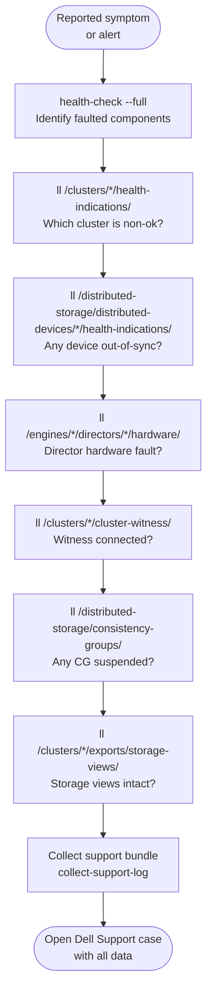
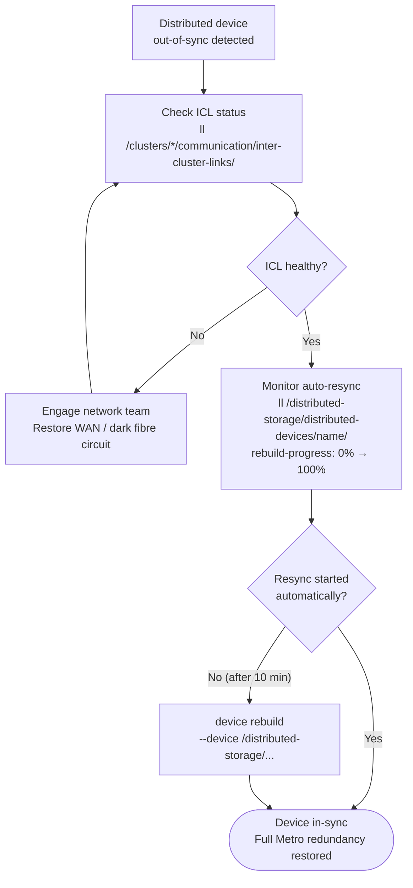

# Dell VPLEX — Diagnostics

Systematic diagnostic procedures for VPLEX faults. Work through the relevant section based on the reported symptom. Collect all outputs before calling Dell Support — they will ask for this data.



## Initial Triage Sequence

Run these commands in order at the start of any VPLEX investigation:

```bash
# 1. Overall system health — quickest way to identify faulted components
vplexcli -q -e "health-check --full"

# 2. Cluster health indications — which cluster has entered a non-ok state
vplexcli -q -e "ll /clusters/*/health-indications/"

# 3. Distributed device sync state — identifies Metro out-of-sync or degraded devices
vplexcli -q -e "ll /distributed-storage/distributed-devices/*/health-indications/"

# 4. Director hardware health — identifies hardware faults on specific directors
vplexcli -q -e "ll /engines/*/directors/*/hardware/"

# 5. Witness status (Metro) — identifies quorum risk
vplexcli -q -e "ll /clusters/cluster-1/cluster-witness/"
vplexcli -q -e "ll /clusters/cluster-2/cluster-witness/"

# 6. Consistency group state — identifies suspended or faulted CGs
vplexcli -q -e "ll /distributed-storage/consistency-groups/"

# 7. Storage view integrity — confirms host access objects are intact
vplexcli -q -e "ll /clusters/*/exports/storage-views/"
```

Record the output of each command with a timestamp before making any changes.

## Distributed Device Diagnostics

### Out-of-Sync Distributed Device

An out-of-sync distributed device means one leg is not receiving writes — the most common cause is an ICL interruption between Metro clusters.

```bash
# Show all distributed devices and their sync states
vplexcli -q -e "ll /distributed-storage/distributed-devices/*/health-indications/"

# Show full detail of the affected device (note: active-leg, rebuild-progress)
vplexcli -q -e "ll /distributed-storage/distributed-devices/<device_name>/"

# Check inter-cluster link status
vplexcli -q -e "ll /clusters/cluster-1/communication/inter-cluster-links/"
vplexcli -q -e "ll /clusters/cluster-2/communication/inter-cluster-links/"

# Check which leg is the active (winning) leg
vplexcli -q -e "ll /distributed-storage/distributed-devices/<device_name>/" \
  | grep -i "active-leg\|service-status"
```

**Resolution sequence:**

1. Confirm the ICL is healthy (see ICL Diagnostics below).
2. Once the ICL is restored, VPLEX begins automatic resync — monitor with:



```bash
# Monitor resync progress (repeat until rebuild-progress: 100%)
vplexcli -q -e "ll /distributed-storage/distributed-devices/<device_name>/" \
  | grep -i "health-state\|rebuild-progress\|service-status"
```

3. Do not interrupt a rebuild in progress — allow it to complete before any further maintenance.
4. If the device does not begin resyncing automatically after the ICL is restored, initiate manually:

```bash
vplexcli -q -e "device rebuild \
  --device /distributed-storage/distributed-devices/<device_name>"
```

### Degraded Distributed Device (One Leg Unreachable)

A degraded device means one cluster leg is unreachable — I/O continues on the surviving leg only.

```bash
# Identify which leg is unreachable
vplexcli -q -e "ll /distributed-storage/distributed-devices/<device_name>/"

# Check the affected cluster's health
vplexcli -q -e "ll /clusters/<affected_cluster>/health-indications/"

# Check director health on the affected cluster
vplexcli -q -e "ll /engines/*/directors/*/hardware/"
```

If the cluster is unreachable due to a site failure and the Witness has granted quorum to the surviving cluster, I/O continues normally. After site recovery: restore ICL, confirm Witness connectivity, then allow the distributed device to rebuild automatically.

### Suspended Distributed Device (I/O Halted)

A suspended device indicates VPLEX could not determine a safe winner — typically ICL down with Witness also unreachable.

```bash
# Confirm the device is suspended and identify the cause
vplexcli -q -e "ll /distributed-storage/distributed-devices/<device_name>/"

# Check Witness status from both clusters
vplexcli -q -e "ll /clusters/cluster-1/cluster-witness/"
vplexcli -q -e "ll /clusters/cluster-2/cluster-witness/"

# Check ICL status
vplexcli -q -e "ll /clusters/cluster-1/communication/inter-cluster-links/"
```

**Do not manually resume I/O until the cause of suspension is understood.** Resuming a suspended distributed device without verifying which leg has the most recent writes risks data divergence.

Recovery procedure:

1. Restore the ICL (if it was interrupted).
2. Restore Witness connectivity.
3. Once both ICL and Witness are healthy, VPLEX typically resumes automatically.
4. If manual resume is required (after confirming the active leg with Dell support):

```bash
# Resume I/O on the confirmed active leg only
vplexcli -q -e "device resume \
  --device /distributed-storage/distributed-devices/<device_name>"
```

## Director Diagnostics

```bash
# List all engines and their directors
vplexcli -q -e "ll /engines/*/directors/"

# Show hardware detail for a specific engine
vplexcli -q -e "ll /engines/engine-1-1/directors/"

# Show all hardware components on a director (fans, PSU, cache module, ports)
vplexcli -q -e "ll /engines/engine-1-1/directors/director-1-1-A/hardware/"

# List and show status of all FE/BE ports on a director
vplexcli -q -e "ll /engines/engine-1-1/directors/director-1-1-A/hardware/ports/"

# Show a specific port's status and WWN
vplexcli -q -e "ll /engines/engine-1-1/directors/director-1-1-A/hardware/ports/A0-FC00/"
```

### Director Health States

| State | Meaning | Action |
|---|---|---|
| `ok` | Director fully operational | Normal |
| `minor-failure` | A component is degraded but director is operational | Investigate the specific component; plan replacement |
| `major-failure` | Director is impaired; redundancy reduced | Escalate to Dell support; plan director replacement |
| `unknown` | Director is not responding to management queries | Check management network connectivity to the director; escalate |

A single director failure within a pair does not interrupt I/O — the surviving director continues serving hosts with cache mirroring on the surviving NVRAM. However, the pair is now in a degraded state with no fault tolerance until the failed director is replaced.

## ICL Diagnostics (Metro)

```bash
# Show inter-cluster link status and latency
vplexcli -q -e "ll /clusters/cluster-1/communication/inter-cluster-links/"
vplexcli -q -e "ll /clusters/cluster-2/communication/inter-cluster-links/"

# Check current ICL link bandwidth and utilisation
# (Available in Unisphere for VPLEX → Metro → ICL Status)

# Ping between cluster management interfaces (from VMS)
ping -c 10 <cluster-2-mgmt-IP>

# Measure ICL RTT using a test (from VMS or network equipment)
ping -c 100 -i 0.1 <cluster-2-ICL-IP>
```

**ICL RTT threshold**: Metro requires ≤5ms round-trip latency. If RTT consistently exceeds this:

1. Check for network congestion on the WAN or dark fibre segment.
2. Check for ICL port errors: `ll /engines/*/directors/*/hardware/ports/` — look for ICL ports.
3. Engage the WAN/network team to investigate the carrier circuit.
4. If RTT exceeds 5ms during a period of sustained high write I/O, check ICL bandwidth — the circuit may be saturated.

## Storage View Diagnostics

If a host reports it cannot see a VPLEX volume:

```bash
# Confirm the storage view exists for this host
vplexcli -q -e "ls /clusters/cluster-1/exports/storage-views"

# Show the specific storage view's initiators, ports, and volumes
vplexcli -q -e "ll /clusters/cluster-1/exports/storage-views/<view_name>/"

# Confirm the host's HBA WWN is registered as an initiator port
vplexcli -q -e "ls /clusters/cluster-1/exports/initiator-ports"
vplexcli -q -e "ll /clusters/cluster-1/exports/initiator-ports/<initiator_name>/"

# Confirm the expected volume is in the storage view
vplexcli -q -e "ll /clusters/cluster-1/exports/storage-views/<view_name>/" \
  | grep -i "virtual-volumes"
```

Host-side verification steps:

```bash
# Linux (Device Mapper Multipath): list all known paths
multipath -ll

# Linux: rescan for new volumes after storage view changes
for host in /sys/class/scsi_host/host*/; do echo "- - -" > ${host}scan; done

# VMware ESXi: rescan storage adapters
esxcli storage core adapter rescan --all

# EMC PowerPath: display all known device paths
powermt display dev=all

# Confirm SAN zoning includes this host HBA → VPLEX FE port
# (From the SAN switch management console)
```

If the zone is active, the storage view is correctly configured, and the host still cannot see the volume, check that the virtual volume's `operational-status` is `ok`:

```bash
vplexcli -q -e "ll /virtual-volumes/<volume_name>/"
```

## Log Analysis

### VMS Log Files

| Log | Path | Key Content |
|---|---|---|
| vplexcli command history | `/var/log/VPlex/cli/vplexcli.log` | All CLI commands with timestamps — search for recent config changes |
| Management events | `/var/log/VPlex/vplexmanagement.log` | Health state changes, director events, configuration updates |
| Unisphere web log | `/var/log/VPlex/` | Web UI access and API activity |
| VMS OS auth log | `/var/log/secure` or `/var/log/auth.log` | SSH login events |

```bash
# SSH to VMS and review recent management log events
ssh service@<VMS_IP>
tail -200 /var/log/VPlex/vplexmanagement.log

# Search for recent health state change events
grep -i "health-state\|major-failure\|degraded\|suspended" \
  /var/log/VPlex/vplexmanagement.log | tail -50

# Search for recent storage view modifications
grep -i "storage-view\|initiator" /var/log/VPlex/cli/vplexcli.log | tail -50

# Identify who ran recent vplexcli commands
grep -i "$(date +%Y-%m-%d)" /var/log/VPlex/cli/vplexcli.log | tail -100
```

### Collecting a Support Bundle

Always collect a support bundle before Dell Support engagement and before any invasive recovery action:

```bash
# From within vplexcli (interactive session)
collect-support-log -f /var/log/support_bundle.tar.gz

# From VMS OS shell (one-shot):
ssh service@<VMS_IP> "vplexcli -q -e 'collect-support-log -f /var/log/support_bundle.tar.gz'"

# Copy the bundle off the VMS to a jump host
scp service@<VMS_IP>:/var/log/support_bundle.tar.gz admin@<jump_host>:/tmp/vplex_support_$(date +%Y%m%d_%H%M).tar.gz
```

The support bundle contains: director firmware versions, hardware inventory, GeoSynchrony version, current configuration snapshot, recent logs from all directors, and health check output.

## GeoSynchrony Version and System Information

```bash
# Show GeoSynchrony (firmware) version on cluster-1
vplexcli -q -e "ll /clusters/cluster-1/system-volumes/version/"

# Show back-end array inventory
vplexcli -q -e "ls /storage-elements/storage-arrays"

# Show detailed information about a back-end array
vplexcli -q -e "ll /storage-elements/storage-arrays/array-A/"

# List all unclaimed storage volumes on a back-end array
vplexcli -q -e "ls /storage-elements/storage-arrays/array-A/storage-volumes"

# Show VPLEX engine serial numbers and hardware revision (for support case)
vplexcli -q -e "ll /engines/engine-1-1/"
```

## Pre-Support-Call Data Collection Checklist

Gather all of the following before opening a Dell Support case:

- [ ] GeoSynchrony version: `ll /clusters/cluster-1/system-volumes/version/`
- [ ] Full health check output: `health-check --full`
- [ ] Cluster health indications: `ll /clusters/*/health-indications/`
- [ ] Distributed device health: `ll /distributed-storage/distributed-devices/*/health-indications/`
- [ ] Director hardware health: `ll /engines/*/directors/*/hardware/`
- [ ] Witness status: `ll /clusters/*/cluster-witness/`
- [ ] Consistency group state: `ll /distributed-storage/consistency-groups/`
- [ ] ICL status: `ll /clusters/*/communication/inter-cluster-links/`
- [ ] Storage view list: `ll /clusters/*/exports/storage-views/`
- [ ] Support bundle: `collect-support-log -f /var/log/support_bundle.tar.gz`
- [ ] Approximate time the issue started (UTC)
- [ ] Description of any recent changes (upgrades, array changes, zoning, host additions)
- [ ] Host-side path output: `powermt display dev=all` or `multipath -ll` from affected hosts
- [ ] VMS management log excerpt covering the incident timeframe
