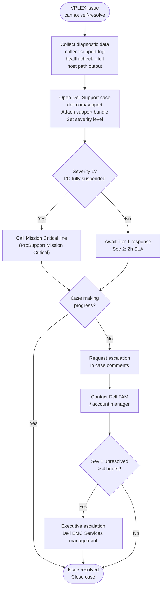

---
tags:
  - dell
  - troubleshooting
---
# Dell VPLEX — Escalation


<div class="kb-summary">
Vendor escalation procedures, support contacts, and information requirements for Dell VPLEX support cases.
</div>
```text
┌─────────────────────────────────────── Dell VPLEX — Escalation ───────────────────────────────────────┐
│                                                                                                       │
│   ┌───────────────────────────────────────────────────────────────────────────────────────────────┐   │
│   │       VPLEX escalation: severity triage, vendor support contact, and required artifacts       │   │
│   │         L1: basic checks, restart services; L2: log analysis, config review, vendor SR        │   │
│   │        Severity: P1 production down → immediate SR + on-call page; P2/P3 business hours       │   │
│   │         Before escalating: collect support bundle, event timeline, and change history         │   │
│   └───────────────────────────────────────────────────────────────────────────────────────────────┘   │
│                                                                                                       │
│    Detect issue → triage severity → collect artifacts → open SR → update                              │
│                                                                                                       │
│                  ▼                                ▼                                ▼                  │
│                                                                                                       │
│   ┌─────────────────────────────┐  ┌─────────────────────────────┐  ┌─────────────────────────────┐   │
│   │            Layer            │  │          Component          │  │            Notes            │   │
│   │        Virtualisation       │  │         Backend LUNs        │  │      Abstracted to VVs      │   │
│   │            Metro            │  │         Sync stretch        │  │        <5ms RTT sites       │   │
│   │             Geo             │  │      Async replication      │  │         Any distance        │   │
│   │          Clustering         │  │        Active-active        │  │       Shared namespace      │   │
│   │            Quorum           │  │          Witness VM         │  │      Split-brain guard      │   │
│   └─────────────────────────────┘  └─────────────────────────────┘  └─────────────────────────────┘   │
│                                                                                                       │
│                          ▼                                                 ▼                          │
│                                                                                                       │
│   ┌───────────────────────────────────────────────────────────────────────────────────────────────┐   │
│   │     Severity     │     Criteria     │   Response time   │      Owner       │    Vendor SLA    │   │
│   │        P1        │ Production down  │     Immediate     │   On-call + L2   │    1 hr 24x7     │   │
│   │        P2        │  Major degraded  │       1 hour      │   L2 engineer    │   4 hr biz hrs   │   │
│   │        P3        │  Minor degraded  │      4 hours      │   L2 engineer    │   8 hr biz hrs   │   │
│   │        P4        │    No impact     │    Next biz day   │    L1 support    │    2 biz days    │   │
│   └───────────────────────────────────────────────────────────────────────────────────────────────┘   │
│                                                                                                       │
│    Physical: VPLEX VS2/VS6 appliance · FC fabric · backend arrays · WAN link (Metro/Geo)              │
│                                                                                                       │
│    Key terms:                                                                                         │
│                                                                                                       │
│    VPLEX              = Dell storage federation; aggregates arrays into virtual volumes across vendors│
│    Virtual volume     = VPLEX-abstracted LUN presented to hosts; backend is array LUNs                │
│    VPLEX Metro        = synchronous active-active stretch cluster; same VV served from two sites      │
│    VPLEX Geo          = asynchronous active-active replication; higher RPO, no distance constraint    │
│    Distributed VV     = virtual volume spanning two sites for Metro active-active host access         │
│    Witness            = third-site quorum arbiter for Metro; prevents split-brain island scenarios    │
│    WAN-COM            = WAN communication module in VPLEX Geo; manages inter-site replication traffic │
│    Management Server  = embedded Linux VM in VPLEX engine; serves web UI and vplex CLI                │
│    Consistency group  = set of virtual volumes that failover together maintaining write order         │
│    Backend volume     = LUN from underlying array presented to VPLEX engine for virtualisation        │
│    Local device       = RAID device or extent of backend volumes on a single VPLEX cluster            │
│    Cluster            = single VPLEX installation; Metro topology requires exactly two clusters       │
│                                                                                                       │
└───────────────────────────────────────────────────────────────────────────────────────────────────────┘
```


## Before you begin

- **Access:** Storage admin credentials (cluster admin or equivalent)
- **Gather first:** recent error message text, event timestamps, and affected object names
- **Scope:** confirm whether the issue affects a single object, host, cluster, or site
- **Escalation:** open a vendor support ticket before running any destructive step
- **Logging:** document each command and output — required if escalation is needed

---

## Support Portal

Dell EMC Support: [https://www.dell.com/support](https://www.dell.com/support)

- Log in with a MyDell account linked to your ProSupport contract
- Navigate to **Cases** to open a new case or view existing cases
- Navigate to **Contracts & Warranties** to verify VPLEX support entitlement before opening a case
- VPLEX serial numbers can be found via `vplexcli -q -e "ll /engines/engine-1-1/"` — include the serial number when opening the case

## Opening a Case

1. Confirm the VPLEX system is registered under your ProSupport contract in the Dell Support portal.
2. Collect all diagnostic information listed in [Diagnostics](../diagnostics/index.md) before opening the case.
3. Go to [https://www.dell.com/support](https://www.dell.com/support) → **Contact Support** → **Create Service Request**.
4. Select product: **Dell EMC VPLEX**.
5. Enter the system serial number from `ll /engines/engine-1-1/`.
6. Set severity level (see table below).
7. In the case description, include:
   - Clear description of the symptom and business impact
   - When the issue started (UTC timestamp)
   - Any changes made within the 72 hours before the issue started
   - GeoSynchrony version: `ll /clusters/cluster-1/system-volumes/version/`
   - Full health check output: `health-check --full`
8. Attach the support bundle to the case immediately after creation.
9. Record the case number and share with the on-call team.

## Severity Levels

| Severity | Criteria | Initial Response Target | Update Cadence |
|---|---|---|---|
| Severity 1 | Production I/O fully suspended; all hosts unable to access VPLEX volumes; active data loss risk | 30 minutes | Every 2 hours until resolved |
| Severity 2 | System degraded but I/O continuing: director down, distributed device out-of-sync, Witness unreachable | 2 hours | Every 4 hours |
| Severity 3 | Non-critical functional issue; single non-production volume affected; minor warning in health-check | Next business day | As updated |
| Severity 4 | General question; planning request; low-impact cosmetic issue | 2 business days | As updated |

Response times are governed by the specific ProSupport contract tier. ProSupport Mission Critical provides faster response than standard ProSupport Plus. Verify your entitlement in the Support portal before assuming SLA times.

## Diagnostic Information to Provide

Attach these before or immediately after case creation. Dell Support will ask for all of them; providing upfront reduces time-to-resolution.

| Item | How to Collect |
|---|---|
| Support bundle | `collect-support-log -f /var/log/support_bundle.tar.gz` from vplexcli |
| GeoSynchrony version | `vplexcli -q -e "ll /clusters/cluster-1/system-volumes/version/"` |
| Full health check output | `vplexcli -q -e "health-check --full"` |
| Cluster health indications | `vplexcli -q -e "ll /clusters/*/health-indications/"` |
| Distributed device health | `vplexcli -q -e "ll /distributed-storage/distributed-devices/*/health-indications/"` |
| Director hardware health | `vplexcli -q -e "ll /engines/*/directors/*/hardware/"` |
| Witness status | `vplexcli -q -e "ll /clusters/*/cluster-witness/"` |
| Consistency group state | `vplexcli -q -e "ll /distributed-storage/consistency-groups/"` |
| ICL status | `vplexcli -q -e "ll /clusters/*/communication/inter-cluster-links/"` |
| Host path output | `powermt display dev=all` or `multipath -ll` from affected hosts |
| VMS management log excerpt | `tail -500 /var/log/VPlex/vplexmanagement.log` from VMS |
| Timeline of events | List: when issue was first observed; what changed in the preceding 72h |

## Escalation Path

Use this path when a case is not progressing at the expected pace.



### Step 1 — Case Update Request

Add a detailed comment to the open case requesting escalation. Include:
- Time elapsed since case opening
- Current case status and last update
- Business impact (hosts affected, applications down, revenue impact if applicable)
- Specific technical question that is blocking resolution

### Step 2 — Account Team Escalation

If the case has not been responded to within the SLA window or is making insufficient progress:

1. Contact your Dell account manager or Technical Account Manager (TAM) by phone and email.
2. Provide the case number and a summary of the business impact.
3. Request the account team engage Dell EMC Services management.

### Step 3 — Mission Critical Escalation

If you have a ProSupport Mission Critical contract:

1. Call the Mission Critical support line (on your contract documentation) — this bypasses standard queuing and connects directly to a senior engineer.
2. Reference the existing case number.
3. Mission Critical provides 24/7 access to senior engineers for Severity 1 issues and can dispatch on-site support.

### Step 4 — Executive Escalation

For Severity 1 cases lasting beyond 4 hours without meaningful progress:

1. Contact your Dell sales representative and request executive escalation.
2. Escalation goes to Dell EMC Services management who can redirect resources directly.
3. Document all escalation actions and timestamps in the case.

## What Dell Support Will Typically Ask

Prepare answers to these questions before the first support call:

| Question | Where to Find the Answer |
|---|---|
| What is the GeoSynchrony version? | `ll /clusters/cluster-1/system-volumes/version/` |
| What is the system serial number? | `ll /engines/engine-1-1/` |
| When did the issue start? | VMS management log; host I/O monitoring timestamps |
| What changed in the 72 hours before the issue? | Change management records; vplexcli log |
| Is this VPLEX Local, Metro, or Geo? | Known from deployment documentation |
| Is the VMS accessible? | SSH to VMS: `ssh service@<VMS_IP>` |
| Can you collect a support bundle? | `collect-support-log -f /var/log/support_bundle.tar.gz` |
| What is the current Witness state? | `ll /clusters/*/cluster-witness/` |
| What is the ICL state? | `ll /clusters/*/communication/inter-cluster-links/` |
| What is host-side path visibility? | `powermt display dev=all` or `multipath -ll` |

## Contacting Dell for Parts / Hardware Replacement

For director hardware replacement (physical dispatch):

1. Open a support case at Severity 2 (degraded system).
2. Confirm the defective component from `ll /engines/*/directors/*/hardware/`.
3. Dell Support will confirm the part number and dispatch a field service engineer (FSE) or ship the part depending on your support contract (on-site vs. parts-only).
4. Do not remove or reseat the faulted director until Dell Support confirms the correct procedure — incorrect handling may impact the surviving director's cache state.
5. Record the replacement part serial numbers and update the hardware inventory in the CMDB after the repair.
