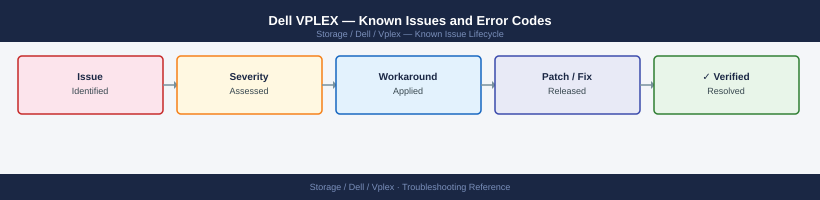

---
tags:
  - troubleshooting
  - vplex
  - dell
  - known-issues
---
# Dell VPLEX — Known Issues and Error Codes

<div class="kb-summary">
Catalog of known VPLEX bugs, error codes, and workarounds covering Metro clustering, WAN COM, and host connectivity.

*Applies to: VPLEX GeoSynchrony 6.x*
</div>



```d2
direction: down

symptom: Identify Symptom {shape: diamond}
metro_cluster: "Metro Cluster" {shape: rectangle}
wan_com: "WAN COM" {shape: rectangle}
host_connectivity: "Host Connectivity" {shape: rectangle}
resolution: Resolve or Escalate {shape: oval}

symptom -> metro_cluster: investigate
symptom -> wan_com: investigate
symptom -> host_connectivity: investigate
metro_cluster -> resolution
wan_com -> resolution
host_connectivity -> resolution
```

## Before you begin

- VPLEX errors appear in the VPLEX Management Console → Alerts.
- `vplexcli` on each engine for CLI diagnostics.
- Metro cluster health: `cluster witness show` — witness must be reachable for Metro split-brain protection.

## Metro Cluster

| Error / Symptom | Affected Versions | Cause | Workaround / Fix | Fixed In |
|---|---|---|---|---|
| `Cluster witness unreachable` alarm | GeoSynchrony 6.x | TCP 443 blocked between witness and both VPLEX engines | Verify witness connectivity; witness is critical for Metro split-brain arbitration | N/A |
| VPLEX Metro splits to single-site after network partition | GeoSynchrony 6.x | WAN COM link lost AND witness unreachable — VPLEX suspends IO on losing site | Restore WAN COM (TCP 443 between engines); restore witness connectivity | N/A |
| I/O suspended on surviving site after split | GeoSynchrony 6.x | Expected protection behavior when arbitration fails | Manually designate winner: `cluster witness force-winner` (requires careful DR process) | N/A |

## WAN COM

| Error / Symptom | Affected Versions | Cause | Workaround / Fix | Fixed In |
|---|---|---|---|---|
| `WAN COM link degraded` | GeoSynchrony 6.x | WAN latency too high (>5ms RTT) or packet loss | Check WAN link quality; VPLEX Metro requires ≤5ms RTT | N/A |

## Host Connectivity

| Error / Symptom | Affected Versions | Cause | Workaround / Fix | Fixed In |
|---|---|---|---|---|
| Host sees duplicate devices after VPLEX zone change | GeoSynchrony 6.x | Old Fibre Channel zone still active in SAN fabric | Remove old FC zone; rescan host HBA | N/A |

## See also

- [Dell VPLEX — Common Issues](common-issues/)
- [Dell RecoverPoint — Known Issues](../../recoverpoint/troubleshooting/known-issues.md)
