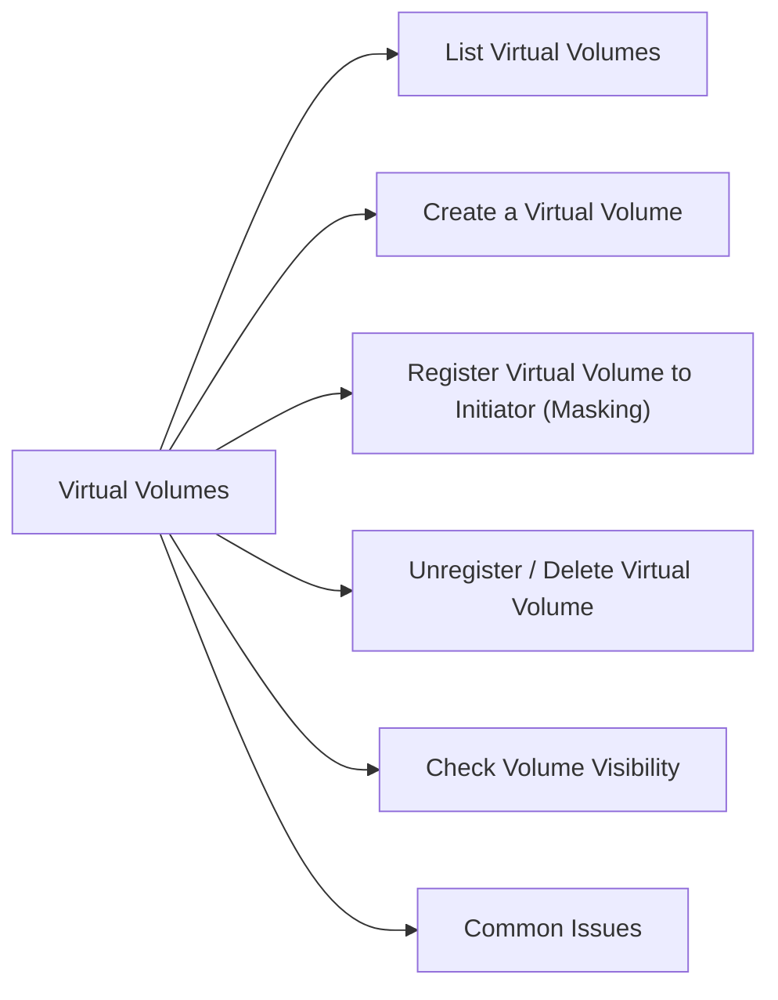

# VPLEX Virtual Volumes

Virtual volumes are the logical storage objects presented to hosts via VPLEX. They are built on top of storage volumes from back-end arrays.



## List Virtual Volumes

```bash
VPlexcli:/> ll /clusters/cluster-1/virtual-volumes/

# Detailed view of a specific volume
VPlexcli:/> ll /clusters/cluster-1/virtual-volumes/<vol_name>/
```

Key attributes:
- `operational-status` — should be `ok`
- `capacity` — size of the volume
- `supporting-device` — the underlying storage device
- `visibility` — which initiators/hosts can see this volume

## Create a Virtual Volume

```bash
# First, claim the back-end storage volume as an extent
VPlexcli:/> storage-volume claim \
    --storage-volume /clusters/cluster-1/storage-elements/storage-volumes/<sv_name>

# Create a device from the extent
VPlexcli:/> device create \
    --device-name <device_name> \
    --extent /clusters/cluster-1/storage-elements/extents/<extent_name>

# Create the virtual volume
VPlexcli:/> virtual-volume create \
    --volume-name <vol_name> \
    --device /clusters/cluster-1/devices/<device_name>
```

## Register Virtual Volume to Initiator (Masking)

```bash
VPlexcli:/> initiator-port register \
    --port-wwn <host_wwn> \
    --cluster cluster-1

VPlexcli:/> storage-view create \
    --name <view_name> \
    --cluster cluster-1

VPlexcli:/> storage-view add-initiator-port \
    --storage-view /clusters/cluster-1/exports/storage-views/<view_name> \
    --port-wwn <host_wwn>

VPlexcli:/> storage-view add-virtual-volume \
    --storage-view /clusters/cluster-1/exports/storage-views/<view_name> \
    --virtual-volume /clusters/cluster-1/virtual-volumes/<vol_name>
```

## Unregister / Delete Virtual Volume

```bash
# Remove from storage view first
VPlexcli:/> storage-view remove-virtual-volume \
    --storage-view /clusters/cluster-1/exports/storage-views/<view_name> \
    --virtual-volume /clusters/cluster-1/virtual-volumes/<vol_name>

# Destroy the virtual volume
VPlexcli:/> virtual-volume destroy \
    --virtual-volume /clusters/cluster-1/virtual-volumes/<vol_name>
```

## Check Volume Visibility

```bash
VPlexcli:/> ll /clusters/cluster-1/exports/storage-views/
VPlexcli:/> ll /clusters/cluster-1/exports/storage-views/<view_name>/
```

## Common Issues

| Issue | Check | Action |
|---|---|---|
| Volume not visible to host | Storage view membership | Add volume to storage view |
| Operational-status not ok | Back-end storage issue | Check supporting device |
| Volume missing after reboot | Host rescan needed | Rescan HBAs on host |
