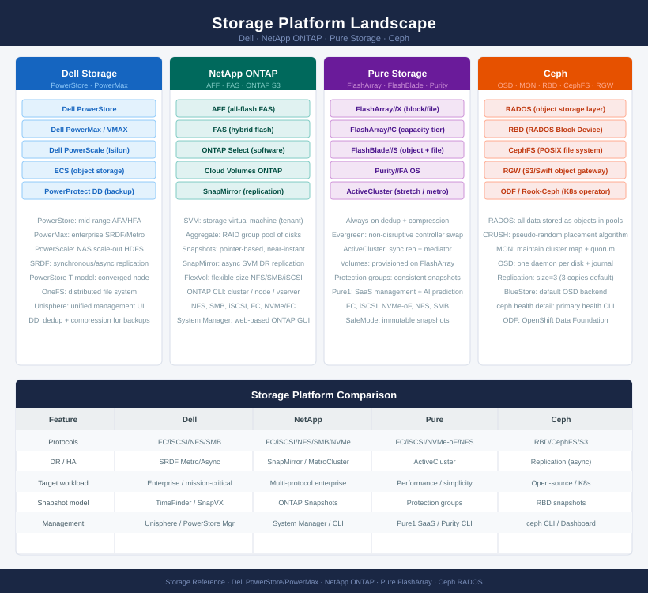
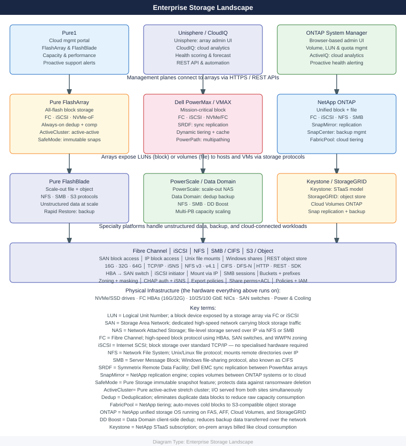

# Storage

Block, file, and object storage platforms used across enterprise infrastructure — Dell PowerMax, PowerScale, PowerStore, Unity, VPLEX, Data Domain, and ECS; Pure Storage FlashArray and FlashBlade; NetApp ONTAP; and Ceph distributed storage. Coverage includes architecture, configuration, performance tuning, multipathing, and troubleshooting.

<a class="kb-card" href="dell/">
  <strong>Dell Storage</strong>
  PowerMax, PowerScale, ECS, Data Domain, Unity, VPLEX, and PowerPath.
</a>

<a class="kb-card" href="pure/">
  <strong>Pure Storage</strong>
  FlashArray, FlashBlade, Evergreen, and Evergreen One.
</a>

<a class="kb-card" href="netapp/">
  <strong>NetApp Storage</strong>
  ONTAP, SnapMirror, SnapCenter, and Keystone.
</a>

<a class="kb-card" href="ceph/">
  <strong>Ceph</strong>
  Open-source distributed storage — RBD block, CephFS file, and RGW object via RADOS.
</a>

<a class="kb-card" href="storage-design/"><strong>Storage Design</strong>Storage architecture design — tiering, sizing, replication topology, and design decision reference.</a>
<a class="kb-card" href="runbooks/"><strong>Runbooks</strong>Cross-platform storage runbooks — volume expansion, LUN provisioning, replication failover, and capacity management.</a>
<a class="kb-card" href="troubleshooting/"><strong>Troubleshooting</strong>Cross-platform storage diagnostics — path failures, capacity alerts, and escalation.</a>

