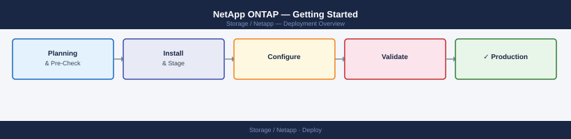
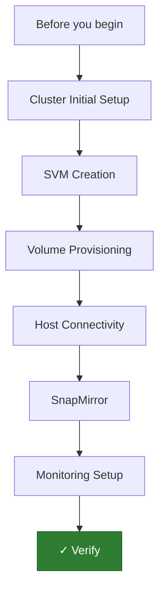

---
tags:
  - deployment
  - netapp
search:
  boost: 1.5
---
# NetApp ONTAP — Getting Started

<div class="kb-summary">
NetApp ONTAP cluster initial setup: first boot through validated host connectivity and replication — covers AFF A-series, C-series, and FAS platforms.

*Applies to: ONTAP 9.12+*
</div>



This guide covers the initial setup of a NetApp ONTAP cluster from first boot through validated host connectivity and replication. Applies to AFF A-series, C-series, and FAS platforms running ONTAP 9.12 and later.

---




```d2
direction: right

plan: "Plan" {shape: oval}
cluster_initial_setup: "Cluster Initial Setup" {shape: rectangle}
svm_creation: "SVM Creation" {shape: rectangle}
volume_provisioning: "Volume Provisioning" {shape: rectangle}
host_connectivity: "Host Connectivity" {shape: rectangle}
snapmirror: "SnapMirror" {shape: rectangle}
monitoring_setup: "Monitoring Setup" {shape: rectangle}
validate: "Validate" {shape: oval}

plan -> cluster_initial_setup
cluster_initial_setup -> svm_creation
svm_creation -> volume_provisioning
volume_provisioning -> host_connectivity
host_connectivity -> snapmirror
snapmirror -> monitoring_setup
monitoring_setup -> validate
```

## Before you begin

<!-- video-link -->
!!! tip "Video Walkthrough"
    [:fontawesome-brands-youtube: NetApp ONTAP 9 Complete Training Course](https://www.youtube.com/watch?v=VE9dqRiGX2o){ .md-button }
<!-- /video-link -->

- **Access:** Storage admin credentials (cluster admin or equivalent)
- **Environment:** DNS, NTP, and network connectivity verified before starting
- **Change management:** change request approved; maintenance window scheduled
- **Rollback:** snapshot or backup taken immediately before deployment begins
- **Time estimate:** 30–90 minutes — do not start if less than 2 hours are available

---

## Cluster Initial Setup

ONTAP cluster setup is performed through the System Manager wizard (browser-based) or the ONTAP CLI setup script (`cluster setup`).

**Initial boot and console access:**

1. Power on the first node (the cluster creates when this node runs setup). Connect to the node via serial console (9600 baud, 8N1) or iDRAC/BMC serial-over-LAN.
2. Log in as `admin` with no password on first boot — ONTAP prompts you to run setup.
3. Launch the setup wizard:

```text
cluster setup
```

4. When prompted, select **Create a new cluster**.
5. Provide:
   - Cluster name (e.g., `ontap-prod-01`)
   - Cluster management IP address, subnet mask, gateway
   - DNS domain and DNS server IPs
   - NTP servers (at least two)
   - Admin password

**Add remaining nodes:**

After the first node completes setup, each additional node joins the cluster:

1. On each additional node's console, run `cluster setup`.
2. Select **Join an existing cluster**.
3. Enter the cluster management IP and admin credentials.
4. Wait for the node to join and ONTAP to begin aggregate discovery.

**Verify cluster formation:**

```bash
cluster show
# All nodes should show Health: true, Eligibility: true

node show
# Each node should show Status: online
```

**Create a cluster-wide service policy for management traffic (if using separated management VLANs):**

```bash
network interface create -vserver <cluster_name> -lif cluster_mgmt -role cluster-mgmt -home-node <node_name> -home-port e0M -address <ip> -netmask <mask>
network route create -vserver <cluster_name> -destination 0.0.0.0/0 -gateway <gw>
```

---

## SVM Creation

A Storage Virtual Machine (SVM) is the logical container for volumes, LIFs, and protocol access. Each workload (NFS, iSCSI, SMB) typically has its own SVM.

**Create an NFS SVM:**

```bash
vserver create -vserver svm_nfs01 -rootvolume root_nfs01 -rootvolume-security-style unix -language C.UTF-8 -snapshot-policy default

# Add NFS protocol
vserver nfs create -vserver svm_nfs01 -v3 enabled -v4.1 enabled

# Create a data LIF for NFS access
network interface create -vserver svm_nfs01 -lif nfs_lif01 -role data -data-protocol nfs -home-node <node_name> -home-port e0d -address 192.168.10.50 -netmask 255.255.255.0

# Create a default route for the SVM
network route create -vserver svm_nfs01 -destination 0.0.0.0/0 -gateway 192.168.10.1
```

**Create an iSCSI SVM:**

```bash
vserver create -vserver svm_iscsi01 -rootvolume root_iscsi01 -rootvolume-security-style unix

# Enable iSCSI
vserver iscsi create -vserver svm_iscsi01
vserver iscsi show -vserver svm_iscsi01
# Note the iSCSI IQN for this SVM

# Create iSCSI data LIFs (one per node, per fabric)
network interface create -vserver svm_iscsi01 -lif iscsi_lif01 -role data -data-protocol iscsi -home-node <node1> -home-port e0e -address 10.0.10.50 -netmask 255.255.255.0
network interface create -vserver svm_iscsi01 -lif iscsi_lif02 -role data -data-protocol iscsi -home-node <node2> -home-port e0e -address 10.0.10.51 -netmask 255.255.255.0
```

---

## Volume Provisioning

ONTAP volumes are thin-provisioned by default and reside inside aggregates (physical disk groups managed by ONTAP).

**Verify aggregate availability:**

```bash
aggr show
# Aggrs on each node should show Available space > 0
```

**Create an NFS volume:**

```bash
volume create -vserver svm_nfs01 -volume vol_nfs_data01 -aggregate aggr1_node1 -size 1TB -junction-path /nfs_data01 -security-style unix -snapshot-policy default

# Export the volume via NFS policy
export-policy rule create -vserver svm_nfs01 -policyname default -clientmatch 192.168.10.0/24 -rorule sys -rwrule sys -superuser sys
```

**Create an iSCSI LUN:**

```bash
# Create the containing volume
volume create -vserver svm_iscsi01 -volume vol_lun_sql01 -aggregate aggr1_node1 -size 500GB

# Create the LUN within the volume
lun create -vserver svm_iscsi01 -path /vol/vol_lun_sql01/lun_sql01_data -size 400GB -ostype linux
```

**Verify volumes:**

```bash
volume show -vserver svm_nfs01
volume show -vserver svm_iscsi01
```

---

## Host Connectivity

**NFS mount from Linux host:**

```bash
mount -t nfs -o vers=3,rw 192.168.10.50:/nfs_data01 /mnt/ontap_nfs
df -h /mnt/ontap_nfs
```

**iSCSI initiator setup (Linux):**

1. Install and start the iSCSI initiator:

```bash
yum install -y iscsi-initiator-utils
systemctl enable --now iscsid
```

2. Discover ONTAP iSCSI targets:

```bash
iscsiadm -m discovery -t st -p 10.0.10.50
```

3. Log in to all discovered targets:

```bash
iscsiadm -m node -L all
```

4. Install and configure multipath:

```bash
yum install -y device-mapper-multipath
mpathconf --enable --with_multipathd y
multipath -ll
```

**Map the LUN to the host:**

```bash
# Create an igroup (initiator group) with the host's IQN
igroup create -vserver svm_iscsi01 -igroup igrp_linux01 -protocol iscsi -ostype linux -initiator iqn.1994-05.com.redhat:host01

# Map the LUN to the igroup
lun map -vserver svm_iscsi01 -path /vol/vol_lun_sql01/lun_sql01_data -igroup igrp_linux01 -lun-id 0

# Rescan on the host
rescan-scsi-bus.sh
multipath -ll
```

---

## SnapMirror

SnapMirror replicates volumes to a remote ONTAP cluster for DR or backup. This section covers the initial configuration; for a full setup guide see the SnapMirror deployment page.

**Prerequisites for SnapMirror:**

- Intercluster LIFs configured on both source and destination clusters
- Cluster peering established
- SVM peering established

**Configure intercluster LIFs:**

```bash
network interface create -vserver <cluster_name> -lif ic_lif01 -role intercluster -home-node <node1> -home-port e0f -address 10.0.20.50 -netmask 255.255.255.0
network interface create -vserver <cluster_name> -lif ic_lif02 -role intercluster -home-node <node2> -home-port e0f -address 10.0.20.51 -netmask 255.255.255.0
```

**Peer the clusters (run from source):**

```bash
cluster peer create -peer-addrs 10.0.20.60,10.0.20.61
# Enter the passphrase set on the destination cluster
```

**Create a SnapMirror relationship:**

```bash
snapmirror create -source-path svm_nfs01:vol_nfs_data01 -destination-path svm_dr01:vol_nfs_dr01 -type DP -schedule hourly
snapmirror initialize -destination-path svm_dr01:vol_nfs_dr01
```

Monitor the initial baseline transfer:

```bash
snapmirror show -destination-path svm_dr01:vol_nfs_dr01
```

---

## Monitoring Setup

**Configure SNMP for monitoring integration:**

```bash
snmp init 1
system snmp community add -community-name public -type ro
system snmp traphost add -peer-address <snmp_manager_ip>
```

**Configure SMTP alerts:**

1. In System Manager, navigate to **Cluster > Settings > Notifications**.
2. Set the SMTP server address and destination email.
3. Test the email notification by triggering a test event:

```bash
event notification create -filter-name important-events -destinations snmp-traphost
system health alert show
```

**Enable Active IQ integration (Call Home):**

```bash
system node autosupport modify -node * -state enable -transport https -support enable -to admin@example.com
autosupport invoke -node * -type test
```

Verify the test AutoSupport was received by NetApp Active IQ (check the Active IQ portal for the array).

---

## Verify

- **Cluster health:** all nodes show online in the management UI
- **Volume access:** mount a test LUN/NFS export from a host and confirm read/write
- **Replication:** confirm replication partner shows last-sync within RPO window

## See also

- [Insightiq](../insightiq/)
- [Keystone](../keystone/)
- [Ontap](../ontap/)
- [Operations](../operations/)
- [Snapcenter](../snapcenter/)
- [Snapmirror](../snapmirror/)
- [Superna Eyeglass](../superna-eyeglass/)
- [NetApp — Overview](../)
