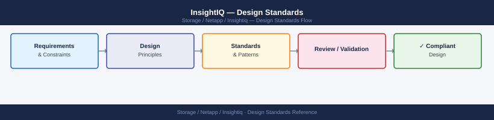

---
tags:
  - architecture
  - netapp
---
# InsightIQ — Design Standards

<div class="kb-summary">
VM sizing, data retention policy, network access requirements, naming conventions, and configuration baselines for InsightIQ deployments.

*Applies to: InsightIQ*
</div>



```d2
direction: right

center: "InsightIQ" {shape: hexagon}
vm_sizing: "VM Sizing" {shape: rectangle}
retention_policy: "Retention Policy" {shape: rectangle}
naming_conventions: "Naming Conventions" {shape: rectangle}
network_requirements: "Network Requirements" {shape: rectangle}
configuration_checklist: "Configuration Checklist" {shape: rectangle}

center -> vm_sizing
center -> retention_policy
center -> naming_conventions
center -> network_requirements
center -> configuration_checklist
```

## VM Sizing

| Parameter | Minimum | Recommended (production) |
|---|---|---|
| vCPU | 4 | 8 |
| RAM | 8 GB | 16 GB |
| OS disk | 100 GB | 100 GB |
| Data disk | 500 GB | 1–2 TB (per retention requirements) |

Data disk sizing: approximately 10 GB per monitored node per month of retention. A 4-node cluster at 12-month retention requires ~480 GB.

## Retention Policy

| Data Granularity | Default Retention | Recommended |
|---|---|---|
| 5-second samples | 14 days | 14 days |
| 30-second rollup | 3 months | 6 months |
| 5-minute rollup | 12 months | 24 months |

- Do not extend fine-grained retention beyond 30 days — disk growth is significant
- Increase 5-minute rollup retention for capacity trending purposes

## Naming Conventions

| Object | Convention | Example |
|---|---|---|
| InsightIQ VM | `insightiq-{site}-{seq}` | `insightiq-dc1-01` |
| Monitored cluster display name | Match OneFS cluster name exactly | `ps-cluster-prod-01` |

## Network Requirements

| Source | Destination | Protocol | Port | Purpose |
|---|---|---|---|---|
| InsightIQ VM | PowerScale mgmt IP | HTTPS | 8080 | OneFS REST API (data collection) |
| InsightIQ VM | PowerScale mgmt IP | HTTPS | 443 | OneFS REST API (newer OneFS versions) |
| Admin workstation | InsightIQ VM | HTTPS | 443 | Web dashboard access |
| InsightIQ VM | SMTP relay | SMTP | 25 / 587 | Alert email delivery |

## Configuration Checklist

- [ ] InsightIQ OVA deployed on management cluster
- [ ] Static IP assigned; hostname resolves in DNS
- [ ] Service account created on each PowerScale cluster (read-only, audit role)
- [ ] Each PowerScale cluster added to InsightIQ with service account credentials
- [ ] Data collection status green for all clusters
- [ ] Retention policy configured per standards above
- [ ] Email notification configured for capacity threshold alerts
- [ ] Backup: VM snapshot or file-level backup of data disk, daily

---

## See also

- [Insightiq — How It Works](how-it-works/)
- [Insightiq — Integrations](integrations/)
- [Insightiq — Deploy](../deploy/)
