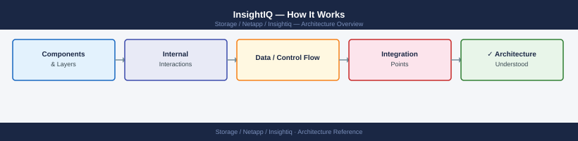
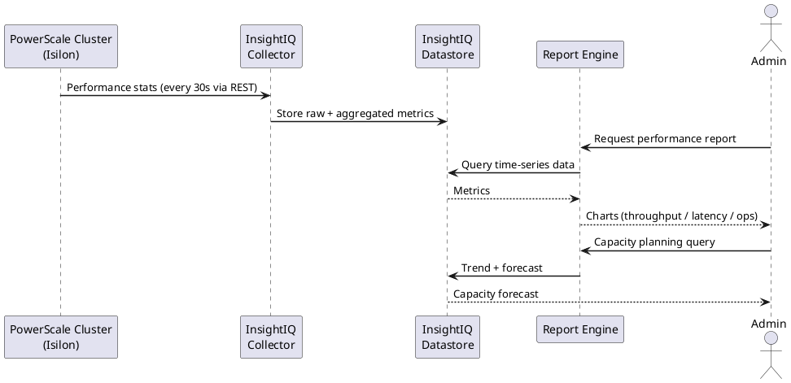

---
tags:
  - architecture
  - netapp
---
# InsightIQ — How It Works

How It Works reference covering Deployment Architecture, Component Roles, Data Collection, Storage and Retention, Sizing Guidelines and 3 more sections.

*Applies to: InsightIQ*

InsightIQ is Dell EMC's performance analytics platform for NetApp PowerScale (Isilon) clusters, deployed as an on-premises virtual appliance. It collects, stores, and presents historical performance data for capacity planning, protocol analysis, and workload trending. A single InsightIQ instance can monitor multiple PowerScale clusters.

---

## Deployment Architecture

```mermaid
graph LR
    Clusters["PowerScale Clusters<br/>OneFS management IP<br/>SmartConnect zones<br/>PAPI REST API"]
    InsightIQ["InsightIQ Appliance<br/>OVA on mgmt cluster<br/>collection engine<br/>TCP 8080 poll"]
    PostgreSQL["PostgreSQL Database<br/>local on-appliance<br/>30-sec raw samples<br/>5-min rollup buckets"]
    WebUI["Web Dashboard<br/>HTTP/HTTPS<br/>pre-built + custom views<br/>time-range queries"]
    Reports["Reports + Alerts<br/>PDF / CSV export<br/>email threshold alerts<br/>SMTP relay"]

    Clusters -->|"HTTPS REST API TCP 8080 every 30 sec"| InsightIQ
    InsightIQ -->|"stores metrics"| PostgreSQL
    PostgreSQL -->|"on-demand queries"| WebUI
    WebUI -->|"scheduled reports"| Reports
    InsightIQ -->|"threshold breach"| Reports

    style Clusters fill:#2563eb,stroke:#1d4ed8,color:#fff
    style InsightIQ fill:#7c3aed,stroke:#6d28d9,color:#fff
    style PostgreSQL fill:#b45309,stroke:#92400e,color:#fff
    style WebUI fill:#15803d,stroke:#166534,color:#fff
    style Reports fill:#15803d,stroke:#166534,color:#fff
```

---

## Component Roles

| Component | Details |
|---|---|
| Deployment | OVA (VMware) or Linux installer on dedicated VM |
| Database | PostgreSQL (local to appliance — stores all collected metrics) |
| Data Collection | OneFS InsightIQ data connector (REST API pull from cluster management IP) |
| Presentation | Web dashboard (HTTP/HTTPS) |
| Multi-cluster | Yes — multiple clusters per instance; no per-cluster licensing constraints |

---

## Data Collection

- **Collection interval**: configurable; default is 30-second samples aggregated to 5-minute buckets
- **Protocol**: HTTPS REST API to OneFS management IP (port 8080)
- **Metrics collected**: total throughput, per-protocol throughput (NFS/SMB/HTTP), CPU utilisation, disk I/O, node-level metrics, client IP activity
- **Authentication**: dedicated read-only OneFS service account (`svc-insightiq`)

---

## Storage and Retention

InsightIQ stores all metrics in a local PostgreSQL database. Retention period is configured per cluster connection.

| Retention Period | Estimated Disk Usage (5 nodes) |
|---|---|
| 30 days | ~20 GB |
| 90 days (standard) | ~60 GB |
| 180 days | ~120 GB |
| 365 days | ~240 GB |

Standard retention policy: **90 days high-resolution**. Extending retention requires additional disk capacity on the InsightIQ VM.

---

## Sizing Guidelines

| Parameter | Minimum | Recommended |
|---|---|---|
| vCPU | 2 | 4 |
| RAM | 4 GB | 8 GB |
| Disk (OS + application) | 40 GB | 80 GB |
| Disk (data volume) | 200 GB / 5 clusters | 400 GB / 5 clusters |

Allocate a separate VMDK for the PostgreSQL data directory to simplify capacity management.

---

## Network Requirements

| Source | Destination | Port | Purpose |
|---|---|---|---|
| InsightIQ appliance | OneFS cluster management IP | TCP 8080 | Performance data collection |
| Browser | InsightIQ appliance | TCP 80 / 443 | Web dashboard access |
| InsightIQ appliance | SMTP relay | TCP 25 / 587 | Alert email delivery |
| InsightIQ appliance | Syslog / SIEM | UDP/TCP 514 | Appliance event forwarding |

---

## High Availability

InsightIQ does not have native HA. Protect the appliance with:

- Regular `pg_dump` database backups (automated daily cron job)
- VM-level snapshots before upgrades
- VM backup via vCenter backup agent to DR location

---

## Supported OneFS Versions

InsightIQ version compatibility with OneFS must be validated using the NetApp Interoperability Matrix Tool (IMT) before any OneFS upgrade. For OneFS 9.5+, consider whether native OneFS performance views may supplement InsightIQ for simpler use cases.

---

## See also

- [Insightiq — Design Standards](../design-standards/)
- [Insightiq — Integrations](../integrations/)
- [Insightiq — Deploy](../../deploy/)
