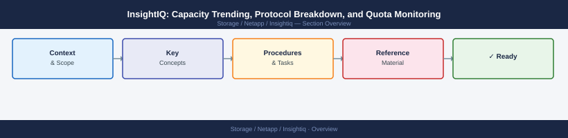

---
tags:
  - netapp
---
# InsightIQ: Capacity Trending, Protocol Breakdown, and Quota Monitoring


<div class="kb-summary">
InsightIQ: Capacity Trending, Protocol Breakdown, and Quota Monitoring reference covering Protocol-Level Capacity Breakdown, Quota Monitoring, Common Capacity Issues.

*Applies to: InsightIQ*
</div>



Quota types in OneFS:

| Quota Type | Enforcement | Use Case |
|---|---|---|
| Hard Quota | Blocks writes when exceeded | Strict per-department limits |
| Soft Quota | Alerts but does not block | Advisory warnings |
| Advisory Quota | Reporting only | Visibility into usage trends |

```d2
direction: right

center: "InsightIQ" {shape: hexagon}
common_capacity_issues: "Common Capacity Issues" {shape: rectangle}

center -> common_capacity_issues
```

## Common Capacity Issues

| Issue | Likely Cause | Fix |
|---|---|---|
| Capacity trending shows sudden jump | Large file ingest or restore | Correlate with job logs; check `/ifs/data` growth |
| InsightIQ data missing for date range | Collector was offline | Check InsightIQ appliance uptime and data collection logs |
| Quota reports not updating | Quota scanner job not running | Run `isi job jobs start QuotaScan` on PowerScale |
| Used capacity exceeds total | Snapshot space not accounted | Include snapshot usage in capacity calculations |
| Protocol breakdown unavailable | InsightIQ version does not support | Upgrade InsightIQ to v4.1+ for per-protocol views |
