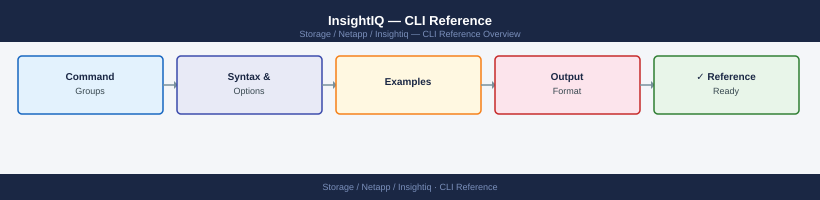

---
tags:
  - netapp
---
# InsightIQ — CLI Reference



```bash
# SSH to the InsightIQ appliance
ssh administrator@<insightiq_fqdn>

# Check InsightIQ service status
sudo service insightiq status

# Restart InsightIQ service
sudo service insightiq restart

# View logs
tail -f /var/log/insightiq/insightiq.log

# Check disk space (InsightIQ database can grow large)
df -h /home/insightiq
```

```bash
# Get capacity summary for a cluster
curl -k -u "admin:<pass>"   "https://<insightiq_fqdn>/api/json/v2/clusters/<guid>/capacity"

# Get per-node capacity
curl -k -u "admin:<pass>"   "https://<insightiq_fqdn>/api/json/v2/clusters/<guid>/nodes/<node_id>/capacity"
```
```bash
# List available reports
curl -k -u "admin:<pass>"   https://<insightiq_fqdn>/api/json/v2/reports

# Download a report
curl -k -u "admin:<pass>"   "https://<insightiq_fqdn>/api/json/v2/reports/<report_id>/download"   -o report.csv
```

```d2
direction: right

center: "InsightIQ" {shape: rectangle}
component_a: "Component A" {shape: rectangle}
component_b: "Component B" {shape: rectangle}
component_c: "Component C" {shape: rectangle}

center -> component_a
center -> component_b
center -> component_c
```

## See also

- [InsightIQ — Overview](../../)
