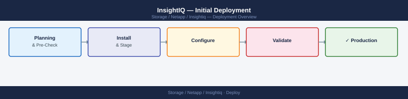
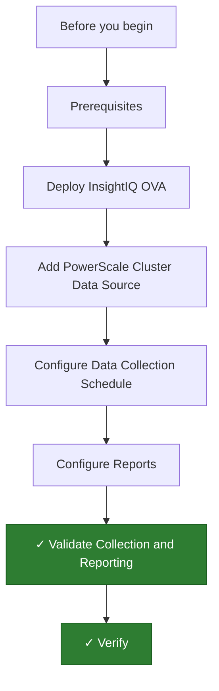

---
tags:
  - deployment
  - netapp
search:
  boost: 1.5
---
# InsightIQ — Initial Deployment


<div class="kb-summary">
Step-by-step guide to deploying Dell EMC InsightIQ, connecting PowerScale clusters, configuring data collection schedules, and validating reporting.

*Applies to: InsightIQ*
</div>





## Before you begin

- **Access:** admin credentials for the target system and any upstream dependencies (DNS, NTP, vCenter, directory services)
- **Timing:** safe to run during a scheduled maintenance window; allow 1-2 hours for initial deployment
- **Dependencies:** network connectivity verified; DNS resolvable; NTP configured; any licence keys available
- **Logging:** record every IP address, hostname, and credential set assigned during this deployment

---

## Prerequisites

Before deploying InsightIQ, confirm the following.

**PowerScale clusters:**

- OneFS 8.0 or later (OneFS 9.x recommended for full InsightIQ 4.x compatibility)
- Administrative credentials for each cluster (or a dedicated read-only account with analytics permissions)
- The InsightIQ data collection user requires the `ISI_PRIV_LOGIN_PAPI` and `ISI_PRIV_STATISTICS` privileges
- Management IP or SmartConnect zone FQDN reachable from the InsightIQ VM

**VM for InsightIQ:**

| Parameter | Minimum | Recommended |
|---|---|---|
| vCPU | 4 | 8 |
| RAM | 8 GB | 16 GB |
| OS disk | 50 GB | 50 GB |
| Data disk | 200 GB | 500 GB+ |

- RHEL/CentOS 7, or deploy via OVA (OVA is recommended)
- Static IP address, DNS forward and reverse records, NTP synchronised
- Port 8080/TCP open for browser access to the InsightIQ web UI
- Port 8083/TCP outbound to PowerScale PAPI (HTTPS)

**InsightIQ licence:**

- InsightIQ licence file (`.lic`) obtained from Dell Support or the Dell Licence portal
- Licence is node-locked — obtain the licence for the InsightIQ VM MAC address

---

## Deploy InsightIQ OVA

1. Download the InsightIQ OVA from the Dell Support site under **Drivers & Downloads → InsightIQ**.
2. In the vSphere Client, right-click the target cluster and select **Deploy OVF Template**.
3. Select the OVA file and click **Next**.
4. Set the VM name (e.g. `insightiq-01`) and target folder.
5. Select the destination cluster or host.
6. Select the storage datastore. Set the disk format to **Thick Provision Lazy Zeroed** for the data disk.
7. Map the network to the appropriate management portgroup.
8. On **Customize template**, set:
   - Hostname (must match DNS A record)
   - IP address, subnet mask, default gateway
   - DNS server IPs
   - NTP server address
9. Click **Finish** to deploy and power on the VM.
10. Wait 5–10 minutes for first-boot setup to complete.

**Post-deploy — apply licence:**

1. SSH to the InsightIQ VM: `ssh admin@<insightiq-ip>`
2. Copy the licence file to the VM:
   ```bash
   scp InsightIQ.lic admin@<insightiq-ip>:/home/admin/
   ```
3. Apply the licence:
   ```bash
   sudo /usr/local/insight/bin/iq_apply_license /home/admin/InsightIQ.lic
   ```
4. Restart the InsightIQ service:
   ```bash
   sudo systemctl restart insightiq
   ```

---

## Add PowerScale Cluster Data Source

1. Open a browser to `http://<insightiq-ip>:8080` and log in (default: `admin` / `insightiq`).
2. Change the default password immediately: **Admin → Change Password**.
3. Navigate to **Configuration → Cluster Data Sources**.
4. Click **Add Cluster**.
5. Enter the following details:
   - **Cluster name:** descriptive name (e.g. `prod-isilon-01`)
   - **Host:** PowerScale cluster management IP or SmartConnect FQDN
   - **Username:** the PAPI-enabled read account created for InsightIQ
   - **Password:** account password
6. Click **Verify Connection** — the connection test must return **Success** before proceeding.
7. Click **Add Cluster**.
8. The cluster appears in the data source list with status **Connected**.
9. Repeat for each PowerScale cluster.

**Verify initial data pull:**

- Navigate to **Reports → Performance** and select the newly added cluster.
- Within 5 minutes of adding the cluster, a first data sample should appear.
- If no data appears after 10 minutes, check the **Logs → Collection Errors** view for PAPI authentication errors.

---

## Configure Data Collection Schedule

InsightIQ collects data from PowerScale clusters on a polling interval. The default interval is 30 seconds for performance data and 1 hour for capacity data.

**Adjust collection intervals:**

1. Navigate to **Configuration → Collection Settings**.
2. For performance data, the recommended interval is 30–60 seconds depending on cluster count and InsightIQ VM resources.
3. For capacity data, the default 1-hour interval is sufficient for most environments.
4. Click **Save** after any changes.

**Set data retention:**

1. Navigate to **Configuration → Data Retention**.
2. Configure retention periods:
   - **High-resolution data** (30-second samples): retain 14 days (default)
   - **Hourly rollups:** retain 90 days
   - **Daily rollups:** retain 2 years
3. Ensure the InsightIQ data disk has sufficient capacity for the configured retention at the expected data volume.
4. Disk usage estimate: approximately 5 GB per cluster per year for a standard retention policy.

---

## Configure Reports

InsightIQ generates performance and capacity reports that can be scheduled for delivery.

**Create a scheduled performance report:**

1. Navigate to **Reports → Scheduled Reports**.
2. Click **Add Scheduled Report**.
3. Configure the report:
   - **Report type:** Performance Summary
   - **Cluster:** select the target cluster (or all clusters)
   - **Time range:** Last 7 days
   - **Metrics:** IOPS, throughput, latency, node CPU
   - **Frequency:** Weekly, every Monday 07:00
   - **Recipients:** enter email addresses of the storage team
4. Click **Save**.

**Create a capacity trend report:**

1. Click **Add Scheduled Report**.
2. Configure:
   - **Report type:** Capacity Trend
   - **Cluster:** all clusters
   - **Forecast horizon:** 90 days
   - **Frequency:** Monthly, first of month
   - **Recipients:** capacity planning team
3. Click **Save**.

**Configure SMTP for report delivery:**

1. Navigate to **Configuration → Email Settings**.
2. Enter the SMTP server address, port (25 or 587), and credentials if authentication is required.
3. Enter the **From** address (e.g. `insightiq@company.local`).
4. Click **Test** to send a test email and confirm delivery.

---

## Validate Collection and Reporting

Run through the following checks after completing the deployment.

**Collection validation:**

- **Configuration → Cluster Data Sources** — all clusters show **Connected**
- **Logs → Collection Errors** — no recent errors for any cluster
- Navigate to **Reports → Performance**, select a cluster, and confirm data points appear for the last hour

**Report validation:**

- Navigate to **Reports → Scheduled Reports** and click **Run Now** on each scheduled report
- Confirm the report is generated (status changes from **Pending** to **Complete**)
- Open the generated report and verify data populates all charts and tables
- Confirm the report email is received at the configured recipient addresses

**Capacity data validation:**

- Navigate to **Reports → Capacity** and select a cluster
- Confirm used, available, and total capacity values match OneFS UI (within a few percent)
- Confirm the forecast line projects future capacity based on current usage trend

**Resource usage:**

- SSH to the InsightIQ VM and confirm the data disk has sufficient free space:
  ```bash
  df -h /data
  ```
- Confirm InsightIQ service is running:
  ```bash
  sudo systemctl status insightiq
  ```

---

## Verify

- **Cluster health:** all nodes show online in the management UI
- **Volume access:** mount a test LUN/NFS export from a host and confirm read/write
- **Replication:** confirm replication partner shows last-sync within RPO window

---

## See also

- [Insightiq — How It Works](../architecture/how-it-works/)
