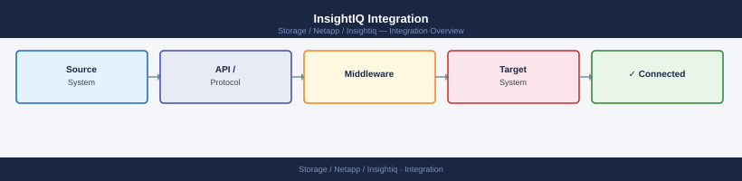

---
tags:
  - netapp
---
# InsightIQ Integration

<div class="kb-summary">
InsightIQ Integration reference covering Overview, OneFS Data Connector (Inbound), SMTP Email Alerts, SNMP Forwarding to Monitoring Platform, Syslog to SIEM and 2 more sections.

*Applies to: InsightIQ*
</div>



```d2
direction: right

center: "InsightIQ" {shape: hexagon}
onefs_data_connector_inbound: "OneFS Data Connector (Inbound)" {shape: rectangle}
snmp_forwarding_to_monitoring_platfo: "SNMP Forwarding to Monitoring Platform" {shape: rectangle}
syslog_to_siem: "Syslog to SIEM" {shape: rectangle}
csv_pdf_report_export: "CSV / PDF Report Export" {shape: rectangle}
integration_summary: "Integration Summary" {shape: rectangle}

center -> onefs_data_connector_inbound
center -> snmp_forwarding_to_monitoring_platfo
center -> syslog_to_siem
center -> csv_pdf_report_export
center -> integration_summary
```

## Overview

InsightIQ integrates primarily with PowerScale (Isilon) clusters for data collection, and with enterprise monitoring, identity, and notification platforms for alerting and access management.

## OneFS Data Connector (Inbound)

The core integration is between InsightIQ and each PowerScale cluster. InsightIQ pulls metrics via the OneFS REST API.


Alert rules are configured per metric threshold under: **Administration > Alert Settings > Add Alert**

## SNMP Forwarding to Monitoring Platform

InsightIQ can forward threshold breach alerts as SNMP traps to enterprise monitoring platforms (Aria Operations, Nagios, Zabbix).

```text
InsightIQ web UI > Administration > SNMP
- SNMP version: v2c or v3 (prefer v3 for security)
- Community string / auth credentials
- Trap target: <Aria-Operations-IP>:162 or <monitoring-platform>:162
```

For Aria Operations: configure an SNMP trap receiver adapter to ingest InsightIQ traps and map them to Aria alert definitions.

## Syslog to SIEM

InsightIQ appliance events (user logins, configuration changes, service errors) are forwarded to the SIEM via syslog.

```bash
# Configure syslog forwarding on InsightIQ appliance (RHEL/CentOS):
# /etc/rsyslog.d/insightiq.conf
*.* @<SIEM-IP>:514        # UDP
# or
*.* @@<SIEM-IP>:514       # TCP
```

Restart rsyslog after configuration change:
```bash
sudo systemctl restart rsyslog
```

## CSV / PDF Report Export

InsightIQ generates scheduled reports distributed via email or available for download.

```text
InsightIQ web UI > Reports > Scheduled Reports > Add
- Report type: Cluster Performance / Capacity Trend / Protocol Summary
- Format: PDF or CSV
- Schedule: weekly or monthly
- Email recipients: distribution list
```

Reports are suitable for distribution to capacity planning teams and management.

## Integration Summary

| Integration | Direction | Purpose |
|---|---|---|
| OneFS Data Connector | Inbound | Performance and capacity metrics collection |
| Active Directory / LDAP | Inbound | Centralised user authentication |
| SMTP | Outbound | Threshold breach email alerts |
| SNMP | Outbound | Availability and threshold alerts to monitoring platform |
| Syslog to SIEM | Outbound | Appliance event audit forwarding |
| CSV / PDF Export | Outbound | Capacity planning report distribution |
