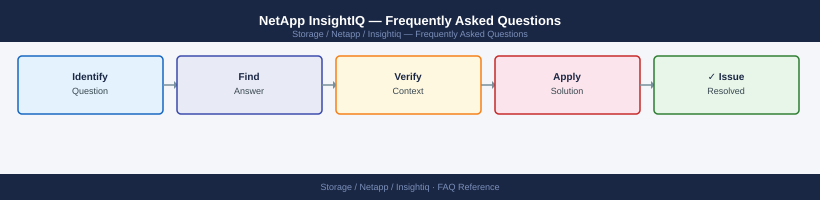

---
tags:
  - netapp-insightiq
  - faq
  - operations
---
# NetApp InsightIQ — Frequently Asked Questions

Common questions about NetApp InsightIQ operations, configuration, and troubleshooting. For step-by-step procedures, see the <a href="index.md">Operations</a> section.

## General

**Q: What InsightIQ version is recommended?**
A: InsightIQ 4.2.x is the latest release. Check via InsightIQ UI → Administration → About. Note: InsightIQ is specific to NetApp PowerScale (Isilon) performance monitoring.

**Q: How do I check the current NetApp InsightIQ version?**
A: `InsightIQ UI → Administration → About`

## Configuration

**Q: What is the default data collection interval?**
A: InsightIQ collects performance data every 30 seconds by default. Reduce to 10 seconds for high-resolution troubleshooting (increases database growth). Increase to 60 seconds for capacity planning at scale.

**Q: How do I enable InsightIQ dashboards for NFS client analytics?**
A: In InsightIQ, go to Analytics → Client Analytics → enable NFS client tracking. This requires OneFS 8.1+ on the cluster. Client-level analytics show per-client throughput and latency breakdown.

## Operations

**Q: How do I upgrade InsightIQ without losing historical data?**
A: InsightIQ stores data in a local PostgreSQL database. Back up before upgrade: `pg_dump insightiq > insightiq_backup.sql`. Apply the upgrade package. Verify data continuity in dashboards post-upgrade.

**Q: What is the correct procedure to add a new PowerScale cluster to InsightIQ?**
A: In InsightIQ: Clusters → Add Cluster. Provide the cluster management IP and credentials (read-only API user recommended). InsightIQ begins collecting data within 5 minutes.

## Troubleshooting

**Q: InsightIQ shows 'Data collection paused for cluster X'. What does it mean?**
A: InsightIQ cannot reach the cluster API. Check network connectivity, API credentials, and OneFS version compatibility. If InsightIQ misses more than 24 hours of data, historical trend charts will show a gap.

**Q: InsightIQ UI is slow to load dashboard data — where do I start?**
A: Check InsightIQ server disk and memory. The PostgreSQL database grows continuously — consider purging data older than 90 days: InsightIQ → Administration → Data Retention. Reduce the number of open dashboards.

## Backup and Recovery

**Q: How often should I back up InsightIQ data?**
A: Weekly PostgreSQL dump. InsightIQ data is performance telemetry — not business-critical, but useful for trending. The InsightIQ configuration (cluster list, dashboard definitions) is more important to back up.

**Q: Can I restore a specific time range of missing performance data?**
A: No — InsightIQ can only display data it has collected. Gaps caused by collection outages cannot be retroactively filled. Use the PowerScale native `isi statistics` CLI for recent data if InsightIQ has a gap.

## See Also

- [NetApp InsightIQ Operations](index.md)
- [NetApp InsightIQ Troubleshooting](../../../troubleshooting/index.md)
