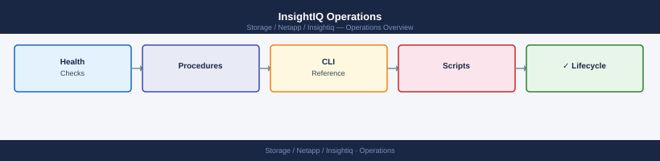

---
tags:
  - netapp
  - operations
---
# InsightIQ Operations

<div class="kb-summary">
InsightIQ Operations reference covering Daily Checklist, Cluster Connection Troubleshooting, Capacity Review (Weekly), Appliance Health Checks, Alert Threshold Review (Monthly) and 2 more sections.

*Applies to: InsightIQ*
  <a class="kb-card" href="faq/"><strong>FAQ</strong><span>Frequently asked questions, common issues, and quick answers for day-to-day operations.</span></a>
</div>



```d2
direction: right

hub: "InsightIQ\nOperations" {shape: hexagon}
daily_checklist: "Daily Checklist" {shape: rectangle}
cluster_connection_troubleshooting: "Cluster Connection Troubleshooting" {shape: rectangle}
appliance_health_checks: "Appliance Health Checks" {shape: rectangle}
alert_threshold_review_monthly: "Alert Threshold Review (Monthly)" {shape: rectangle}
report_generation: "Report Generation" {shape: rectangle}
monthly_tasks: "Monthly Tasks" {shape: rectangle}

hub -> daily_checklist
hub -> cluster_connection_troubleshooting
hub -> appliance_health_checks
hub -> alert_threshold_review_monthly
hub -> report_generation
hub -> monthly_tasks
```

## Before you begin

- **Access:** Storage admin credentials (cluster admin or equivalent)
- **Timing:** safe to run during business hours unless a step is marked ⚠ (causes interruption)
- **Dependencies:** no active upgrades or migrations on the same infrastructure
- **Logging:** capture command output — paste into the change record on completion

---

## Daily Checklist

| Check | Location | Pass Criteria |
|---|---|---|
| Cluster connection status | Dashboard > Clusters | All clusters show Active (green) |
| Appliance disk usage | Administration > System Status | Data volume below 80% used |
| Latest data collection timestamp | Dashboard > [Cluster] > Overview | Last data point within last 15 minutes |
| Active alert review | Administration > Alerts > Active Alerts | No unacknowledged Critical latency or throughput alerts |

If a cluster shows as Disconnected or the last data point is stale (> 30 minutes), investigate before stand-up.

## Cluster Connection Troubleshooting


## Appliance Health Checks

```bash
# Check InsightIQ service status
sudo systemctl status iiq

# Check PostgreSQL service
sudo systemctl status postgresql

# Check disk usage on data volume
df -h /data

# Review recent errors in InsightIQ logs
sudo journalctl -u iiq --since "24 hours ago" | grep -i error

# Check database size
psql -U iiq -c "SELECT pg_size_pretty(pg_database_size('iiq'));"
```

## Alert Threshold Review (Monthly)

- Review the past month's active alerts for noise patterns
- Adjust thresholds for workloads with known high baselines (document deviations from standard)
- Validate SNMP trap delivery to monitoring platform with a test trap
- Confirm SMTP alert emails are being delivered (check spam/junk filters)

## Report Generation

### On-Demand Report

```text
InsightIQ web UI > Reports > Custom Report
- Select: Cluster, Time Range, Metrics (throughput, latency, CPU)
- Format: PDF or CSV
- Download or email directly
```

### Scheduled Report Validation

```text
Administration > Reports > Scheduled Reports
- Verify each scheduled report shows Last Run within expected window
- If a report failed: check SMTP configuration and recipient list
- Manually trigger to test: Actions > Run Now
```

## Monthly Tasks

- Generate monthly capacity planning report for all clusters and share with management
- Validate InsightIQ database backup is completing (check cron logs or backup target)
- Review InsightIQ appliance OS patches and schedule maintenance window if needed
- Review user accounts and remove stale accounts (Administration > Users)

---

## Verify

- Confirm the operation completed without errors in the log or management UI
- Verify the expected state change is visible (service running, object created, config applied)
- Document the outcome in the change record

## See also

- [Architecture](../architecture/)
- [Capacity](../capacity/)
- [Cli Reference](../cli-reference/)
- [Deploy](../deploy/)
- [Design Standards](../design-standards/)
- [Integration](../integration/)
- [Learning Path](../learning-path/)
- [Lifecycle](../lifecycle/)
- [Performance](../performance/)
- [Reports](../reports/)
- [Scripts](../scripts/)
- [Security](../security/)
- [Troubleshooting](../troubleshooting/)
- [Vendor Support](../vendor-support/)
- [Workloads](../workloads/)
- [InsightIQ — Overview](../)
