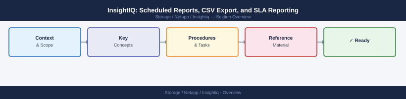

---
tags:
  - netapp
---
# InsightIQ: Scheduled Reports, CSV Export, and SLA Reporting

InsightIQ: Scheduled Reports, CSV Export, and SLA Reporting reference covering CSV Export for Analysis, SLA Reporting, Common Report Issues.

*Applies to: InsightIQ*

Typical SLA thresholds for NAS workloads:

| Workload Type | Latency SLA | Throughput SLA |
|---|---|---|
| VMware NFS datastores | < 5 ms average | > 1 GB/s per cluster |
| Home directories (SMB) | < 20 ms average | > 500 MB/s |
| Analytics (HDFS) | < 100 ms average | > 5 GB/s |
| Archive (cold NFS) | < 200 ms | Best effort |

## Common Report Issues

| Issue | Likely Cause | Fix |
|---|---|---|
| Scheduled report not delivered | SMTP not configured or email bounced | Verify SMTP settings under InsightIQ admin settings |
| CSV shows all zeros | Data collection gap during report period | Check InsightIQ collector status and connectivity |
| Report takes too long to generate | Large time range at 5-min granularity | Use daily granularity for periods > 30 days |
| Graphs in PDF are blurry | Low DPI PDF export setting | Not configurable in current InsightIQ versions; use CSV |
| Cluster not available in report dropdown | Cluster not registered in InsightIQ | Add cluster under InsightIQ > Clusters > Add |
