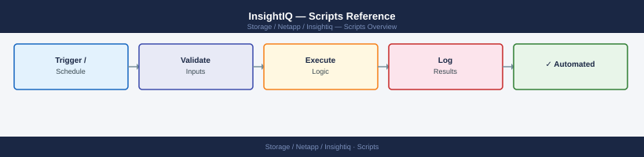

---
tags:
  - netapp
---
# InsightIQ — Scripts Reference



```python
import requests
from requests.auth import HTTPBasicAuth

IIQ_BASE = "https://<insightiq-host>"
AUTH     = HTTPBasicAuth("svc-iiq-admin", "<password-from-secrets-manager>")

def iiq_get(path: str, params: dict = None) -> dict:
    resp = requests.get(f"{IIQ_BASE}/api/v2{path}",
                        auth=AUTH, params=params, verify=True)
    resp.raise_for_status()
    return resp.json()
```

```python
import smtplib
from email.mime.multipart import MIMEMultipart
from email.mime.base import MIMEBase
from email import encoders

def email_report(report_bytes: bytes, filename: str, recipients: list):
    msg = MIMEMultipart()
    msg["From"]    = "insightiq-reports@company.com"
    msg["To"]      = ", ".join(recipients)
    msg["Subject"] = f"InsightIQ Weekly Utilisation Report — {filename}"

    part = MIMEBase("application", "octet-stream")
    part.set_payload(report_bytes)
    encoders.encode_base64(part)
    part.add_header("Content-Disposition", f"attachment; filename={filename}")
    msg.attach(part)

    with smtplib.SMTP("relay.company.com", 587) as smtp:
        smtp.starttls()
        smtp.send_message(msg)
```
```bash
# Query OneFS statistics API directly
curl -sk -u svc-insightiq https://<cluster-ip>:8080/platform/1/statistics/summary/drive | jq .
curl -sk -u svc-insightiq https://<cluster-ip>:8080/platform/3/statistics/current \
  -G --data-urlencode 'keys=node.ifs.bytes.in.rate,node.ifs.bytes.out.rate' | jq .
```

```d2
direction: right

center: "InsightIQ" {shape: rectangle}
component_a: "Component A" {shape: rectangle}
component_b: "Component B" {shape: rectangle}
component_c: "Component C" {shape: rectangle}

center -> component_a
center -> component_b
center -> component_c
```

## See also

- [InsightIQ — Overview](../../)
