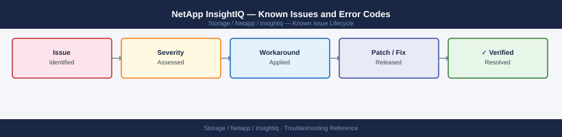

---
tags:
  - troubleshooting
  - insightiq
  - netapp
  - known-issues
---
# NetApp InsightIQ — Known Issues and Error Codes

<div class="kb-summary">
Catalog of known InsightIQ bugs, error codes, and workarounds covering data collection, API connectivity, and reporting.

*Applies to: NetApp InsightIQ 4.x (formerly Isilon InsightIQ)*
</div>



```d2
direction: down

symptom: Identify Symptom {shape: diamond}
data_collection: "Data Collection" {shape: rectangle}
reporting: "Reporting" {shape: rectangle}
resolution: Resolve or Escalate {shape: oval}

symptom -> data_collection: investigate
symptom -> reporting: investigate
data_collection -> resolution
reporting -> resolution
```

## Before you begin

- InsightIQ errors appear in the web UI under `Administration → Data Collections`.
- Check the InsightIQ appliance system log: `tail -f /var/log/insightiq/insightiq.log`.

## Data Collection

| Error / Symptom | Affected Versions | Cause | Workaround / Fix | Fixed In |
|---|---|---|---|---|
| Cluster data collection showing `No data` | InsightIQ 4.x | InsightIQ cannot reach PowerScale platform API on 8080 | Verify TCP 8080 from InsightIQ to PowerScale SmartConnect IP | N/A |
| `Authentication failed` for managed cluster | InsightIQ 4.x | PowerScale API credentials changed or user locked out | Update cluster credentials in InsightIQ → Clusters → Edit | N/A |
| Performance graphs empty after OneFS upgrade | InsightIQ 4.x | OneFS upgrade changed platform API version; InsightIQ not updated | Upgrade InsightIQ to version compatible with new OneFS release | N/A |

## Reporting

| Error / Symptom | Affected Versions | Cause | Workaround / Fix | Fixed In |
|---|---|---|---|---|
| Report generation times out for long date ranges | InsightIQ 4.x | Database query timeout for large time ranges | Reduce report window to ≤30 days; archive older data to free DB space | N/A |
| Scheduled email report not delivered | InsightIQ 4.x | SMTP relay not configured or port 25 blocked from InsightIQ | Configure SMTP relay in InsightIQ → Administration → Email Settings | N/A |

## See also

- [Dell PowerScale — Known Issues](../../../dell/powerscale/troubleshooting/known-issues.md)
- [NetApp ONTAP — Known Issues](../../ontap/troubleshooting/known-issues.md)
