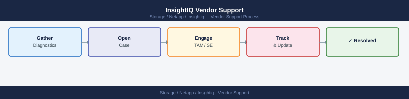

---
tags:
  - netapp
---
# InsightIQ Vendor Support

InsightIQ vendor support: opening NetApp support cases, collecting `isi_gather_info` and InsightIQ diagnostic bundles, and escalation contact procedure.

*Applies to: InsightIQ*

InsightIQ support is provided by NetApp via the NetApp Support Portal (mysupport.netapp.com). When raising an SR, collect logs from the InsightIQ appliance at `/var/log/insightiq/` and the PostgreSQL connection status. Include details of the OneFS clusters being monitored and any recent changes (upgrades, network changes, credential rotations).

**Information to collect before opening an SR**

- InsightIQ version
- OneFS version(s) for all monitored clusters
- Number of clusters monitored
- Error messages from `/var/log/insightiq/` logs
- Screenshot or description of the issue (connection failure, missing data, UI error)
- Appliance disk usage and resource utilisation

| Resource | Details |
|---|---|
| NetApp Support Portal | mysupport.netapp.com |
| Log location | `/var/log/insightiq/` |
| NetApp IMT | mysupport.netapp.com/matrix |
| InsightIQ Documentation | docs.netapp.com |
