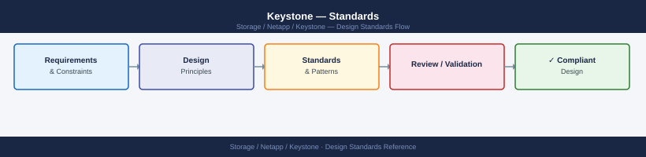

---
tags:
  - architecture
  - netapp
---
# Keystone — Standards

Standards reference covering Service Level Selection, Naming Conventions, Capacity Management.

*Applies to: Keystone STaaS*

> Part of the [Keystone Architecture](index.md) reference.

---

## Service Level Selection

- Map each application tier to the appropriate Keystone service tier before provisioning: Extreme for databases and high-IOPS workloads, Premium for virtualization and mixed workloads, Standard for file and backup
- Document the committed capacity per tier per application in the CMDB or capacity register
- Review burst usage monthly — persistent burst usage signals that committed capacity should be increased at the next amendment opportunity
- Do not downgrade a workload from a higher performance tier to a lower one mid-subscription; plan service level assignments carefully at provisioning time

## Naming Conventions

- Volume naming follows the site-standard naming convention; do not deviate for Keystone-managed volumes
- Tag each volume with the application owner and Keystone service level to enable accurate consumption attribution and chargeback
- Use QoS policy-group names that clearly identify the Keystone service level, e.g., `extreme-ks`, `premium-ks`, `standard-ks` — this reduces the risk of volumes being assigned to the wrong tier
- Snapshots on Keystone volumes follow the same naming convention as standard ONTAP snapshots; excessive snapshots on premium tiers consume high-cost committed capacity unnecessarily

## Capacity Management

| Threshold | Action |
|---|---|
| 70% of committed capacity | Internal review; forecast growth timeline |
| 80% of committed capacity | Alert triggered; begin capacity amendment process |
| 90% of committed capacity | Burst activates; escalate to Keystone Success Manager |
| Burst limit reached | Further provisioning blocked; emergency amendment required |

- Set EMS capacity threshold alerts at 80% of committed tier within ONTAP; configure BlueXP notifications for Keystone capacity events
- Request a committed capacity increase at least 60 days before anticipated growth to allow for NetApp procurement and order processing
- Generate and archive monthly consumption reports from the BlueXP digital wallet for internal chargeback or showback to business units

---

## See also

- [Keystone — How It Works](../how-it-works/)
- [Keystone — Integrations](../integrations/)
