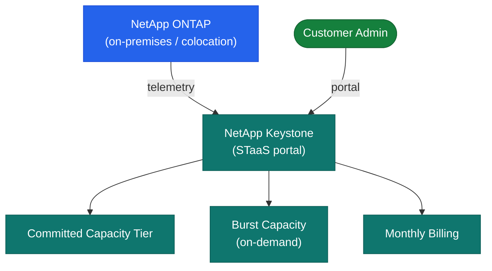

# Keystone — How It Works


<div class="kb-summary">
How It Works reference covering Overview, STaaS Consumption Model, Capacity Management Thresholds.
</div>

## Overview

NetApp Keystone is a Storage as a Service (STaaS) subscription that delivers on-premises NetApp hardware — AFF/FAS for block and file, StorageGRID for object — on an OpEx consumption model. NetApp installs, owns, and manages the hardware at the customer's data center or colocation facility. The customer commits to a minimum capacity per service tier and pays for committed capacity plus burst usage above the commitment. A Keystone Collector agent reports consumption telemetry to NetApp for billing.

## STaaS Consumption Model


┌─────────────────────────────────── NetApp Keystone — How It Works ────────────────────────────────────┐
│                                                                                                       │
│   ┌───────────────────────────────────────────────────────────────────────────────────────────────┐   │
│   │          Keystone Collector VM polls ONTAP REST API every 5 min; aggregates capacity          │   │
│   │          Metrics compressed and uploaded to Active IQ via HTTPS/TLS to cloud endpoint         │   │
│   │         Billing engine computes committed + burst consumed; monthly invoice generated         │   │
│   │           Customer views usage in Active IQ Digital Advisor; exports CSV for finance          │   │
│   └───────────────────────────────────────────────────────────────────────────────────────────────┘   │
│                                                                                                       │
│    ONTAP REST poll -> Collector aggregates -> HTTPS upload -> IQ billing -> invoice                   │
│                                                                                                       │
│                  ▼                                ▼                                ▼                  │
│                                                                                                       │
│   ┌─────────────────────────────┐  ┌─────────────────────────────┐  ┌─────────────────────────────┐   │
│   │          Collection         │  │            Upload           │  │           Billing           │   │
│   │        REST API poll        │  │          HTTPS/TLS          │  │        Committed calc       │   │
│   │         Every 5 min         │  │       Compressed JSON       │  │          Burst calc         │   │
│   │       Volume capacity       │  │         IQ endpoint         │  │       Monthly invoice       │   │
│   │        Perf counters        │  │        Retry on fail        │  │          CSV export         │   │
│   │         SVM metadata        │  │        Proxy support        │  │         Usage charts        │   │
│   └─────────────────────────────┘  └─────────────────────────────┘  └─────────────────────────────┘   │
│                                                                                                       │
│    Collector must reach ONTAP mgmt LIF on 443 and Active IQ cloud endpoint on 443                     │
│                                                                                                       │
│                  ▼                                ▼                                ▼                  │
│                                                                                                       │
│   ┌───────────────────────────────────────────────────────────────────────────────────────────────┐   │
│   │       Step       │      Action      │     Frequency     │     Outcome      │      Notes       │   │
│   │       Poll       │  REST API call   │       5 min       │   Raw metrics    │     Per SVM      │   │
│   │    Aggregate     │    Summarise     │      Per poll     │   JSON bundle    │    Compressed    │   │
│   │      Upload      │   HTTPS to IQ    │     Per cycle     │   Cloud stored   │     TLS 1.2+     │   │
│   │       Bill       │   Compute cost   │      Monthly      │   Invoice PDF    │   Burst extra    │   │
│   └───────────────────────────────────────────────────────────────────────────────────────────────┘   │
│                                                                                                       │
│    Physical: Collector VM 2 vCPU 8 GB RAM needs outbound TCP 443 to cloud                             │
│                                                                                                       │
│    Key terms:                                                                                         │
│                                                                                                       │
│    Keystone Collector = Linux VM; polls ONTAP and ships metrics to Active IQ                          │
│    ONTAP REST API     = Native JSON/HTTPS API (v9.6+); replaces legacy ZAPI                           │
│    Active IQ          = NetApp cloud analytics; stores metrics; computes billing                      │
│    Committed cap.     = Baseline TB contracted; billed at flat rate monthly                           │
│    Burst cap.         = TB used above committed; billed at higher per-TB rate                         │
│    Service level SLO  = Max latency + min IOPS/TB guaranteed per tier                                 │
│    SVM                = Storage VM; ONTAP tenancy unit; polled individually                           │
│    JSON bundle        = Compressed payload Collector uploads: volumes, capacity, perf                 │
│    Proxy support      = Collector can route HTTPS uploads via HTTP/SOCKS proxy                        │
│    Retry              = Collector queues failed uploads; retries up to 24 h                           │
│    CSV export         = Active IQ provides usage CSV for chargeback/finance                           │
│    TLS 1.2+           = Minimum encryption standard for all Collector communications                  │
│                                                                                                       │
└───────────────────────────────────────────────────────────────────────────────────────────────────────┘

Each Keystone service level corresponds to a named adaptive QoS policy group applied to volumes — e.g., `extreme-ks`, `premium-ks`, `standard-ks`.

## Capacity Management Thresholds

| Threshold | Action |
|---|---|
| 70% of committed capacity | Internal review; forecast growth timeline |
| 80% of committed capacity | Alert triggered; begin capacity amendment process |
| 90% of committed capacity | Burst activates; escalate to Keystone Success Manager |
| Burst limit reached | Further provisioning blocked; emergency amendment required |

```bash
# Request committed capacity increase at least 60 days before anticipated growth
# Monitor burst usage via BlueXP Digital Wallet before month-end
```
