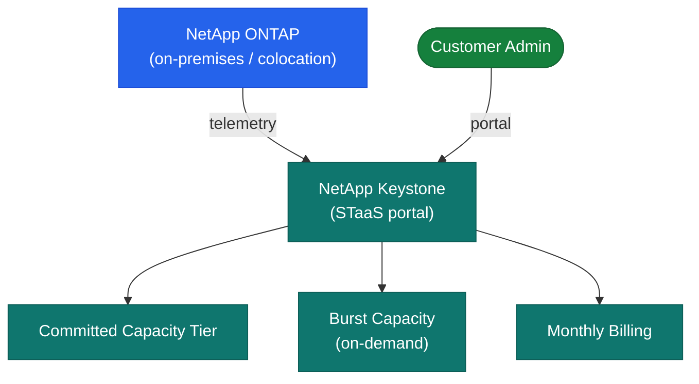

# Keystone — Architecture

Keystone STaaS architecture reference — delivery model, service tiers, components, capacity model, and consumption reporting.

<a class="kb-card" href="how-it-works/"><strong>How It Works</strong>STaaS delivery model, service tiers, components, capacity model, and QoS mapping.</a>
<a class="kb-card" href="integrations/"><strong>Integrations</strong>BlueXP, ActiveIQ, ONTAP, and third-party integrations.</a>
<a class="kb-card" href="design-standards/"><strong>Design Standards</strong>Service level selection, naming conventions, and capacity management thresholds.</a>

| Tier | Platform | IOPS/TB | Latency | Use Case |
|---|---|---|---|---|
| Extreme | NVMe-AF (all-flash NVMe) | Up to 12,000 | < 1 ms | Latency-sensitive databases, high-IOPS workloads |
| Premium | AFF (all-flash SAS/NVMe) | Up to 4,000 | < 1 ms | Mixed workloads, virtualization |
| Standard | FAS (hybrid or capacity flash) | Up to 2,000 | < 2 ms | File storage, backup targets |
| Object | StorageGRID | Up to 64 | < 17 ms | Unstructured data, archives, S3 |

