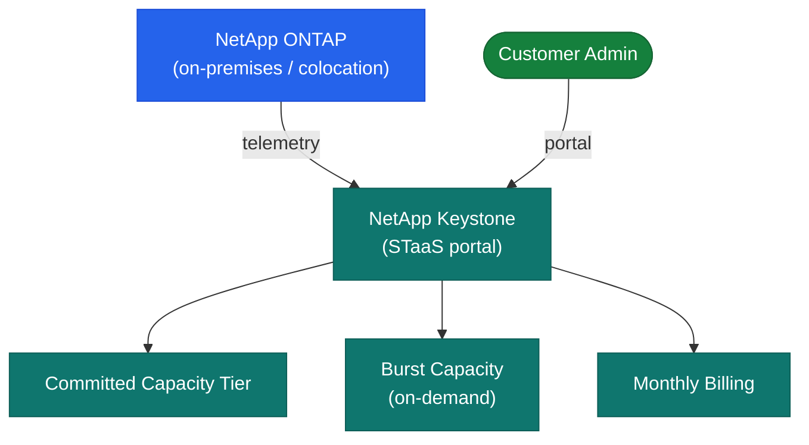

# Keystone — Overview

> Part of the [Keystone Architecture](../) reference.

---

## Overview

NetApp Keystone is a Storage as a Service (STaaS) subscription that delivers on-premises NetApp hardware — AFF/FAS for block and file, StorageGRID for object — on an OpEx consumption model. NetApp installs, owns, and manages the hardware either at the customer's data center or in a colocation facility. The customer commits to a minimum capacity per service tier and pays for committed capacity plus any burst usage above that commitment. A Keystone Collector agent deployed on-premises reports consumption telemetry to NetApp for billing.

## STaaS Consumption Model

## Service Tiers

| Tier | Protocol | Use Case |
|---|---|---|
| Extreme | NVMe-AF (all-flash NVMe) | Latency-sensitive databases, high-IOPS transactional workloads |
| Premium | AFF (all-flash SAS/NVMe) | Mixed workloads, virtualization, general-purpose high-performance |
| Standard | FAS (hybrid or capacity flash) | File storage, backup targets, less latency-sensitive workloads |
| Object | StorageGRID | Unstructured data, backups, archives, S3-compatible object storage |

Customers select one or more tiers per subscription; each tier has a committed capacity minimum and a defined performance SLA (IOPS/TB and latency).

## Connectivity

Storage protocols are identical to the underlying platform: NFS, SMB/CIFS, iSCSI, FC, and S3 (StorageGRID). There is no change to how hosts connect to storage compared to a standard NetApp deployment. The Keystone Collector VM requires outbound HTTPS (port 443) to `keystone.netapp.com` for telemetry reporting — no inbound ports are required. If the Collector cannot reach the NetApp endpoint, consumption reporting stops and billing data gaps occur.

## Capacity Model

- **Committed capacity** — the minimum monthly capacity the customer contracts for per service tier; billed whether used or not
- **Burst capacity** — available headroom above committed capacity up to a defined burst limit; billed at a higher per-TB rate when consumed
- **True-up cadence** — monthly; consumption report from the Collector is reconciled and the invoice reflects committed capacity plus burst usage for the period
- Committed capacity can be increased mid-term but cannot be decreased; plan initial sizing conservatively and use burst for growth headroom
