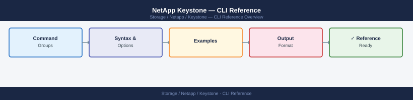

---
tags:
  - netapp
---
# NetApp Keystone — CLI Reference



```bash
# Exchange client credentials for a bearer token
TOKEN=$(curl -s -X POST "https://netapp-cloud-account.auth0.com/oauth/token" \
  -H "Content-Type: application/json" \
  -d '{
    "grant_type": "client_credentials",
    "client_id": "<YOUR_CLIENT_ID>",
    "client_secret": "<YOUR_CLIENT_SECRET>",
    "audience": "https://api.activeiq.netapp.com"
  }' | python3 -c "import sys,json; print(json.load(sys.stdin)['access_token'])")

echo "Token acquired"
```

```bash
# List service levels (tiers) available under a subscription
curl -s "https://api.activeiq.netapp.com/v1/keystone/subscriptions/${SUBSCRIPTION_ID}/service-levels" \
  -H "Authorization: Bearer $TOKEN" | python3 -m json.tool
```
```bash
# Check if any tier is in burst (consumed > committed)
curl -s "https://api.activeiq.netapp.com/v1/keystone/subscriptions/${SUBSCRIPTION_ID}/usage" \
  -H "Authorization: Bearer $TOKEN" | python3 -c "
import sys, json
data = json.load(sys.stdin)
alert = False
for tier in data.get('usageDetails', []):
    committed = float(tier.get('committedCapacity', 0))
    consumed  = float(tier.get('consumedCapacity',  0))
    pct = (consumed / committed * 100) if committed > 0 else 0
    status = 'BURST' if consumed > committed else ('WARN' if pct >= 90 else 'OK')
    print(f\"{status}  {tier['serviceLevel']:20s}  {pct:5.1f}%  ({consumed:.1f} / {committed:.1f} TiB)\")
    if status != 'OK':
        alert = True
sys.exit(1 if alert else 0)
"
```
```bash
# All volumes: size, used, available
volume show -fields size,used,available,percent-used

# Sort by percent-used (highest first)
volume show -fields size,used,percent-used | sort -k4 -rn

# Aggregate-level capacity
storage aggregate show -fields size,used,available,percent-used

# SVM-level logical space view
vserver show -fields name -type data
volume show -vserver <svm_name> -fields size,used,logical-used,available

# QoS workload to correlate per-volume performance with Keystone tier
qos workload show -fields workload-name,volume,policy-group

# Check volume space guarantee (impacts Keystone committed capacity)
volume show -fields space-guarantee,size,used
```
```bash
# Volumes with thick guarantee (count against committed immediately)
volume show -space-guarantee volume -fields size,used,space-guarantee

# Volumes with thin/none guarantee (count against committed as written)
volume show -space-guarantee none -fields size,used,space-guarantee
```
```bash
BLUEXP_TOKEN="<bluexp_bearer_token>"

# List Digital Wallet assets
curl -s "https://api.bluexp.netapp.com/marketplace/api/v1/subscriptions" \
  -H "Authorization: Bearer $BLUEXP_TOKEN" | python3 -m json.tool

# Check capacity pool status
curl -s "https://api.bluexp.netapp.com/marketplace/api/v1/capacity-pools" \
  -H "Authorization: Bearer $BLUEXP_TOKEN" | python3 -m json.tool
```

```d2
direction: right

center: "Keystone STaaS" {shape: rectangle}
component_a: "Component A" {shape: rectangle}
component_b: "Component B" {shape: rectangle}
component_c: "Component C" {shape: rectangle}

center -> component_a
center -> component_b
center -> component_c
```

## See also

- [NetApp Keystone — Overview](../../)
