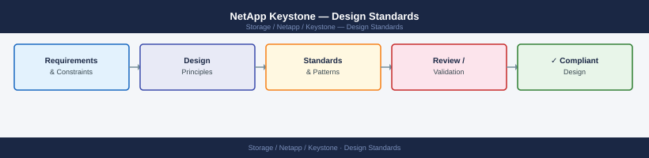

---
tags:
  - netapp
---
# NetApp Keystone — Design Standards



```bash
# Set a volume comment to identify application owner and Keystone tier
volume modify \
    -vserver svm_prod \
    -volume vol_oradb01_data \
    -comment "app=oradb01 owner=finance tier=extreme keystone=true"

# List volumes with their comments to verify tagging
volume show -fields vserver,volume,comment | grep keystone
```

```bash
# Set a volume-level space threshold alert at 80% utilisation
# (Keystone billing is based on logical used, but physical capacity matters for planning)
event config modify -threshold-alerts-enabled true

# Configure a volume nearly-full threshold event for Keystone volumes
# ONTAP generates wafl.vol.full.threshold events when volumes reach configured thresholds
set advanced
volume modify \
    -vserver svm_prod \
    -volume vol_oradb01_data \
    -space-nearly-full-threshold-percent 80 \
    -space-full-threshold-percent 95
set admin

# Verify threshold settings
volume show -vserver svm_prod -volume vol_oradb01_data \
    -fields space-nearly-full-threshold-percent,space-full-threshold-percent
```
```bash
# Step 1: Confirm the volume is no longer in use (no active client mounts)
nfs show -vserver svm_prod | grep vol_oldapp
# Verify no NFS exports; check CIFS share list
vserver cifs share show -vserver svm_prod -volume vol_oldapp

# Step 2: Delete all snapshots to release capacity immediately
snapshot delete -vserver svm_prod -volume vol_oldapp -snapshot * -force

# Step 3: Unmount and offline the volume
volume unmount -vserver svm_prod -volume vol_oldapp
volume offline -vserver svm_prod -volume vol_oldapp

# Step 4: Delete the volume
volume delete -vserver svm_prod -volume vol_oldapp -force

# Step 5: Verify the volume no longer appears
volume show -vserver svm_prod -volume vol_oldapp
# Expected: no matching volumes

# Step 6: Confirm the capacity is reflected in the next BlueXP reporting cycle
# (capacity reduction visible in BlueXP within the next Collector collection interval)
```
