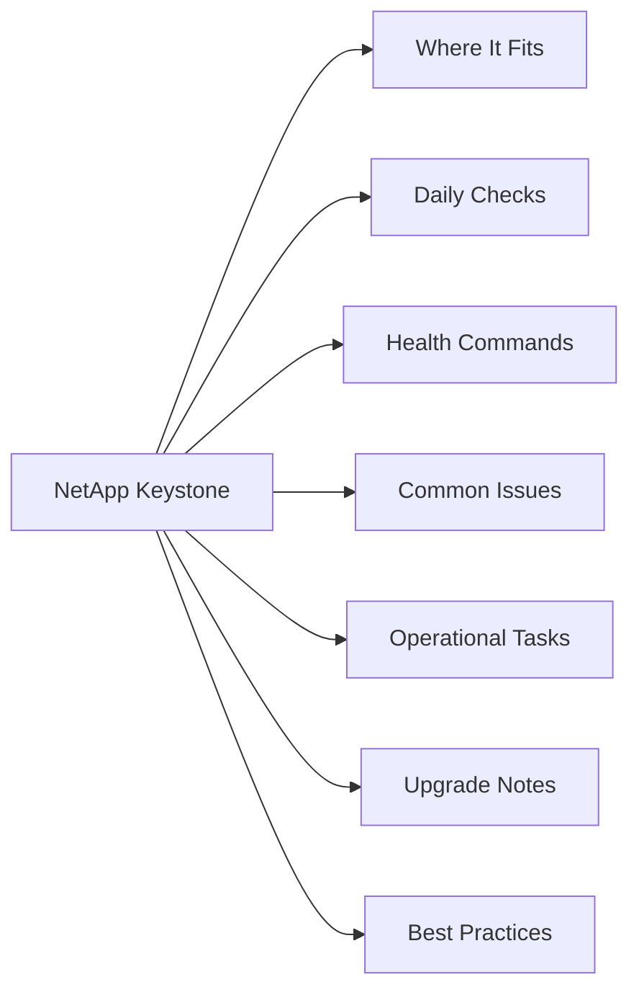

# NetApp Keystone

<a class="kb-card" href="architecture/"><strong>Architecture</strong>HA topology, components, connectivity, and sizing.</a>
<a class="kb-card" href="standards/"><strong>Standards</strong>Naming conventions, build baseline, and configuration checklist.</a>
<a class="kb-card" href="lifecycle/"><strong>Lifecycle</strong>Version matrix, upgrade paths, EOL tracking, and refresh planning.</a>
<a class="kb-card" href="operations/"><strong>Operations</strong>Daily checks, health monitoring, maintenance tasks, and runbooks.</a>
<a class="kb-card" href="cli-reference/"><strong>CLI Reference</strong>Command reference by category with syntax and examples.</a>
<a class="kb-card" href="scripts/"><strong>Scripts</strong>Automation scripts for daily checks, health, health, incident triage, and validation.</a>
<a class="kb-card" href="troubleshooting/"><strong>Troubleshooting</strong>Common issues, diagnostic commands, log locations, and error codes.</a>
<a class="kb-card" href="integration/"><strong>Integration</strong>VMware, backup tools, monitoring, authentication, and API integration.</a>
<a class="kb-card" href="security/"><strong>Security</strong>Hardening checklist, RBAC, encryption, audit logging, and compliance.</a>
<a class="kb-card" href="vendor-support/"><strong>Vendor Support</strong>Opening a case, information to collect, support portal, and SLA tiers.</a>

<a class="kb-card" href="service-levels/">
  <strong>Service Levels</strong>
  Service Levels notes, checks, commands, and references.
</a>

<a class="kb-card" href="usage-reporting/">
  <strong>Usage Reporting</strong>
  Usage Reporting notes, checks, commands, and references.
</a>

## Overview

NetApp Keystone (Keystone STaaS) is a storage-as-a-service subscription offering that delivers on-premises NetApp infrastructure — AFF/FAS for block and file, and StorageGRID for object — on a consumption-based, OpEx model. Customers commit to a minimum capacity tier per service level and can burst above that commitment within the subscription period, with usage telemetry collected by the Keystone Collector agent and reported monthly for billing. The Keystone dashboard, embedded in BlueXP (formerly Active IQ), provides visibility into committed vs. consumed capacity, burst usage, and SLA compliance across all subscriptions.

## Where It Fits

| Use Case |
|---|
| Organizations that need on-premises NetApp storage but want OpEx billing rather than CapEx hardware purchase or leasing |
| Workloads requiring predictable per-TB pricing at defined performance tiers (NVMe through capacity-optimized HDD) |
| Environments with fluctuating capacity demands that benefit from burst capacity above a committed baseline |
| Hybrid cloud strategies where on-premises infrastructure must integrate with BlueXP-managed cloud services |
| Regulated industries where data must remain on-premises but financial flexibility of a service model is required |
| StorageGRID object storage consumption alongside ONTAP block/file under a unified subscription |

## Daily Checks

| Check | Command | Notes |
|---|---|---|
| Verify Keystone Collector service is running and last reported telemet |  |  |
| Review current consumed capacity vs. committed tier per service level |  |  |
| Check whether burst capacity is active and how close burst consumption |  |  |
| Confirm no service-level SLA breaches are flagged (availability, laten |  |  |
| Validate that recently provisioned volumes are assigned to the correct |  |  |
| Review any open support tickets or notifications from NetApp regarding |  |  |

## Health Commands

~~~bash
# On the Keystone Collector VM — check collector service status (Linux systemd)
sudo systemctl status keystone-collector

# View Keystone Collector logs for reporting errors
sudo journalctl -u keystone-collector -n 100

# On the ONTAP cluster — verify AQoS policies assigned to Keystone volumes
qos policy-group show

# Check that volumes are associated with the correct Keystone service-level policy group
volume show -fields qos-policy-group

# Verify ONTAP cluster is reachable from the Keystone Collector
# (run from the Collector VM)
curl -sk https://<cluster-mgmt-lif>/api/cluster

# On ONTAP — review capacity per volume to correlate with Keystone billing tiers
volume show -fields size,used,percent-used
~~~

## Common Issues

| Symptom | Likely Cause | Action |
|---|---|---|
| Keystone Collector stops reporting telemetry | Collector service crashed, network blocked to NetApp cloud endpoint, or credentials expired | Run `systemctl status keystone-collector`; check logs; verify outbound HTTPS to NetApp telemetry endpoint; refresh credentials via Collector TUI |
| Unexpected burst usage spike | Recent volume provisioning added to a committed tier without capacity review; snapshot growth | Open BlueXP Keystone dashboard; identify which subscription and service level is bursting; review recent provisioning and snapshot schedules |
| Volume assigned to wrong service level | AQoS policy-group not applied or wrong policy-group name used during volume creation | Run `volume show -fields qos-policy-group`; use `volume modify -qos-policy-group <correct-psl>` to reassign; notify NetApp to adjust billing if period is open |
| SLA latency breach flagged in dashboard | Workload exceeds IOPS/TB ceiling for the assigned service level; underlying array under-provisioned | Review QoS statistics with `qos statistics performance show`; consider moving workload to a higher service level tier |
| Billing discrepancy between expected and invoiced capacity | Collector reported burst consumption that was not anticipated; billing period lag | Download consumption report from BlueXP digital wallet; reconcile against provisioned capacity; raise a Keystone support case if data is incorrect |

## Operational Tasks

| Task | Command |
|---|---|
| Monitor current and trended capacity consumption per service level from the Blue |  |
| Request a subscription amendment (capacity increase or service level change) thr |  |
| Validate new volume provisioning assigns the correct AQoS policy-group (`qos-pol |  |
| Review and reduce burst usage before the monthly billing close by decommissionin |  |
| Update Keystone Collector credentials and software version when notified by NetA |  |
| Generate and archive monthly consumption reports from BlueXP digital wallet for |  |
| Coordinate with NetApp to add StorageGRID object capacity tiers to an existing K |  |

## Upgrade Notes

| Step | Action |
|---|---|
| 1 | Monitor NetApp release notes for Keystone Collector updates — the Collector is a separate software component from ONTAP and has its own release cadence |
| 2 | Before upgrading the Collector, back up the Collector configuration file and record the current reporting status and last successful telemetry timestamp |
| 3 | Download the new Collector package from the NetApp support site and follow the installation guide for the target OS (Linux RPM/DEB) |
| 4 | After upgrade, confirm the Collector service restarts cleanly with `systemctl status keystone-collector` and that telemetry resumes within the next reporting interval |
| 5 | For ONTAP upgrades on Keystone-managed clusters, follow the standard ONTAP ANDU upgrade path and verify AQoS policy-group assignments are intact post-upgrade with `volume show -fields qos-policy-group` |
| 6 | Notify NetApp Keystone operations team before any major infrastructure change (node additions, aggregate rebuilds) that could affect reported capacity |
| 7 | After any significant change, validate the BlueXP Keystone dashboard reflects accurate consumption within one reporting cycle before closing the maintenance window |

## Best Practices

| Recommendation | Detail |
|---|---|
| Review capacity consumption weekly | not just at month-end — so burst usage can be corrected before it appears on the invoice |
| Set capacity threshold alerts at 80% of the committed tier | Set capacity threshold alerts at 80% of the committed tier within ONTAP (EMS thresholds) or via BlueXP notifications to get early warning before burst activates |
| Document which application or team owns each volume and its assigned Keystone service level | this enables accurate internal chargeback and faster root-cause analysis for billing surprises |
| Use QoS policy-group naming conventions that clearly | Use QoS policy-group naming conventions that clearly identify the Keystone service level (e.g., `extreme-ks`, `premium-ks`) to reduce misconfiguration risk |
| Do not downgrade from a higher performance service level to a lower one mid-subscription term | plan service level assignments carefully at provisioning time |
| Keep the Keystone Collector VM on a supported OS version and patched | an outdated or unhealthy Collector is the most common cause of reporting gaps that complicate billing reconciliation |
| Align snapshot policies on Keystone volumes with the service level tier | excessive snapshots on Extreme/Premium tiers consume high-cost committed capacity unnecessarily |
| Engage NetApp Keystone success team quarterly to review | Engage NetApp Keystone success team quarterly to review consumption trends, forecast next subscription period sizing, and discuss burst patterns |
