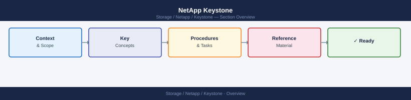

---
tags:
  - netapp
---
# NetApp Keystone

NetApp Keystone STaaS knowledge base — architecture, operations, security, and troubleshooting for on-premises consumption-based storage subscriptions.

*Applies to: Keystone STaaS*

<a class="kb-card" href="architecture/"><strong>Architecture</strong>How it works, integrations, and design standards.</a>
<a class="kb-card" href="design-standards/"><strong>Standards</strong>Service level selection, naming conventions, and capacity management thresholds.</a>
<a class="kb-card" href="lifecycle/"><strong>Lifecycle</strong>Version matrix, upgrade paths, EOL tracking, and refresh planning.</a>
<a class="kb-card" href="operations/"><strong>Operations</strong>Daily checks, health monitoring, maintenance tasks, and runbooks.</a>
<a class="kb-card" href="cli-reference/"><strong>CLI Reference</strong>Command reference by category with syntax and examples.</a>
<a class="kb-card" href="scripts/"><strong>Scripts</strong>Automation scripts for daily checks, incident triage, and validation.</a>
<a class="kb-card" href="troubleshooting/"><strong>Troubleshooting</strong>Common issues, diagnostic commands, log locations, and error codes.</a>
<a class="kb-card" href="integration/"><strong>Integration</strong>BlueXP, ONTAP, monitoring, and third-party integrations.</a>
<a class="kb-card" href="security/"><strong>Security</strong>Hardening checklist, RBAC, encryption, audit logging, and compliance.</a>
<a class="kb-card" href="vendor-support/"><strong>Vendor Support</strong>Opening a case, information to collect, support portal, and SLA tiers.</a>
<a class="kb-card" href="service-levels/"><strong>Service Levels</strong>Service level definitions, IOPS targets, and SLA compliance monitoring.</a>
<a class="kb-card" href="usage-reporting/"><strong>Usage Reporting</strong>Consumption reporting, BlueXP digital wallet, and billing reconciliation.</a>

