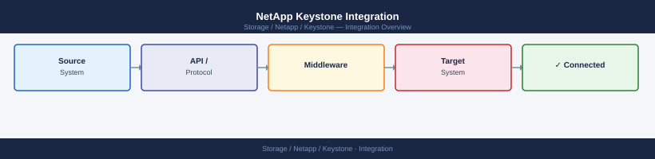

---
tags:
  - netapp
---
# NetApp Keystone Integration


<div class="kb-summary">
NetApp Keystone Integration reference covering ActiveIQ Digital Advisor, Keystone Collector, REST API, ITSM Integration, CloudOps Integration.

*Applies to: Keystone STaaS*
</div>



Authenticate via ActiveIQ API tokens generated in the BlueXP portal. Tokens are scoped to the customer account and expire on a configurable schedule.

```d2
direction: right

center: "Keystone STaaS" {shape: hexagon}
itsm_integration: "ITSM Integration" {shape: rectangle}
cloudops_integration: "CloudOps Integration" {shape: rectangle}

center -> itsm_integration
center -> cloudops_integration
```

## ITSM Integration

Integrate Keystone consumption data with ServiceNow CMDB or similar ITSM platforms for:

- Asset and capacity records that reflect actual Keystone-managed hardware
- Monthly consumption report import for chargeback automation
- Alert generation from BlueXP webhooks to trigger ServiceNow incidents on capacity threshold breaches

Use the Keystone REST API to pull monthly consumption reports and push them to ServiceNow via its REST API or integration hub.

## CloudOps Integration

For hybrid cloud strategies, Keystone Flex extends the subscription model to Cloud Volumes ONTAP (CVO) instances in AWS, Azure, or GCP. A unified Keystone subscription can cover both on-premises Keystone STaaS and cloud CVO capacity under the same committed/burst billing model, with a single BlueXP dashboard view of total consumption across on-premises and cloud.
