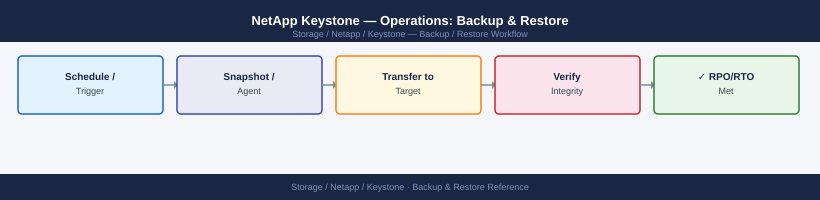

---
tags:
  - netapp
  - operations
---
# NetApp Keystone — Operations: Backup & Restore


```bash
# SSH into Keystone Collector VM
ssh admin@<keystone-collector-ip>

# Export current configuration
keystone-config export --output /tmp/ks-config-$(date +%Y%m%d).tar.gz
scp admin@<keystone-collector-ip>:/tmp/ks-config-$(date +%Y%m%d).tar.gz ./

# Verify configuration is parseable
tar -tzf ks-config-<date>.tar.gz
```

```bash
# On new or rebuilt Collector VM:
scp ks-config-<date>.tar.gz admin@<new-collector-ip>:/tmp/

ssh admin@<new-collector-ip>
keystone-config import --input /tmp/ks-config-<date>.tar.gz

# Verify after import
keystone-config validate
keystone-collector status
```

## Before you begin

- **Access:** Storage admin credentials (cluster admin or equivalent)
- **Timing:** safe to run during business hours unless a step is marked ⚠ (causes interruption)
- **Dependencies:** no active upgrades or migrations on the same infrastructure
- **Logging:** capture command output — paste into the change record on completion

---

---

## Verify

- Confirm the operation completed without errors in the log or management UI
- Verify the expected state change is visible (service running, object created, config applied)
- Document the outcome in the change record

---

## See also

- [Keystone — Procedures](procedures/)
- [Keystone — Health Checks](health-checks/)
