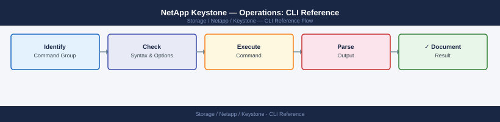

---
tags:
  - netapp
  - operations
---
# NetApp Keystone — Operations: CLI Reference


```bash
# Show Collector status and version
keystone-collector status
keystone-collector version

# Validate configuration
keystone-config validate

# Force data collection (triggers immediate usage push to Keystone portal)
keystone-collector collect --force

# Show last collection result
keystone-collector show-last-collection

# List managed arrays
keystone-collector list-arrays

# Update Collector software
keystone-collector upgrade --check     # dry-run
keystone-collector upgrade --apply
```

```python
import requests

PORTAL = "https://keystone.netapp.com/api/v1"
TOKEN  = "<keystone-api-token>"
HDR    = {"Authorization": f"Bearer {TOKEN}", "Content-Type": "application/json"}

# Get subscription details
resp = requests.get(f"{PORTAL}/subscriptions", headers=HDR)
for sub in resp.json().get("subscriptions", []):
    print(f"{sub['subscriptionNumber']}  committed={sub['committedCapacity']} consumed={sub['consumedCapacity']}")
```

## Before you begin

- **Access:** Storage admin credentials (cluster admin or equivalent)
- **Timing:** safe to run during business hours unless a step is marked ⚠ (causes interruption)
- **Dependencies:** no active upgrades or migrations on the same infrastructure
- **Logging:** capture command output — paste into the change record on completion

---

---

## Verify

- Confirm the operation completed without errors in the log or management UI
- Verify the expected state change is visible (service running, object created, config applied)
- Document the outcome in the change record

---

## See also

- [Keystone — Procedures](../procedures/)
- [Keystone — Scripts](../scripts/)
- [Keystone — Health Checks](../health-checks/)
