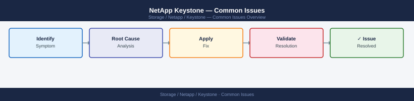

---
tags:
  - netapp
  - operations
---
# NetApp Keystone — Common Issues

<div class="kb-summary">
Common Issues reference covering Keystone Collector Not Reporting, Subscription Consumption Shows Unexpected Spike, SnapMirror Lag Alert, Collector VM Cannot Reach ONTAP Array, Keystone Portal Shows Wrong Committed Capacity and 1 more sections.

*Applies to: Keystone STaaS*
</div>


## Before you begin

- **Access:** Storage admin credentials (cluster admin or equivalent)
- **Timing:** safe to run during business hours unless a step is marked ⚠ (causes interruption)
- **Dependencies:** no active upgrades or migrations on the same infrastructure
- **Logging:** capture command output — paste into the change record on completion

---

## Keystone Collector Not Reporting

**Symptom:** Keystone portal shows arrays as "not reporting" or last collection timestamp is stale.

**Checks:**

```bash
# On Collector VM
keystone-collector status
keystone-collector show-last-collection

# Check network connectivity to Keystone cloud endpoints
curl -I https://keystone.netapp.com
curl -I https://api.keystone.netapp.com

# Check Collector logs
journalctl -u keystone-collector --since "1 hour ago"
```

**Resolution:**

1. Confirm outbound HTTPS (443) is allowed from Collector VM to NetApp cloud endpoints
2. Re-validate configuration: `keystone-config validate`
3. Force a collection: `keystone-collector collect --force`
4. If still failing, restart the service: `systemctl restart keystone-collector`

---

## Subscription Consumption Shows Unexpected Spike

**Symptom:** Keystone portal reports a sudden jump in consumed TiB not explained by provisioning.

**Checks:**

```bash
# On ONTAP — check which volumes grew
volume show -vserver <keystone-svm> -fields size,used,percent-used | sort -k3 -r

# Check for large snapshot accumulation
volume snapshot show -vserver <keystone-svm> -fields size

# Check for new qtrees or volumes provisioned without Keystone awareness
volume show -vserver <keystone-svm>
qtree show -vserver <keystone-svm>
```

**Common causes:** Snapshot accumulation from a missed cleanup job; a bulk data ingest; a new volume provisioned directly on the SVM outside of Keystone portal workflow.

---

## SnapMirror Lag Alert

**Symptom:** Keystone portal or ONTAP reports replication lag on a Keystone-backed SnapMirror relationship.

```bash
# Check SnapMirror relationship status
snapmirror show -vserver <svm> -fields state,lag-time,health

# Re-sync if relationship is broken
snapmirror resync -source-path <src> -destination-path <dst>

# Update immediately
snapmirror update -destination-path <dst>
```

---

## Collector VM Cannot Reach ONTAP Array

**Symptom:** `keystone-collector list-arrays` shows an array as unreachable.

```bash
# Test from Collector VM
ping <ontap-mgmt-ip>
curl -sk -u admin:<pass> https://<ontap-mgmt-ip>/api/cluster | jq .name

# Check ONTAP management LIF status
network interface show -role cluster-mgmt
```

**Resolution:** Confirm ONTAP management LIF is up, firewall rules allow 443 from Collector VM, and credentials stored in Collector config are current.

---

## Keystone Portal Shows Wrong Committed Capacity

**Symptom:** Portal committed TiB doesn't match the signed order.

**Action:** Open a support case with NetApp referencing subscription number. The committed values are provisioned by NetApp — they cannot be self-corrected.

---

## Quick Reference — Error Patterns

| Symptom | First Check |
|---|---|
| Stale last-collection timestamp | `keystone-collector status` + outbound 443 |
| Consumption spike | Snapshot accumulation on SVM |
| SnapMirror lag | `snapmirror show -fields lag-time,health` |
| Array unreachable | ONTAP mgmt LIF + firewall |
| Wrong committed capacity | NetApp support ticket |

---

## Verify

- Confirm the operation completed without errors in the log or management UI
- Verify the expected state change is visible (service running, object created, config applied)
- Document the outcome in the change record

## See also

- [NetApp Keystone — Operations: Backup & Restore](backup-restore.md)
- [NetApp Keystone — Operations: CLI Reference](cli-reference.md)
- [Keystone — Health Checks](health-checks.md)
- [NetApp Keystone — Operations](index.md)
- [Keystone — Architecture](../architecture/)
- [NetApp Keystone Security](../security/)
- [NetApp Keystone Troubleshooting](../troubleshooting/)
