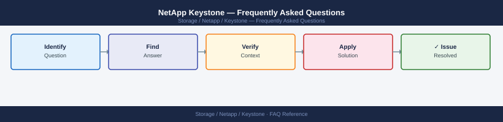

---
tags:
  - netapp-keystone
  - faq
  - operations
---
# NetApp Keystone — Frequently Asked Questions

*Applies to: NetApp ONTAP 9.x*

Common questions about NetApp Keystone operations, configuration, and troubleshooting. For step-by-step procedures, see the <a href="index.md">Operations</a> section.

## General

**Q: How do I check my Keystone subscription status and committed capacity?**
A: Log in to NetApp BlueXP (console.bluexp.netapp.com) → Keystone → Subscriptions. View committed capacity, consumed capacity, and burst usage by service level.

**Q: How do I check the current NetApp Keystone version?**
A: `BlueXP → Keystone → Subscriptions → View Details`

## Configuration

**Q: What is the default burst tolerance for Keystone subscriptions?**
A: Keystone allows burst up to 20% above committed capacity. Burst usage is billed at a higher rate. Monitor burst consumption in BlueXP → Keystone → Capacity Trend to avoid unexpected charges.

**Q: How do I enable Keystone capacity reporting alerts?**
A: In BlueXP → Keystone → Alerts, configure capacity threshold notifications (e.g., alert at 80% of committed capacity). Alerts are sent via email. Set up early warnings to allow time for subscription adjustment.

## Operations

**Q: How does Keystone handle service level upgrades mid-subscription?**
A: Contact NetApp to modify the subscription. Service level changes (e.g., Extreme to Premium) take effect at the next billing period. Capacity committed at the new level is immediately available after order processing.

**Q: What is the correct procedure to add capacity to a Keystone subscription?**
A: Submit a request via BlueXP → Keystone → Manage Subscription → Add Capacity, or contact your NetApp account team. Additional committed capacity is typically provisioned within 2 business days.

## Troubleshooting

**Q: Keystone shows 'Burst threshold exceeded'. What does it mean?**
A: Consumed capacity exceeds the committed + 20% burst threshold. Additional burst may be denied or billed at overage rates per your contract. Review which workloads are consuming excess capacity and either expand the subscription or reduce consumption.

**Q: Keystone storage performance is below committed SLA — where do I start?**
A: Check BlueXP performance dashboards. If below contracted SLA, raise a support case with NetApp. Keystone SLAs are contractually backed — NetApp is obligated to investigate and remediate.

## Backup and Recovery

**Q: How is Keystone data protected?**
A: Keystone includes built-in redundancy. Application-level backup (SnapCenter, Veeam) is the customer's responsibility. Review your Keystone contract for data protection responsibilities and included snapshot features.

**Q: Can I restore data from a Keystone snapshot?**
A: Yes — Keystone services include snapshot capabilities. Restore via the array management interface (ONTAP System Manager for Keystone ONTAP services) or via the backup application (SnapCenter).

## See Also

- [NetApp Keystone Operations](index.md)
- [NetApp Keystone Troubleshooting](../../../troubleshooting/index.md)
