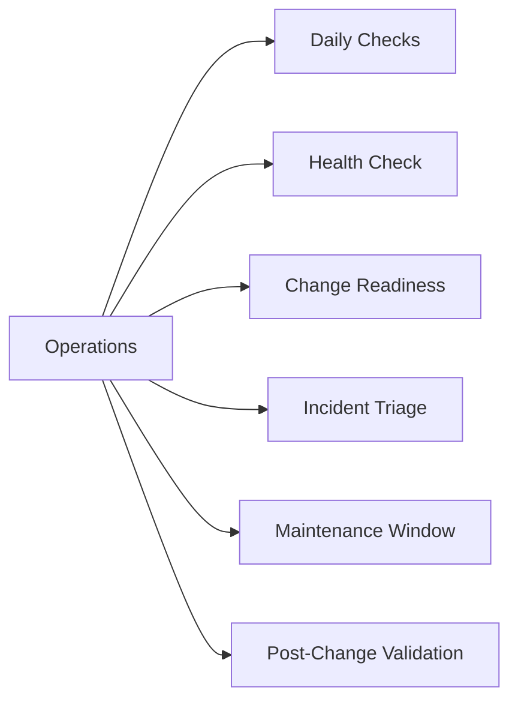

# Operations

> Part of the [NetApp Keystone](../) reference.

---

## Daily Checks

| Check | Command | Notes |
|---|---|---|
| [ ] Verify Keystone Collector service is running | `systemctl status keystone-collector` |  |
| [ ] Check last collection timestamp in collector logs | `journalctl -u keystone-collector -n 50 | grep -i "collection\|reported\|error"` |  |
| [ ] Open BlueXP → Digital Wallet → Keystone |  |  |
| [ ] Check burst usage |  | flag if any service level is consuming burst > 10% above committed tier |
| [ ] Run `volume show -fields qos-policy-group` on the ONTAP cluster | `volume show -fields qos-policy-group` | confirm all Keystone volumes have an AQoS policy assigned |
| [ ] Check for unclassified volumes (missing or incorrect QoS policy gr |  |  |
| [ ] Review the Keystone Collector health dashboard in BlueXP for any c |  |  |

## Health Check

- [ ] Collector service is active and not in a failed or activating loop
- [ ] Last successful telemetry report is within the expected collection interval (typically 1 hour)
- [ ] No collection errors in `/var/log/keystone-collector/` or systemd journal
- [ ] BlueXP Keystone dashboard reflects current capacity — data is not stale
- [ ] No service-level SLA breaches flagged (availability, latency, IOPS/TB)
- [ ] All volumes are assigned to the correct Keystone service-level AQoS policy group
- [ ] Burst usage is within acceptable range — not approaching the burst limit

~~~bash
# On the Keystone Collector VM — check collector service status
sudo systemctl status keystone-collector

# View recent collector logs for errors or collection timestamps
sudo journalctl -u keystone-collector -n 100

# Tail the collector log file directly
sudo tail -100 /var/log/keystone-collector/keystone-collector.log

# On the ONTAP cluster — verify AQoS policies exist for all Keystone service levels
qos policy-group show

# Check that all volumes have a Keystone AQoS policy group assigned
volume show -fields volume,svm,qos-policy-group

# Confirm ONTAP cluster is reachable from the Collector VM
curl -sk https://<cluster-mgmt-lif>/api/cluster | python3 -m json.tool
~~~

## Change Readiness

- [ ] Keystone Collector is running and last reported telemetry within the expected interval
- [ ] Confirm the change is not scheduled immediately before the monthly billing close (avoid capacity spikes at billing cutover)
- [ ] All volumes involved in the change have correct AQoS policy-group assignments — verify before and after
- [ ] If adding new volumes, the target Keystone service level has sufficient committed capacity headroom
- [ ] If decommissioning volumes, confirm snapshot copies on those volumes are also being removed to avoid lingering capacity charges
- [ ] Collector configuration backup taken: copy `/etc/keystone-collector/` and current config before any Collector changes
- [ ] BlueXP dashboard reviewed for current consumed vs. committed — document baseline before change

| Item | Status | Notes |
|---|---|---|
| Collector reporting current telemetry | | |
| Change timed away from billing close | | |
| AQoS policy-group assignments verified | | |
| Target service level has capacity headroom | | |
| Baseline consumption documented in BlueXP | | |

## Incident Triage

- [ ] If no telemetry in BlueXP: run `systemctl status keystone-collector` — check for crash or config error
- [ ] If Collector stopped: restart with `systemctl restart keystone-collector`; then check logs for root cause
- [ ] If capacity discrepancy in BlueXP: audit volume QoS assignments with `volume show -fields qos-policy-group` — identify unclassified or mis-assigned volumes
- [ ] If burst usage spike: identify which service level is bursting in BlueXP dashboard; review recent provisioning and snapshot schedules
- [ ] If billing question or discrepancy: export the consumption report from BlueXP Digital Wallet; compare against provisioned volumes; open a Keystone support case if data is inconsistent
- [ ] If Collector cannot reach ONTAP cluster: test connectivity from the Collector VM with `curl -sk https://<cluster-mgmt-lif>/api/cluster`; check firewall and credentials
- [ ] If SLA latency breach: review `qos statistics performance show` on ONTAP; consider escalating workload to a higher service level tier

| Question | Answer |
|---|---|
| Is the Collector service running and reporting? | |
| What does the BlueXP Keystone dashboard show? | |
| Are all volumes assigned to correct AQoS policies? | |
| Which service level is bursting and by how much? | |
| Is this a billing discrepancy or a real capacity issue? | |

## Maintenance Window

1. Record the current consumed capacity baseline from BlueXP Digital Wallet before starting
2. If performing Collector maintenance: stop the Collector with `systemctl stop keystone-collector`; complete changes; restart with `systemctl start keystone-collector`
3. For ONTAP cluster changes that affect Keystone-reported volumes: complete the ONTAP change following the standard ONTAP maintenance procedure
4. After ONTAP changes, verify AQoS policy-group assignments are still intact: `volume show -fields qos-policy-group`
5. Restart Keystone Collector if any ONTAP credentials or cluster management LIF changed: update the Collector configuration via the TUI first
6. Monitor Collector logs for the next collection cycle to confirm successful telemetry reporting
7. Validate the BlueXP Keystone dashboard reflects accurate consumption within one reporting cycle before closing the maintenance window

## Post-Change Validation

- [ ] Keystone Collector is running and not in an error state: `systemctl status keystone-collector`
- [ ] New collection timestamp visible in logs — telemetry resumed after the change
- [ ] BlueXP Keystone dashboard shows updated consumption data (not stale from before the change)
- [ ] All volumes — including any newly provisioned during the window — have correct AQoS policy-group assignments
- [ ] No unclassified volumes: `volume show -fields qos-policy-group` shows no blanks for Keystone volumes
- [ ] Consumed capacity in BlueXP is consistent with expected provisioned capacity post-change
- [ ] No unexpected burst activation triggered by the change
