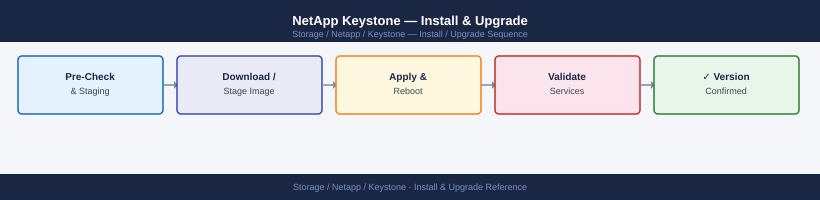

---
tags:
  - netapp
  - operations
---
# NetApp Keystone — Install & Upgrade

<div class="kb-summary">
Install & Upgrade reference covering Keystone Collector Deployment, Upgrade Keystone Collector, Add a New ONTAP Array to Keystone, Remove an Array from Keystone, Post-Upgrade Validation.

*Applies to: Keystone STaaS*
</div>


## Before you begin

- **Access:** Storage admin credentials (cluster admin or equivalent)
- **Timing:** safe to run during business hours unless a step is marked ⚠ (causes interruption)
- **Dependencies:** no active upgrades or migrations on the same infrastructure
- **Logging:** capture command output — paste into the change record on completion

---

## Keystone Collector Deployment

The Keystone Collector is deployed as an OVA on vSphere. It collects usage data from ONTAP arrays and reports to the Keystone portal.

### Prerequisites

| Requirement | Specification |
|---|---|
| vSphere version | 6.7 U3+ or 7.x |
| vCPU | 4 |
| Memory | 12 GB |
| Disk | 200 GB |
| Network | HTTPS (443) outbound to NetApp cloud endpoints |
| ONTAP version | 9.8+ recommended |

### OVA Deployment Steps

1. Download the Keystone Collector OVA from the NetApp Support portal
2. Deploy OVA via vSphere Client → **File → Deploy OVF Template**
3. Assign a static IP on the management network
4. Power on and accept EULA at first boot
5. Run initial setup wizard:

```bash
# SSH into Collector VM (default credentials in deployment guide)
ssh admin@<collector-ip>

# Run initial setup
keystone-config setup

# Follow prompts:
# - Enter Keystone portal credentials
# - Add ONTAP array IPs and credentials
# - Configure proxy if required
# - Run validation
keystone-config validate
```

## Upgrade Keystone Collector

```bash
# Check current version
keystone-collector version

# Check for available update
keystone-collector upgrade --check

# Apply upgrade (downloads and installs new version)
keystone-collector upgrade --apply

# Verify after upgrade
keystone-collector version
keystone-collector status
```

## Add a New ONTAP Array to Keystone

```bash
# On Collector VM
keystone-config add-array \
    --host <ontap-mgmt-ip> \
    --username admin \
    --password <pass> \
    --type ontap

# Validate the new array is reachable
keystone-config validate

# Force immediate collection to confirm data flows
keystone-collector collect --force

# Verify in portal — array should appear within 15 minutes
```

## Remove an Array from Keystone

```bash
keystone-config remove-array --host <ontap-mgmt-ip>
keystone-config validate
```

## Post-Upgrade Validation

```bash
# Confirm status is healthy
keystone-collector status

# Confirm last collection succeeded
keystone-collector show-last-collection

# Check logs for errors
journalctl -u keystone-collector --since "30 min ago" | grep -i error
```

---

## Verify

- Confirm the operation completed without errors in the log or management UI
- Verify the expected state change is visible (service running, object created, config applied)
- Document the outcome in the change record

---

## See also

- [Keystone — Procedures](procedures/)
- [Keystone — Health Checks](health-checks/)
