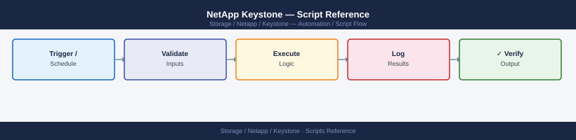

---
tags:
  - netapp
  - operations
---
# NetApp Keystone — Script Reference

<div class="kb-summary">
Script Reference reference covering Subscription Utilization Report, ONTAP Volume Usage Snapshot, Keystone Collector Health Monitor.

*Applies to: Keystone STaaS*
</div>


## Before you begin

- **Access:** Storage admin credentials (cluster admin or equivalent)
- **Timing:** safe to run during business hours unless a step is marked ⚠ (causes interruption)
- **Dependencies:** no active upgrades or migrations on the same infrastructure
- **Logging:** capture command output — paste into the change record on completion

---

## Subscription Utilization Report

Queries the Keystone portal API and generates a CSV report of committed vs consumed capacity per service tier.

```python
#!/usr/bin/env python3
"""
keystone-capacity-report.py
Requires: pip install requests
"""
import requests, csv, os
from datetime import datetime

PORTAL   = "https://keystone.netapp.com/api/v1"
TOKEN    = os.environ.get("KEYSTONE_TOKEN", "")
HDR      = {"Authorization": f"Bearer {TOKEN}"}
OUT_FILE = f"keystone-report-{datetime.now().strftime('%Y%m%d')}.csv"

def main():
    resp = requests.get(f"{PORTAL}/subscriptions", headers=HDR)
    resp.raise_for_status()
    subscriptions = resp.json().get("subscriptions", [])

    with open(OUT_FILE, "w", newline="") as f:
        writer = csv.writer(f)
        writer.writerow(["Subscription", "ServiceLevel", "CommittedTiB",
                         "ConsumedTiB", "BurstTiB", "PctUsed"])
        for sub in subscriptions:
            for tier in sub.get("serviceLevels", []):
                committed = tier.get("committedCapacity", 0)
                consumed  = tier.get("consumedCapacity", 0)
                burst     = tier.get("burstCapacity", 0)
                pct       = round(consumed / committed * 100, 1) if committed else 0
                writer.writerow([
                    sub.get("subscriptionNumber"),
                    tier.get("name"),
                    committed, consumed, burst, pct
                ])
                print(f"{tier.get('name'):<20} {consumed:>8.2f} / {committed:<8.2f} TiB  ({pct}%)")

    print(f"\nReport saved: {OUT_FILE}")

if __name__ == "__main__":
    main()
```

## ONTAP Volume Usage Snapshot

Pulls current volume usage from all Keystone-managed ONTAP arrays via REST API.

```bash
#!/usr/bin/env bash
# ontap-volume-usage.sh
# Usage: ONTAP_IP=<ip> ONTAP_USER=admin ONTAP_PASS=<pass> ./ontap-volume-usage.sh

ONTAP_IP="${ONTAP_IP:?ONTAP_IP required}"
ONTAP_USER="${ONTAP_USER:-admin}"
ONTAP_PASS="${ONTAP_PASS:?ONTAP_PASS required}"
SVM="${SVM:-}"   # optional: filter by SVM name

AUTH="$ONTAP_USER:$ONTAP_PASS"
BASE="https://$ONTAP_IP/api"
QUERY="fields=name,svm,space"
[[ -n "$SVM" ]] && QUERY="$QUERY&svm.name=$SVM"

echo "=== Volume Usage Report: $ONTAP_IP $(date) ==="
printf "%-40s %-20s %12s %12s %8s\n" "Volume" "SVM" "UsedGiB" "TotalGiB" "Used%"
printf '%.0s-' {1..96}; echo

curl -sk -u "$AUTH" "$BASE/storage/volumes?$QUERY&limit=500" | \
jq -r '.records[] | [
    .name,
    .svm.name,
    (.space.used / 1073741824 | round),
    (.space.size / 1073741824 | round),
    (if .space.size > 0 then (.space.used / .space.size * 100 | round) else 0 end)
] | @tsv' | \
awk -F'\t' '{ printf "%-40s %-20s %12s %12s %7s%%\n", $1, $2, $3, $4, $5 }' | sort
```


```text title="Expected output"
=== Volume Usage Report: 192.168.1.50 Wed Jan 15 14:32:18 UTC 2025 ===
Volume                                   SVM                      UsedGiB     TotalGiB   Used%
------------------------------------------------------------------------------------------------
vol_data_prod                            svm_prod                    2048       5120     40%
vol_logs_archive                         svm_prod                     512       2048     25%
vol_backup_dr                            svm_dr                      3584       8192     44%
vol_home_users                           svm_corp                     768       1024     75%
vol_temp_scratch                         svm_corp                      64        512      12%
vol_analytics_raw                        svm_analytics               4096      10240     40%
vol_snapshots_reserve                    svm_prod                     256       1024     25%
```

!!! warning "Common errors"
    **`curl: (60) SSL certificate problem: self signed certificate`** — Add `-k` flag to curl (already present) or import the ONTAP certificate into your system's CA bundle.
    **`jq: parse error: Cannot index number with string "name"`** — Verify the ONTAP API version supports the `/storage/volumes` endpoint and that `fields=name,svm,space` returns valid JSON with `.svm.name` structure.
    **`ONTAP_IP required`** — Set the ONTAP_IP environment variable before running the script: `export ONTAP_IP=192.168.1.50`.
## Keystone Collector Health Monitor

Runs from cron on the Collector VM. Sends an alert if Collector has not collected within the last 2 hours.

```bash
#!/usr/bin/env bash
# ks-collector-monitor.sh
# Add to cron: 0 * * * * /opt/scripts/ks-collector-monitor.sh

ALERT_EMAIL="infra@example.com"
MAX_AGE_HOURS=2

LAST=$(keystone-collector show-last-collection 2>/dev/null | \
    grep -oP '\d{4}-\d{2}-\d{2}T\d{2}:\d{2}:\d{2}')

if [[ -z "$LAST" ]]; then
    echo "Keystone Collector: no collection timestamp found" | \
        mail -s "[ALERT] Keystone Collector - No Collection Data" "$ALERT_EMAIL"
    exit 1
fi

LAST_EPOCH=$(date -d "$LAST" +%s 2>/dev/null || date -j -f "%Y-%m-%dT%H:%M:%S" "$LAST" +%s)
NOW_EPOCH=$(date +%s)
AGE_HOURS=$(( (NOW_EPOCH - LAST_EPOCH) / 3600 ))

if (( AGE_HOURS >= MAX_AGE_HOURS )); then
    echo "Last successful collection was ${AGE_HOURS}h ago (threshold: ${MAX_AGE_HOURS}h)" | \
        mail -s "[ALERT] Keystone Collector - Stale Collection" "$ALERT_EMAIL"
    exit 1
fi

echo "Keystone Collector OK - last collection ${AGE_HOURS}h ago"
```


```text title="Expected output"
Keystone Collector OK - last collection 0h ago
```

!!! warning "Common errors"
    **`keystone-collector: command not found`** — Ensure the NetApp Keystone Collector package is installed and `/opt/keystone/bin` is in your PATH, or use the full path to the binary.
    **`date: invalid date 'YYYY-MM-DDTHH:MM:SS'`** — The `show-last-collection` output format differs from expected; verify the actual output format with `keystone-collector show-last-collection` and adjust the grep pattern accordingly.
---

## Verify

- Confirm the operation completed without errors in the log or management UI
- Verify the expected state change is visible (service running, object created, config applied)
- Document the outcome in the change record

---

## See also

- [Keystone — Procedures](../procedures/)
- [Keystone — CLI Reference](../cli-reference/)
- [Keystone — Health Checks](../health-checks/)
