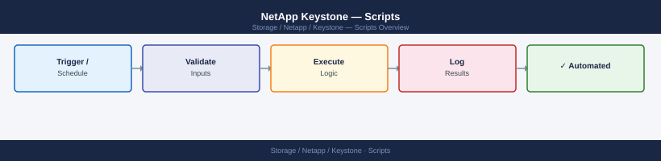

---
tags:
  - netapp
---
# NetApp Keystone — Scripts


<div class="kb-summary">
NetApp Keystone automation scripts: REST API queries for subscription consumption data, capacity trend reporting, and SLA threshold alert integration.

*Applies to: Keystone STaaS*
</div>



---
## Keystone Collector Health Check (Bash)

Check Keystone Collector service status, verify the last collection timestamp from the collector log, and confirm the collector can reach the Keystone API endpoint. Exits non-zero if the collector is stopped or the last collection is more than two hours old.

```bash
#!/bin/bash
# Keystone Collector Health Check
# Run on the Keystone Collector host.
# Usage: KEYSTONE_API_HOST=keystone.example.com ./keystone_health.sh

set -euo pipefail

KEYSTONE_API_HOST="${KEYSTONE_API_HOST:-keystone.netapp.com}"
LOG_DIR="${KEYSTONE_LOG_DIR:-/var/log/keystone-collector}"
MAX_AGE_HOURS=2

# ANSI colours
RED='\033[0;31m'; YEL='\033[0;33m'; GRN='\033[0;32m'; NC='\033[0m'

worst=0  # 0=OK 1=WARN 2=CRIT

pass()  { echo -e "${GRN}[PASS]${NC}  $*"; }
warn()  { echo -e "${YEL}[WARN]${NC}  $*"; (( worst < 1 )) && worst=1; }
fail()  { echo -e "${RED}[FAIL]${NC}  $*"; (( worst < 2 )) && worst=2; }

echo "=== Keystone Collector Health Check ==="
echo "Host : $(hostname)"
echo "Time : $(date)"
echo "---------------------------------------"

# ------------------------------------------------------------------
# Check 1: systemd service status
# ------------------------------------------------------------------
if systemctl is-active --quiet keystone-collector 2>/dev/null; then
    pass "keystone-collector service is active"
elif systemctl is-active --quiet keystonecollector 2>/dev/null; then
    pass "keystonecollector service is active"
else
    fail "Keystone Collector service is NOT running"
    echo "       Hint: sudo systemctl start keystone-collector"
fi

# ------------------------------------------------------------------
# Check 2: Last collection timestamp from logs
# ------------------------------------------------------------------
LATEST_LOG=$(find "$LOG_DIR" -maxdepth 2 -name "*.log" -newer /dev/null 2>/dev/null \
             | xargs ls -t 2>/dev/null | head -1)

if [[ -z "$LATEST_LOG" ]]; then
    warn "No log files found in $LOG_DIR"
else
    # Look for the most recent "collection completed" or "data collected" entry
    LAST_LINE=$(grep -iE "collection (complete|success|finished)|data collected" "$LATEST_LOG" 2>/dev/null \
                | tail -1 || true)

    if [[ -z "$LAST_LINE" ]]; then
        warn "No successful collection entry found in $LATEST_LOG"
    else
        # Extract ISO timestamp if present (format: 2024-01-15T14:30:00)
        if [[ "$LAST_LINE" =~ ([0-9]{4}-[0-9]{2}-[0-9]{2}T[0-9]{2}:[0-9]{2}:[0-9]{2}) ]]; then
            LAST_TS="${BASH_REMATCH[1]}"
            LAST_EPOCH=$(date -d "$LAST_TS" +%s 2>/dev/null || date -j -f "%Y-%m-%dT%H:%M:%S" "$LAST_TS" +%s 2>/dev/null || echo 0)
            NOW_EPOCH=$(date +%s)
            AGE_HOURS=$(( (NOW_EPOCH - LAST_EPOCH) / 3600 ))

            if (( AGE_HOURS <= MAX_AGE_HOURS )); then
                pass "Last collection: $LAST_TS (${AGE_HOURS}h ago)"
            else
                fail "Last collection was ${AGE_HOURS}h ago (threshold: ${MAX_AGE_HOURS}h) — $LAST_TS"
            fi
        else
            warn "Cannot parse timestamp from: $LAST_LINE"
        fi
    fi
fi

# ------------------------------------------------------------------
# Check 3: API endpoint reachability
# ------------------------------------------------------------------
API_URL="https://${KEYSTONE_API_HOST}/api/v1/health"
HTTP_CODE=$(curl -sk -o /dev/null -w "%{http_code}" --max-time 10 "$API_URL" 2>/dev/null || echo "000")

if [[ "$HTTP_CODE" =~ ^(200|401|403) ]]; then
    # 401/403 means the endpoint is reachable but auth is required — that is fine for a connectivity test
    pass "Keystone API endpoint reachable (HTTP $HTTP_CODE) — $KEYSTONE_API_HOST"
elif [[ "$HTTP_CODE" == "000" ]]; then
    fail "Cannot reach Keystone API endpoint — $KEYSTONE_API_HOST (connection refused or DNS failure)"
else
    warn "Keystone API returned unexpected status HTTP $HTTP_CODE — $KEYSTONE_API_HOST"
fi

# ------------------------------------------------------------------
# Summary
# ------------------------------------------------------------------
echo "---------------------------------------"
case $worst in
    0) echo -e "${GRN}Overall: PASS${NC}" ;;
    1) echo -e "${YEL}Overall: WARNING${NC}" ;;
    2) echo -e "${RED}Overall: FAIL${NC}" ;;
esac
exit $worst
```

### How to run this script — step by step

**Before you start — what you need**
- This script is designed to run directly on the Linux server that hosts the Keystone Collector — it checks a local systemd service and local log files
- SSH access to that Linux server, or a terminal already open on it
- On Windows: use WSL, Git Bash, or PuTTY/SSH to connect to the collector server first

**Step 1 — Save the file**

1. Open **Notepad** (press the Windows key, type `Notepad`, press Enter)
2. Copy the entire code block above
3. Click **File → Save As**
4. Change "Save as type" to **All Files**
5. Name it `keystone_health.sh` — save it to your Desktop

**Step 2 — Fill in your details**

| Variable | What to put here | Where to find it |
|---|---|---|
| `KEYSTONE_API_HOST` | Keystone API hostname (default: keystone.netapp.com) | Your NetApp account team |
| `KEYSTONE_LOG_DIR` | Path to Keystone Collector logs (default: /var/log/keystone-collector) | Your Linux admin |

**Step 3 — Copy the script to the Keystone Collector server**

From Windows, open Command Prompt and use SCP to copy the file:
```bash
scp %USERPROFILE%\Desktop\keystone_health.sh youruser@collector-server:/home/youruser/
```

Or use WinSCP (winscp.net — free tool) to drag and drop the file.

**Step 4 — Run the script on the collector server**

SSH into the collector server (use PuTTY or Windows Terminal) and run:
```text
bash keystone_health.sh
```

**What you should see**

Three check results: `[PASS]`, `[WARN]`, or `[FAIL]` for the service status, last collection age, and API reachability. An overall status line at the bottom. If the collector service is stopped or the last collection was more than 2 hours ago, you will see `[FAIL]` and a hint on how to fix it.

---

## Keystone Usage Report (Python)

Authenticate to the NetApp BlueXP / Keystone API with an API key, retrieve committed vs. consumed capacity per service level tier, calculate burst usage percentage, and print a formatted table. Warns if burst exceeds 10% of committed for any tier.

```python
#!/usr/bin/env python3
"""
Keystone Usage Report
Requires: pip install requests tabulate
Variables: KEYSTONE_API_HOST, API_KEY, SUBSCRIPTION_ID
"""

import os
import sys
import requests
from tabulate import tabulate

# -------------------------------------------------------------------
# Configuration
# -------------------------------------------------------------------
API_HOST        = os.environ.get("KEYSTONE_API_HOST", "keystone.netapp.com")
API_KEY         = os.environ.get("API_KEY",           "")
SUBSCRIPTION_ID = os.environ.get("SUBSCRIPTION_ID",   "")
BURST_WARN_PCT  = 10   # warn if burst > this % of committed

if not API_KEY or not SUBSCRIPTION_ID:
    sys.exit("ERROR: Set API_KEY and SUBSCRIPTION_ID environment variables.")

BASE_URL = f"https://{API_HOST}/api/v1"
HEADERS  = {
    "Authorization": f"Bearer {API_KEY}",
    "Content-Type":  "application/json",
}

# ANSI colours
RED = "\033[0;31m"; YEL = "\033[0;33m"; GRN = "\033[0;32m"; NC = "\033[0m"

# -------------------------------------------------------------------
# Fetch subscription usage
# -------------------------------------------------------------------
def fetch_usage():
    url = f"{BASE_URL}/subscriptions/{SUBSCRIPTION_ID}/usage"
    resp = requests.get(url, headers=HEADERS, timeout=30, verify=True)
    resp.raise_for_status()
    return resp.json()

# -------------------------------------------------------------------
# Parse service level tiers from the API response
# -------------------------------------------------------------------
def parse_tiers(data):
    tiers = []
    # Adjust the key path to match your actual API response schema
    service_levels = data.get("service_levels", data.get("tiers", []))
    for sl in service_levels:
        name      = sl.get("name", sl.get("service_level", "unknown"))
        committed = float(sl.get("committed_tib", sl.get("committed", 0)))
        consumed  = float(sl.get("consumed_tib",  sl.get("consumed",  0)))
        burst     = float(sl.get("burst_tib",     sl.get("burst",     0)))
        burst_pct = (burst / committed * 100) if committed > 0 else 0.0
        tiers.append({
            "tier":      name,
            "committed": committed,
            "consumed":  consumed,
            "burst":     burst,
            "burst_pct": burst_pct,
        })
    return tiers

# -------------------------------------------------------------------
# Print the usage table
# -------------------------------------------------------------------
def print_table(tiers):
    rows = []
    warnings = []
    for t in tiers:
        pct_of_committed = (t["consumed"] / t["committed"] * 100) if t["committed"] > 0 else 0
        burst_flag = ""
        if t["burst_pct"] > BURST_WARN_PCT:
            burst_flag = f"{YEL} WARN{NC}"
            warnings.append(f"{t['tier']}: {t['burst_pct']:.1f}% burst of committed")

        rows.append([
            t["tier"],
            f"{t['committed']:.2f} TiB",
            f"{t['consumed']:.2f} TiB",
            f"{t['burst']:.2f} TiB",
            f"{t['burst_pct']:.1f}%{burst_flag}",
            f"{pct_of_committed:.1f}%",
        ])

    print(f"\nKeystone Usage Report — Subscription: {SUBSCRIPTION_ID}")
    print("=" * 80)
    print(tabulate(
        rows,
        headers=["Tier", "Committed", "Consumed", "Burst Used", "Burst %", "% of Committed"],
        tablefmt="simple",
    ))
    print()

    if warnings:
        print(f"{YEL}Burst warnings:{NC}")
        for w in warnings:
            print(f"  - {w}")
        print()

    return bool(warnings)

# -------------------------------------------------------------------
# Main
# -------------------------------------------------------------------
def main():
    try:
        data  = fetch_usage()
        tiers = parse_tiers(data)
    except requests.HTTPError as exc:
        sys.exit(f"API error: {exc}")
    except Exception as exc:
        sys.exit(f"Unexpected error: {exc}")

    if not tiers:
        print("No service level data returned. Check SUBSCRIPTION_ID.")
        sys.exit(1)

    had_warnings = print_table(tiers)
    sys.exit(1 if had_warnings else 0)

if __name__ == "__main__":
    main()
```

### How to run this script — step by step

**Before you start — what you need**
- Python 3 installed (download from python.org — tick "Add Python to PATH" during setup)
- A Keystone API key and your subscription ID — get these from your NetApp account team or the Keystone portal
- Internet access to reach the Keystone API at keystone.netapp.com

**Step 1 — Save the file**

1. Open **Notepad** (press the Windows key, type `Notepad`, press Enter)
2. Copy the entire code block above
3. Click **File → Save As**
4. Change "Save as type" to **All Files**
5. Name it `keystone_usage.py` — save it to your Desktop

**Step 2 — Fill in your details**

| Variable | What to put here | Where to find it |
|---|---|---|
| `API_KEY` | Your Keystone Bearer API key | NetApp Keystone portal or your account team |
| `SUBSCRIPTION_ID` | Your Keystone subscription ID | NetApp Keystone portal → Subscriptions |
| `KEYSTONE_API_HOST` | API hostname (default: keystone.netapp.com) | Your NetApp account team |

**Step 3 — Open Command Prompt**

Press the Windows key, type `cmd`, press Enter.

**Step 4 — Install required packages and set variables**

```bash
pip install requests tabulate
set API_KEY=your-api-key-here
set SUBSCRIPTION_ID=your-subscription-id
```

**Step 5 — Run the script**

```bash
cd %USERPROFILE%\Desktop
python keystone_usage.py
```

**What you should see**

A table with one row per Keystone service level tier (e.g., Extreme, Performance, Standard). Each row shows committed capacity, consumed capacity, burst used, burst percentage, and percentage of committed consumed. If any tier's burst exceeds 10% of committed capacity, it is flagged with a yellow `WARN` label.

---

## Volume Service Level Audit (Bash)

SSH to the ONTAP cluster backing a Keystone subscription, list all volumes and their assigned QoS policy groups, and flag any volumes that have no QoS policy assigned. Unclassified volumes may be billed at the wrong Keystone service level tier.

```bash
#!/bin/bash
# Keystone Volume Service Level Audit
# Usage: ONTAP_HOST=cluster ONTAP_USER=admin ONTAP_PASS=secret ./keystone_vol_audit.sh

set -euo pipefail

CLUSTER="${ONTAP_HOST:?Set ONTAP_HOST}"
USER="${ONTAP_USER:?Set ONTAP_USER}"
PASS="${ONTAP_PASS:?Set ONTAP_PASS}"

if ! command -v sshpass &>/dev/null; then
    echo "ERROR: sshpass required." >&2
    exit 3
fi

RAW=$(sshpass -p "$PASS" ssh -o StrictHostKeyChecking=no \
    "${USER}@${CLUSTER}" \
    'volume show -fields vserver,volume,qos-policy-group,state 2>/dev/null' 2>/dev/null)

# ANSI colours
RED='\033[0;31m'; GRN='\033[0;32m'; NC='\033[0m'

total=0
unclassified=0
declare -A tier_count

printf "\n%-30s %-35s %-30s %s\n" "VSERVER" "VOLUME" "QOS POLICY (SERVICE LEVEL)" "FLAG"
printf '%0.s-' {1..110}; echo

while IFS= read -r line; do
    [[ "$line" =~ ^(Vserver|vserver|[[:space:]]*$|[0-9]+ entries) ]] && continue

    vserver=$(echo "$line" | awk '{print $1}')
    volume=$(echo "$line"  | awk '{print $2}')
    qos=$(echo "$line"     | awk '{print $3}')
    state=$(echo "$line"   | awk '{print $4}')

    [[ -z "$vserver" || -z "$volume" ]] && continue
    [[ "$state" == "offline" ]] && continue   # skip offline volumes

    (( total++ ))

    if [[ -z "$qos" || "$qos" == "-" || "$qos" == "none" ]]; then
        flag="${RED}NO QOS — unclassified${NC}"
        (( unclassified++ ))
    else
        flag="${GRN}OK${NC}"
        tier_count["$qos"]=$(( ${tier_count["$qos"]:-0} + 1 ))
    fi

    printf "%-30s %-35s %-30s " "$vserver" "$volume" "${qos:--}"
    echo -e "$flag"
done <<< "$RAW"

echo
printf '%0.s-' {1..110}; echo
echo "Total volumes checked : $total"
echo -e "Unclassified volumes  : ${RED}${unclassified}${NC}"

if (( ${#tier_count[@]} > 0 )); then
    echo
    echo "Volumes per QoS policy:"
    for tier in "${!tier_count[@]}"; do
        printf "  %-30s : %d volumes\n" "$tier" "${tier_count[$tier]}"
    done
fi

echo
if (( unclassified > 0 )); then
    echo -e "${RED}ACTION REQUIRED: $unclassified volume(s) have no QoS policy and may be billed at the wrong Keystone tier.${NC}"
    echo "Fix: volume modify -vserver <svm> -volume <vol> -qos-policy-group <keystone-psl>"
    exit 1
else
    echo -e "${GRN}All volumes have a QoS policy assigned.${NC}"
    exit 0
fi
```

### How to run this script — step by step

**Before you start — what you need**
- WSL (Windows Subsystem for Linux) with Ubuntu, or Git Bash from gitforwindows.org
- `sshpass` installed inside WSL: `sudo apt install sshpass`
- Network access to the ONTAP cluster that backs your Keystone subscription
- ONTAP admin credentials

**Step 1 — Save the file**

1. Open **Notepad** (press the Windows key, type `Notepad`, press Enter)
2. Copy the entire code block above
3. Click **File → Save As**
4. Change "Save as type" to **All Files**
5. Name it `keystone_vol_audit.sh` — save it to your Desktop

**Step 2 — Fill in your details**

| Variable | What to put here | Where to find it |
|---|---|---|
| `ONTAP_HOST` | Cluster management IP or hostname | NetApp System Manager |
| `ONTAP_USER` | ONTAP admin username | Your storage admin |
| `ONTAP_PASS` | ONTAP admin password | Your storage admin |

**Step 3 — Open WSL**

Open the Ubuntu app from the Start menu.

**Step 4 — Set variables and run**

```bash
export ONTAP_HOST=192.168.1.100
export ONTAP_USER=admin
export ONTAP_PASS=yourpassword
cd /mnt/c/Users/YourName/Desktop
bash keystone_vol_audit.sh
```

**What you should see**

A table listing every online volume with its SVM, volume name, QoS policy group, and a flag. Volumes with a QoS policy assigned show green `OK`. Volumes with no QoS policy show red `NO QOS — unclassified`. At the end, a count of unclassified volumes and a remediation command if any are found. Unclassified volumes are a billing risk in Keystone.

---

## Windows: Keystone Subscription Usage via REST API (PowerShell)

Authenticate to the NetApp ActiveIQ Keystone API using OAuth2 with a client ID and secret, retrieve subscription and usage data, and print a formatted capacity report.

```powershell
# keystone_usage_rest.ps1 — Keystone Subscription Usage via REST API (Windows PowerShell)
# Requires: PowerShell 5.1+ (pre-installed on Windows 10/11)
# Keystone API via ActiveIQ: https://api.activeiq.netapp.com/
# Run: .\keystone_usage_rest.ps1

$KeystoneClientId     = "your-client-id"      # OAuth2 client ID from ActiveIQ portal
$KeystoneClientSecret = "your-client-secret"   # OAuth2 client secret from ActiveIQ portal

# Handle self-signed SSL certificates if needed
if (-not ([System.Management.Automation.PSTypeName]'TrustAll').Type) {
    Add-Type @"
    using System.Net; using System.Security.Cryptography.X509Certificates;
    public class TrustAll : ICertificatePolicy {
        public bool CheckValidationResult(ServicePoint s, X509Certificate c, WebRequest r, int p) { return true; }
    }
"@
    [System.Net.ServicePointManager]::CertificatePolicy = New-Object TrustAll
}
[Net.ServicePointManager]::SecurityProtocol = [Net.SecurityProtocolType]::Tls12

$ApiBase = "https://api.activeiq.netapp.com"

# --- Step 1: Get OAuth2 access token ---
Write-Host "Authenticating to Keystone API ..." -ForegroundColor Cyan

try {
    $TokenResp = Invoke-RestMethod `
        -Uri    "$ApiBase/v1/tokens/accessToken" `
        -Method POST `
        -Body   (@{ client_id = $KeystoneClientId; client_secret = $KeystoneClientSecret } | ConvertTo-Json) `
        -ContentType "application/json" `
        -ErrorAction Stop
} catch {
    Write-Error "Authentication failed: $($_.Exception.Message)"
    exit 1
}

$AccessToken = $TokenResp.access_token
if (-not $AccessToken) {
    Write-Error "No access token returned. Check client_id and client_secret."
    exit 1
}

$AuthHeaders = @{ Authorization = "Bearer $AccessToken" }
Write-Host "Authenticated successfully." -ForegroundColor Green

# --- Step 2: List subscriptions ---
Write-Host "`nFetching Keystone subscriptions ..." -ForegroundColor Cyan

try {
    $SubsResp = Invoke-RestMethod `
        -Uri     "$ApiBase/v1/keystone/subscriptions" `
        -Headers $AuthHeaders `
        -Method  GET `
        -ErrorAction Stop
} catch {
    Write-Error "Failed to retrieve subscriptions: $($_.Exception.Message)"
    exit 1
}

$Subscriptions = $SubsResp.items
if (-not $Subscriptions -or $Subscriptions.Count -eq 0) {
    Write-Host "No Keystone subscriptions found for this account."
    exit 0
}

Write-Host "Found $($Subscriptions.Count) subscription(s).`n"

# --- Step 3: For each subscription, get usage ---
Write-Host "=== Keystone Subscription Usage Report ===" -ForegroundColor Cyan
Write-Host ("-" * 80)

foreach ($sub in $Subscriptions) {
    $subId   = $sub.id
    $subName = $sub.name

    Write-Host "`nSubscription: $subName  (ID: $subId)" -ForegroundColor Yellow

    try {
        $UsageResp = Invoke-RestMethod `
            -Uri     "$ApiBase/v1/keystone/subscriptions/$subId/usage" `
            -Headers $AuthHeaders `
            -Method  GET `
            -ErrorAction Stop
    } catch {
        Write-Warning "Could not retrieve usage for subscription $subName : $($_.Exception.Message)"
        continue
    }

    $tiers = $UsageResp.service_levels
    if (-not $tiers) { $tiers = $UsageResp.tiers }

    if (-not $tiers -or $tiers.Count -eq 0) {
        Write-Host "  No tier data available for this subscription."
        continue
    }

    Write-Host ("  {0,-25} {1,12} {2,12} {3,8}" -f "Tier", "Committed", "Consumed", "% Used")
    Write-Host ("  " + "-" * 62)

    foreach ($tier in $tiers) {
        $committed = [double]($tier.committed_tib ?? $tier.committed ?? 0)
        $consumed  = [double]($tier.consumed_tib  ?? $tier.consumed  ?? 0)
        $pctUsed   = if ($committed -gt 0) { [math]::Round($consumed / $committed * 100, 1) } else { 0 }

        $colour = if ($pctUsed -ge 90) { "Red" } elseif ($pctUsed -ge 80) { "Yellow" } else { "Green" }
        $tierName = $tier.name ?? $tier.service_level ?? "unknown"

        Write-Host ("  {0,-25} {1,10:F2} TiB {2,10:F2} TiB {3,6:F1}%" -f `
            $tierName, $committed, $consumed, $pctUsed) -ForegroundColor $colour
    }
}

Write-Host "`n" + ("-" * 80)
Write-Host "Report complete." -ForegroundColor Cyan
```

### How to run this script — step by step

**Before you start — what you need**
- A Windows 10 or Windows 11 PC (PowerShell is already installed)
- A Keystone OAuth2 client ID and client secret — get these from the NetApp ActiveIQ portal (activeiq.netapp.com) or ask your NetApp account team
- Internet access to reach api.activeiq.netapp.com

**Step 1 — Save the file**

1. Open **Notepad** (press the Windows key, type `Notepad`, press Enter)
2. Copy the entire code block above
3. Click **File → Save As**
4. Change "Save as type" to **All Files**
5. Name it `keystone_usage_rest.ps1` — save it to your Desktop

**Step 2 — Fill in your details**

Open the saved file in Notepad and change these lines near the top:

| Variable | What to put here | Where to find it |
|---|---|---|
| `$KeystoneClientId` | Your OAuth2 client ID | NetApp ActiveIQ portal → API access |
| `$KeystoneClientSecret` | Your OAuth2 client secret | NetApp ActiveIQ portal → API access |

**Step 3 — Open PowerShell as Administrator**

Press the Windows key, type `PowerShell`, right-click **Windows PowerShell**, choose **Run as Administrator**.

**Step 4 — Allow script execution (one-time per session)**

```powershell
Set-ExecutionPolicy -Scope Process -ExecutionPolicy Bypass
```

**Step 5 — Run the script**

```bash
cd C:\Users\YourName\Desktop
.\keystone_usage_rest.ps1
```

**What you should see**

The script authenticates, lists your Keystone subscriptions, and for each one prints a table of service level tiers (e.g., Extreme, Performance, Standard) showing committed capacity in TiB, consumed capacity in TiB, and percentage used. Tiers below 80% used appear in green, 80-89% in yellow, and 90%+ in red.

---

## Windows: Keystone Usage Trending (PowerShell)

Authenticate to the Keystone API and retrieve monthly usage history for each subscription. Print a simple text-based bar chart showing monthly consumption trends and warn if any month exceeded committed capacity.

```powershell
# keystone_trending.ps1 — Keystone Usage Trending (Windows PowerShell)
# Requires: PowerShell 5.1+ (pre-installed on Windows 10/11)
# Run: .\keystone_trending.ps1

$KeystoneClientId     = "your-client-id"      # OAuth2 client ID from ActiveIQ portal
$KeystoneClientSecret = "your-client-secret"   # OAuth2 client secret from ActiveIQ portal
$MonthsBack           = 3                      # How many months of history to show

# Handle self-signed SSL certificates if needed
if (-not ([System.Management.Automation.PSTypeName]'TrustAll').Type) {
    Add-Type @"
    using System.Net; using System.Security.Cryptography.X509Certificates;
    public class TrustAll : ICertificatePolicy {
        public bool CheckValidationResult(ServicePoint s, X509Certificate c, WebRequest r, int p) { return true; }
    }
"@
    [System.Net.ServicePointManager]::CertificatePolicy = New-Object TrustAll
}
[Net.ServicePointManager]::SecurityProtocol = [Net.SecurityProtocolType]::Tls12

$ApiBase = "https://api.activeiq.netapp.com"

# --- Authenticate ---
Write-Host "Authenticating to Keystone API ..." -ForegroundColor Cyan
try {
    $TokenResp = Invoke-RestMethod `
        -Uri    "$ApiBase/v1/tokens/accessToken" `
        -Method POST `
        -Body   (@{ client_id = $KeystoneClientId; client_secret = $KeystoneClientSecret } | ConvertTo-Json) `
        -ContentType "application/json" `
        -ErrorAction Stop
} catch {
    Write-Error "Authentication failed: $($_.Exception.Message)"
    exit 1
}
$AuthHeaders = @{ Authorization = "Bearer $($TokenResp.access_token)" }
Write-Host "Authenticated." -ForegroundColor Green

# --- Get subscriptions ---
$SubsResp = Invoke-RestMethod -Uri "$ApiBase/v1/keystone/subscriptions" -Headers $AuthHeaders -Method GET
$Subscriptions = $SubsResp.items
if (-not $Subscriptions -or $Subscriptions.Count -eq 0) {
    Write-Host "No subscriptions found."
    exit 0
}

Write-Host "`n=== Keystone Usage Trend ($MonthsBack months) ===" -ForegroundColor Cyan

# Helper: draw a simple ASCII bar
function Get-Bar {
    param([double]$pct, [int]$width = 30)
    $filled = [math]::Round($pct / 100 * $width)
    $filled = [math]::Max(0, [math]::Min($filled, $width))
    return "[" + ("#" * $filled) + ("-" * ($width - $filled)) + "]"
}

foreach ($sub in $Subscriptions) {
    $subId   = $sub.id
    $subName = $sub.name
    Write-Host "`nSubscription: $subName" -ForegroundColor Yellow

    try {
        $UsageResp = Invoke-RestMethod `
            -Uri     "$ApiBase/v1/keystone/subscriptions/$subId/usage?granularity=monthly" `
            -Headers $AuthHeaders `
            -Method  GET `
            -ErrorAction Stop
    } catch {
        Write-Warning "  Could not retrieve monthly usage for $subName"
        continue
    }

    # Get the most recent N months of data
    $monthlyData = $UsageResp.monthly_usage ?? $UsageResp.usage_history ?? @()
    if (-not $monthlyData -or $monthlyData.Count -eq 0) {
        Write-Host "  No monthly trend data available for this subscription."
        continue
    }

    # Sort by date, take last N months
    $sorted = $monthlyData | Sort-Object { $_.month ?? $_.period } | Select-Object -Last $MonthsBack

    foreach ($entry in $sorted) {
        $month     = $entry.month ?? $entry.period ?? "unknown"
        $committed = [double]($entry.committed_tib ?? $entry.committed ?? 0)
        $consumed  = [double]($entry.consumed_tib  ?? $entry.consumed  ?? 0)
        $pct       = if ($committed -gt 0) { [math]::Round($consumed / $committed * 100, 1) } else { 0 }
        $bar       = Get-Bar -pct $pct

        $overCommit = $consumed -gt $committed

        if ($overCommit) {
            $flag   = " *** OVER COMMITTED"
            $colour = "Red"
        } elseif ($pct -ge 90) {
            $flag   = " (near limit)"
            $colour = "Yellow"
        } else {
            $flag   = ""
            $colour = "Green"
        }

        Write-Host ("  {0,-10} {1} {2,5:F1}%  {3:F2}/{4:F2} TiB{5}" -f `
            $month, $bar, $pct, $consumed, $committed, $flag) -ForegroundColor $colour
    }
}

Write-Host "`n=== Trend report complete ===" -ForegroundColor Cyan
```

### How to run this script — step by step

**Before you start — what you need**
- A Windows 10 or Windows 11 PC (PowerShell is already installed)
- A Keystone OAuth2 client ID and client secret from the NetApp ActiveIQ portal
- Internet access to reach api.activeiq.netapp.com

**Step 1 — Save the file**

1. Open **Notepad** (press the Windows key, type `Notepad`, press Enter)
2. Copy the entire code block above
3. Click **File → Save As**
4. Change "Save as type" to **All Files**
5. Name it `keystone_trending.ps1` — save it to your Desktop

**Step 2 — Fill in your details**

Open the saved file in Notepad and change these lines near the top:

| Variable | What to put here | Where to find it |
|---|---|---|
| `$KeystoneClientId` | Your OAuth2 client ID | NetApp ActiveIQ portal → API access |
| `$KeystoneClientSecret` | Your OAuth2 client secret | NetApp ActiveIQ portal → API access |
| `$MonthsBack` | Number of months to show in the trend (default: 3) | Your preference |

**Step 3 — Open PowerShell as Administrator**

Press the Windows key, type `PowerShell`, right-click **Windows PowerShell**, choose **Run as Administrator**.

**Step 4 — Allow script execution (one-time per session)**

```powershell
Set-ExecutionPolicy -Scope Process -ExecutionPolicy Bypass
```

**Step 5 — Run the script**

```bash
cd C:\Users\YourName\Desktop
.\keystone_trending.ps1
```

**What you should see**

For each Keystone subscription, the script prints a row per month showing a text bar chart. The bar fills up proportionally to how much of your committed capacity was consumed that month. Green means well within limits, yellow means approaching the limit (90%+), and red with `*** OVER COMMITTED` means that month exceeded your committed capacity — which may trigger burst billing charges. This lets you spot growth trends at a glance.

## See also

- [NetApp Keystone — Overview](../../)
