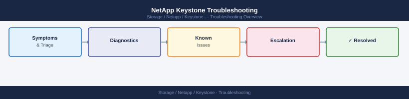

---
tags:
  - netapp
  - troubleshooting
search:
  boost: 1.5
---
# NetApp Keystone Troubleshooting

<div class="kb-summary">
NetApp Keystone Troubleshooting reference covering Common Issues, Diagnostic, Log Locations, Before Calling Support.

*Applies to: Keystone STaaS*
</div>



## Before you begin

- **Access:** Storage admin credentials (cluster admin or equivalent)
- **Gather first:** recent error message text, event timestamps, and affected object names
- **Scope:** confirm whether the issue affects a single object, host, cluster, or site
- **Escalation:** open a vendor support ticket before running any destructive step
- **Logging:** document each command and output — required if escalation is needed

---

## Common Issues

| Symptom | Likely Cause | Action |
|---|---|---|
| Keystone Collector not reporting telemetry | Collector service stopped, network blocked to NetApp endpoint, or Collector credentials expired | Check `systemctl status keystone-collector`; review Collector logs; verify outbound HTTPS to `keystone.netapp.com`; refresh credentials via Collector TUI |
| Burst charges higher than expected | Recent volume provisioning added capacity to a committed tier without a review; snapshot growth consuming tier capacity | Review BlueXP Keystone dashboard; identify which tier is bursting; review recent provisioning and snapshot schedules; decommission unused volumes before month-end |
| Performance below SLA (latency or IOPS) | Workload exceeds the IOPS/TB ceiling for the assigned service level; underlying array under-provisioned | Review QoS statistics with `qos statistics performance show`; raise with Keystone Success Manager — NetApp manages the platform and must remediate infrastructure-level performance issues |
| Capacity not provisioning / headroom exhausted | Committed capacity for the service tier is fully consumed; burst limit reached | Check committed capacity headroom in BlueXP; contact Keystone Success Manager for emergency capacity amendment |
| BlueXP dashboard showing stale data | Keystone Collector connectivity issue; Collector stopped reporting | Check Collector service status; verify network path to NetApp endpoint; restart Collector service if stopped |
| Billing discrepancy | Collector reported burst that was not anticipated; billing period lag | Download consumption report from BlueXP digital wallet; reconcile against provisioned capacity per tier; raise a Keystone support case if data appears incorrect |
| Volume at wrong service level | AQoS policy-group not applied or wrong policy-group assigned at provisioning | Run `volume show -fields qos-policy-group`; use `volume modify -qos-policy-group <correct-psl>`; notify NetApp KSM to review billing impact |

## Diagnostic

```bash
# Check Keystone Collector service status (on Collector VM)
sudo systemctl status keystone-collector

# View Collector logs for reporting errors
sudo journalctl -u keystone-collector -n 100

# Test connectivity from Collector VM to NetApp endpoint
curl -v https://keystone.netapp.com

# On ONTAP — verify AQoS policy-groups assigned to Keystone volumes
volume show -fields qos-policy-group

# Review QoS performance statistics
qos statistics performance show

# Check ONTAP cluster capacity
volume show -fields size,used,percent-used
```

Review the BlueXP Keystone dashboard for capacity consumption, burst status, and SLA compliance — most customer-visible issues are diagnosable from the dashboard without ONTAP CLI access.

## Log Locations

- **Keystone Collector logs** — on the Collector VM at `/var/log/keystone-collector/` or via `journalctl -u keystone-collector`
- **ONTAP EMS log** — `event log show -severity error` on the ONTAP cluster
- **BlueXP portal** — consumption history, burst events, and SLA compliance reports at https://activeiq.netapp.com
- **NetApp-managed platform logs** — accessible to NetApp SRE only; request via support case if platform-level diagnostics are needed

## Before Calling Support

Gather the following before opening a Keystone support case:

- Keystone subscription ID (from BlueXP portal)
- Keystone Collector version (`sudo keystone-collector --version`)
- Screenshot of the BlueXP Keystone dashboard showing the issue
- Collector VM status output (`systemctl status keystone-collector`)
- Consumption report for the affected period (download from BlueXP digital wallet)
- Clear description of the symptom and its business impact

---

## Verify resolution

- Confirm the original symptom no longer occurs
- Check logs for any residual errors related to the issue
- Monitor for 10–15 minutes to confirm the fix is stable

## See also

- [Architecture](../architecture/)
- [Cli Reference](../cli-reference/)
- [Design Standards](../design-standards/)
- [Integration](../integration/)
- [Learning Path](../learning-path/)
- [Lifecycle](../lifecycle/)
- [Operations](../operations/)
- [Scripts](../scripts/)
- [Security](../security/)
- [Service Levels](../service-levels/)
- [Usage Reporting](../usage-reporting/)
- [Vendor Support](../vendor-support/)
- [NetApp Keystone — Overview](../)
