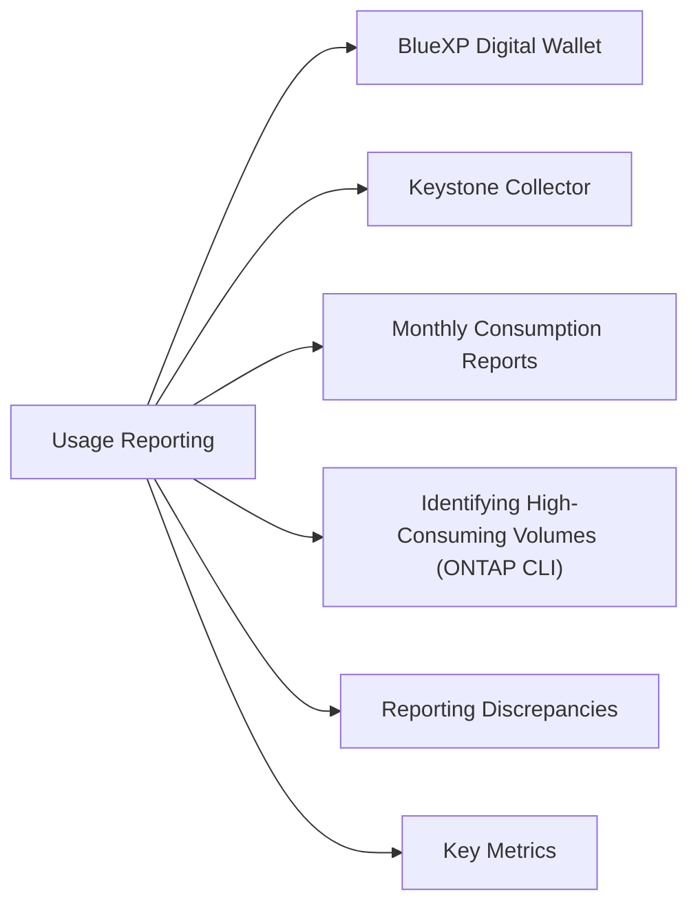

# Keystone Usage Reporting



## BlueXP Digital Wallet

Primary source for Keystone consumption reporting:

1. Log in to **BlueXP** (console.bluexp.netapp.com)
2. Navigate to **Digital Wallet → Keystone Subscriptions**
3. Select your subscription to view:
   - Committed capacity per service level
   - Consumed (logical) capacity per service level
   - Burst usage and burst limits
   - Month-to-date consumption trend

## Keystone Collector

The Keystone Collector is a virtual appliance deployed on-premises that collects and transmits consumption telemetry to NetApp:

```bash
# SSH to the Keystone Collector appliance
ssh admin@<collector_ip>

# Check collector service status
systemctl status keystone-collector

# View last collection run
journalctl -u keystone-collector --since "1 hour ago"
```

If the collector is offline, NetApp cannot generate accurate invoices — restore connectivity promptly.

## Monthly Consumption Reports

- Reports are generated monthly by NetApp
- Available in BlueXP Keystone dashboard before invoice generation
- Review consumption report against committed capacity before month-end
- If burst consumption is unexpected, identify the source before the invoice is finalized

## Identifying High-Consuming Volumes (ONTAP CLI)

```bash
# List volumes sorted by used capacity
volume show -vserver * -fields size,used,percent-used | sort -k4 -nr

# Identify volumes in burst service levels
qos statistics volume show
```

## Reporting Discrepancies

If the consumption report shows unexpected usage:

1. Compare ONTAP volume usage with Keystone report
2. Check for any large snapshots or recently provisioned volumes
3. Engage the Keystone Success Manager via the BlueXP support portal
4. Discrepancies must be raised before the invoice is finalized

## Key Metrics

| Metric | Where to Find | Normal |
|---|---|---|
| Committed capacity | BlueXP Digital Wallet | Contractual baseline |
| Burst usage | BlueXP Digital Wallet | 0 (or expected seasonal) |
| Collector health | Collector appliance status | Running, no errors |
| Telemetry latency | Last collection timestamp | Within last 24 hours |
