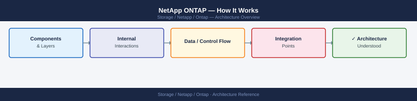
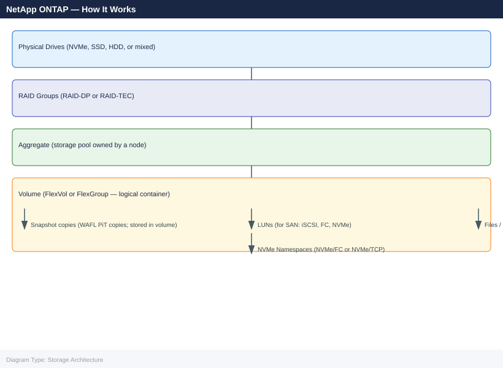
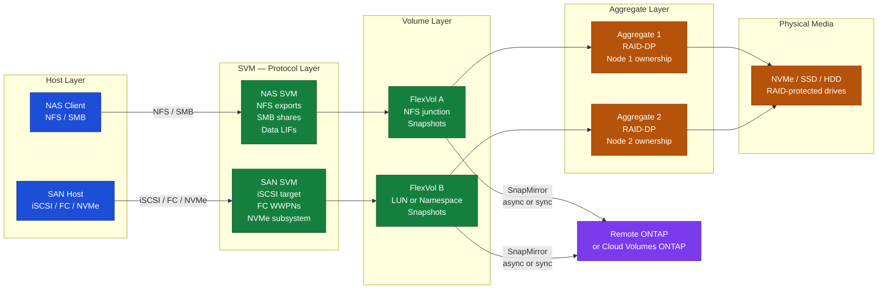
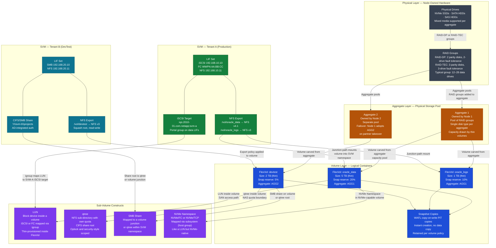

---
tags:
  - architecture
  - netapp
---
# NetApp ONTAP — How It Works

Internal architecture and data-path reference: HA pair design, WAFL filesystem, Aggregate-SVM-Volume hierarchy, data protocols, SnapMirror, MetroCluster, ONTAP Mediator, and SnapCenter integration.

*Applies to: ONTAP 9.x*

## Architecture Overview

ONTAP is NetApp's unified storage operating system. A single ONTAP cluster can serve block, file, and object workloads simultaneously from the same hardware — NFS, CIFS/SMB, iSCSI, FC, NVMe/FC, NVMe/TCP, and S3 all run on the same cluster at the same time. The cluster scales from a single HA pair up to 24 HA pairs of nodes, with capacity expansion and non-disruptive workload migration across nodes.

ONTAP runs on four platform types:

| Platform | Type | Notes |
|---|---|---|
| AFF (All Flash FAS) | Purpose-built all-flash hardware | Optimised for sub-millisecond latency; NVMe-native on AFF A-series |
| FAS (Fabric-Attached Storage) | Hybrid flash/HDD hardware | Capacity-optimised; suitable for NAS, backup, and archive |
| ASA (All-SAN Array) | All-flash SAN-optimised | Simplified SAN-only configuration; symmetric active-active paths |
| ONTAP Select | Software-defined on x86 | Runs on VMware ESXi or KVM; supports cloud and edge deployments |

ONTAP Cloud (Cloud Volumes ONTAP) runs the same OS in AWS, Azure, and GCP, enabling SnapMirror replication directly between on-premises ONTAP clusters and cloud-hosted ONTAP instances.

## HA Pair Architecture

Two ONTAP controller nodes form an HA pair. Both nodes are active simultaneously — each serves its own set of aggregates and volumes, and each holds the partner node's NVRAM write log as a mirror. Under normal operation the workload is split across both nodes; under takeover one node serves the entire workload.

Key hardware components per node:

| Component | Role |
|---|---|
| Multi-core CPU | Runs ONTAP kernel, WAFL, protocol stacks, data services |
| NVRAM | Write buffer; holds incoming writes before they are committed to disk as a consistency point |
| HA interconnect | Dedicated high-speed link between node pairs; carries NVRAM mirror and heartbeat |
| Cluster network ports | 10/25/100 GbE; carry inter-node traffic for volume moves, NVRAM sync, and SnapMirror |
| Data network ports | Client-facing; NFS, SMB, iSCSI, NVMe/TCP LIFs assigned here |
| FC HBA ports | SAN client-facing; FC and FCoE LIFs assigned here |

**Takeover and giveback** are the HA mechanisms:

- **Takeover** — when the partner node fails, the surviving node automatically takes ownership of the failed node's aggregates and begins serving all its volumes and LIFs
- **Giveback** — when the failed node recovers and rejoins the cluster, the surviving node returns the borrowed aggregates and LIFs back to their home node
- Takeover completes in approximately 45 seconds under automatic failover; LIFs migrate to the surviving node and client access resumes without remounting

The NVRAM mirror means that no acknowledged writes are lost during takeover. WAFL only acknowledges a write to the host after the write is recorded in NVRAM on both nodes.

## WAFL — Write Anywhere File Layout

WAFL is ONTAP's internal filesystem engine. It is not a POSIX filesystem exposed to users — it is the internal data management layer that underpins all volumes, LUNs, and snapshots.

**Copy-on-write design:** WAFL never overwrites existing data blocks in place. When data is modified, WAFL writes the new version to a free location and updates the metadata pointer. The old block remains in place and becomes the snapshot's view of the data. This property is what makes ONTAP snapshots instant and non-disruptive — creating a snapshot requires only locking the current set of block pointers, not copying any data.

**Consistency Points (CPs):** WAFL accumulates writes in NVRAM and flushes them to disk in batches called consistency points. A CP is triggered either by a timer (every 10 seconds by default) or when NVRAM fills to approximately 80% capacity. Each CP represents a fully consistent, crash-recoverable state of all volumes on the node. If a node crashes mid-CP, the previous CP is the recovery point — no data acknowledged before the crash is lost.

**RAID-DP and RAID-TEC:** ONTAP protects data within aggregates using double-parity RAID (RAID-DP) or triple-parity RAID (RAID-TEC). RAID-DP tolerates any two simultaneous drive failures within a RAID group; RAID-TEC tolerates three simultaneous failures, making it suitable for very large SATA drive aggregates where the statistical probability of a triple failure during rebuild is non-negligible.

| RAID Type | Parity Disks | Simultaneous Failure Tolerance | Typical Use |
|---|---|---|---|
| RAID-DP | 2 | 2 drives | Standard; AFF and FAS default for all disk types |
| RAID-TEC | 3 | 3 drives | Large SATA aggregates; groups larger than 20 disks |

## Aggregate → SVM → Volume Hierarchy

ONTAP organises storage through a layered hierarchy. Understanding this hierarchy is fundamental to diagnosing capacity issues, designing multi-tenancy, and planning data protection.

Volumes (FlexVols) are the primary logical container. A volume is always owned by a single node's aggregate but can be accessed via LIFs on both nodes in the HA pair. FlexGroups are scale-out volumes that span multiple aggregates across multiple nodes, designed for very large NAS workloads that exceed the limits of a single FlexVol.

**SVMs (Storage Virtual Machines)** sit above the volume layer and provide multi-tenancy isolation. Each SVM has:

- Its own namespace (junction-path tree of mounted volumes)
- Its own set of LIFs (IP addresses or WWPNs)
- Its own protocol configuration (NFS exports, CIFS shares, iSCSI targets)
- Its own authentication and name-service configuration (LDAP, Active Directory, NIS, local users)
- Its own RBAC roles — SVM admin cannot access other SVMs or the cluster admin SVM

SVMs are the data access boundary. A host connects to an SVM's LIF and sees only that SVM's volumes and shares.

## Data Protocols

A single ONTAP cluster serves all major storage protocols simultaneously. Protocol selection is per-SVM and per-volume:

| Protocol | Standard | Notes |
|---|---|---|
| NFSv3 | UDP/TCP port 2049 | Stateless; widely compatible; recommended for VMware VMFS-NFS datastores |
| NFSv4.1 / pNFS | TCP port 2049 | Stateful; Kerberos support; parallel NFS for performance at scale |
| SMB 2.1 / 3.0 / 3.1.1 | TCP port 445 | Windows file sharing; SMB 3.0 adds encryption and multichannel |
| iSCSI | TCP port 3260 | Block storage over Ethernet; iSCSI initiator connects to SVM iSCSI LIF |
| FC / FCoE | N/A | Block storage over Fibre Channel; LIFs presented as WWPNs on FC fabric |
| NVMe/FC | N/A | NVMe namespaces over FC fabric; supported on AFF A-series and C-series |
| NVMe/TCP | TCP port 4420 | NVMe namespaces over IP; ONTAP 9.10.1 and later |
| S3 | TCP 80 / 443 | Object storage via ONTAP's built-in S3 service; ONTAP 9.8 and later |

All protocols are served from the same physical hardware and the same underlying volumes and aggregates. An NFS export and an iSCSI LUN can coexist in the same aggregate and even the same SVM.

## Mermaid Diagram: I/O Architecture

## SnapMirror and SnapVault

SnapMirror is ONTAP's native data replication engine. It operates at the volume level and transfers only changed WAFL blocks between snapshots — making replication incremental and network-efficient.

**SnapMirror Asynchronous (XDP)**

- Transfers Snapshot copies from a source volume to a destination volume on a schedule (e.g., hourly, every 5 minutes)
- The destination volume is read-only during normal operation; it can be broken off and made read-write for DR failover
- RPO equals the replication frequency — typically minutes to hours depending on configuration
- Supported between any two ONTAP systems, including ONTAP Cloud (cross-cloud and cloud-to-on-premises)

**SnapMirror Synchronous**

- Every write to the source volume is synchronously confirmed at the destination before the host ACK is returned
- RPO = 0 — no data loss on failover
- Requires low-latency network between sites; available in StrictSync mode (zero loss, I/O stops if destination is unreachable) and Sync mode (degrades to async if link fails)

**SnapVault (SnapMirror Vault)**

SnapVault (now configured as SnapMirror XDP with a vault policy) is the backup-oriented variant. It is designed for long-term retention at a secondary site, not for active failover:

- The destination retains more snapshots than the source — enabling point-in-time recovery going back days, weeks, or months
- The relationship is initialised from the source but managed by a separate retention policy at the destination
- Used in conjunction with SnapCenter for application-consistent backup workflows

## MetroCluster and ONTAP Mediator

**MetroCluster** extends the HA pair architecture across two physical data centres. It synchronously mirrors all data between Site A and Site B at the storage layer. From the host perspective, all volumes are always available at both sites — there is no RPO and no RTO for storage-layer failures.

MetroCluster components:

| Component | Role |
|---|---|
| Node pairs at each site | Two HA pairs (one per site) each mirror data to the opposite site |
| FC-VI or IP switch fabric | Carries the MetroCluster inter-site replication traffic |
| SyncMirror | The block-level mirroring engine within ONTAP; underpins MetroCluster |
| ONTAP Mediator | Third-site arbitration service; prevents split-brain when inter-site link fails |

**ONTAP Mediator** is a Linux-based service installed on a third location (outside both production sites). When the inter-site link between MetroCluster nodes fails (network partition), both sides believe they are the survivor. The Mediator breaks the tie by maintaining a quorum vote — the side that can reach the Mediator stays active; the other side fences itself. Without the Mediator, an administrator must manually arbitrate a split-brain scenario.

**SnapMirror active sync** (formerly SnapMirror Business Continuity, SM-BC) provides a similar RPO=0 and RTO~0 capability at the volume group level, without requiring full MetroCluster hardware:

- Works for SAN workloads (iSCSI, FC) only
- Volumes are synchronously mirrored; both copies are readable by hosts
- ONTAP Mediator is required for automatic failover
- Simpler to deploy than MetroCluster; suitable for two-site clusters without dedicated MetroCluster fabric

## SnapCenter Integration

SnapCenter is NetApp's centralised backup orchestration tool. It coordinates application-consistent snapshot workflows across the host OS, the application, and ONTAP — so that a snapshot captures data in a transactionally consistent state, not just a crash-consistent one.

SnapCenter workflow for a database backup:

1. SnapCenter plugin on the host quiesces the application (e.g., puts SQL Server databases in backup mode, or calls Oracle RMAN begin backup)
2. SnapCenter calls the ONTAP REST API to create a Snapshot on the volume hosting the database data
3. SnapCenter unquiesces the application (online backup mode ends)
4. Optionally, SnapCenter triggers a SnapMirror update to replicate the new Snapshot to a remote ONTAP or SnapVault destination
5. The Snapshot is catalogued in the SnapCenter repository for restore browsing

Supported applications with native SnapCenter plugins:

| Application | Plugin |
|---|---|
| Microsoft SQL Server | SnapCenter Plugin for SQL Server |
| Oracle Database | SnapCenter Plugin for Oracle |
| SAP HANA | SnapCenter Plugin for SAP HANA |
| Microsoft Exchange | SnapCenter Plugin for Exchange |
| VMware vSphere VMs | SnapCenter Plugin for VMware (ONTAP Tools) |
| Custom applications | SnapCenter Agent (generic pre/post quiesce scripts) |

SnapCenter manages retention policies at the backup job level. Expired backup copies are deleted from both the source ONTAP snapshot and the SnapVault destination, ensuring no orphaned snapshots accumulate on the array.

## Storage Hierarchy — Aggregate → SVM → Volume → LUN/qtree with Multi-Tenancy

The diagram below shows how ONTAP layers physical drives, RAID groups, aggregates, SVMs, volumes, and sub-volume constructs (LUNs, qtrees, shares) into a coherent hierarchy. The SVM boundary is where multi-tenancy is enforced — each tenant sees only its own namespace, LIFs, and data.

Key points illustrated:

- **Aggregate ownership** is per-node. AGG1 lives on Node 1; AGG2 on Node 2. During HA takeover, the surviving node temporarily adopts the failed partner's aggregates — this is why both nodes must be able to see all disk shelves.
- **SVM boundary** is the multi-tenancy wall. Tenant A (Production) and Tenant B (DevTest) each have separate LIF addresses, separate namespace trees, separate export policies, and separate Active Directory integrations — even though both SVMs draw physical capacity from the same aggregates.
- **Volumes** are thin-provisioned: a 5 TB FlexVol does not consume 5 TB of aggregate space on creation. Physical blocks are allocated only as data is written. Space guarantee settings (`volume` or `none`) control how aggressively space is reserved.
- **Sub-volume constructs** depend on the protocol: SAN workloads use LUNs (SCSI) or NVMe Namespaces mapped via igroups/subsystems; NAS workloads use junction-path mounts, qtrees for quota management, and SMB shares — all rooted in the same volume hierarchy.
- **Snapshot copies** are WAFL copy-on-write pointers anchored at the volume level. They are instant to create (no data movement) and share unchanged blocks with the live volume, making them space-efficient until data diverges.

## Key Terms Glossary

| Term | Definition |
|---|---|
| WAFL | Write Anywhere File Layout — ONTAP's internal filesystem engine; uses copy-on-write, enabling instant non-disruptive snapshots |
| Aggregate | A RAID group of physical drives owned by a specific ONTAP node; the physical storage pool from which volumes draw capacity |
| SVM | Storage Virtual Machine — a logical storage server with its own namespace, LIFs, protocols, and security domain; enables multi-tenancy |
| Volume | A logical data container (FlexVol or FlexGroup) within an aggregate; thin-provisioned; holds files, LUNs, NVMe namespaces, and snapshots |
| SnapMirror | ONTAP's native replication engine; transfers incremental Snapshot deltas to a remote ONTAP system; supports async and synchronous modes |
| SnapVault | SnapMirror vault policy variant; designed for long-term backup retention at a secondary site, not active-active failover |
| HA pair | Two ONTAP nodes sharing disk shelf access and NVRAM mirror; provides automatic node-level failover (takeover) with RPO=0 |
| Takeover / Giveback | The HA mechanism: takeover = surviving node adopts failed partner's aggregates; giveback = recovered node reclaims its aggregates |
| NVRAM | Non-volatile RAM write buffer per node; holds writes until a consistency point flush; mirrored to partner node over HA interconnect |
| MetroCluster | ONTAP stretch-cluster technology; synchronously mirrors all data across two sites; provides RPO=0 and transparent site failover |
| ONTAP Mediator | Third-site Linux service; provides quorum arbitration for MetroCluster and SnapMirror active sync to prevent split-brain |
| SnapCenter | NetApp's backup orchestration tool; coordinates application quiesce, ONTAP snapshot creation, and SnapMirror/SnapVault replication |

---

## See also

- [Ontap — Design Standards](design-standards/)
- [Ontap — Integrations](integrations/)
