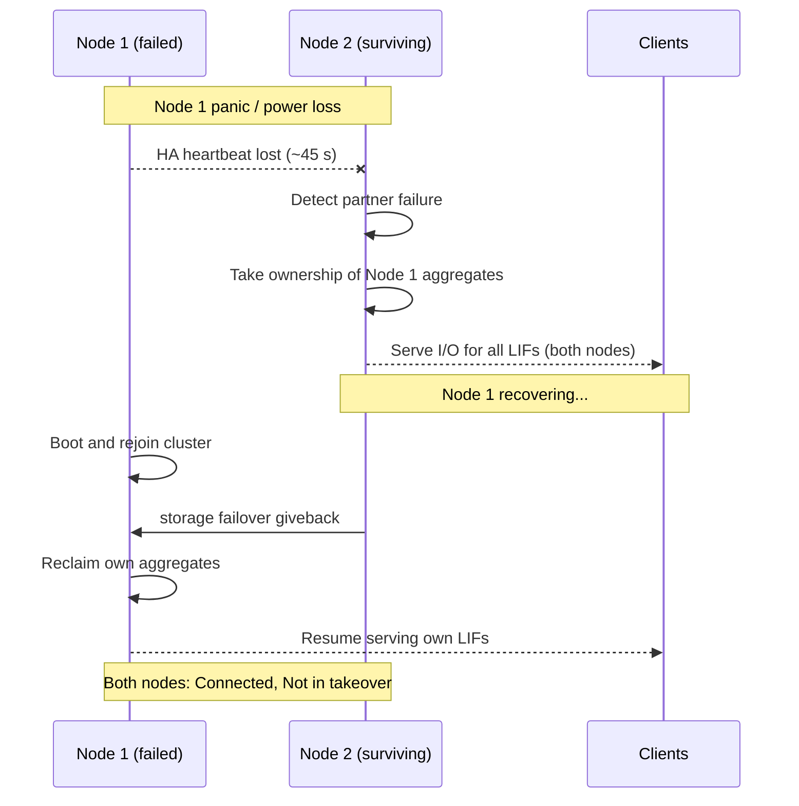

# ONTAP — How It Works

## Overview

NetApp ONTAP is a clustered storage operating system that abstracts physical hardware into logical constructs, enabling non-disruptive operations, multi-protocol data access, and built-in data protection. The hierarchy flows from cluster → nodes → aggregates → SVMs → volumes, with data served across NFS, SMB/CIFS, iSCSI, FC, FCoE, NVMe/FC, and S3 protocols simultaneously from a single cluster.

ONTAP runs on three hardware forms:

- **AFF (All Flash FAS)** — all-NVMe or all-SSD arrays optimised for latency-sensitive workloads
- **FAS (Fabric-Attached Storage)** — hybrid flash/disk arrays for capacity-optimised or mixed workloads
- **ONTAP Select** — software-defined ONTAP running on commodity x86 servers (VMware or KVM hypervisor)

## HA Topology

ONTAP HA pairs are active-active: both nodes serve I/O simultaneously and each holds a full copy of the partner's NVRAM write log. In the event of a node failure, the surviving node performs an automatic storage failover (takeover) within ~45 seconds.



```bash
storage failover takeover -ofnode <node-to-take-over>   # planned takeover
storage failover show                                    # monitor takeover / giveback
storage failover giveback -ofnode <node-name>            # return ownership
```

| Takeover Mode | Trigger | Notes |
|---|---|---|
| Automatic | Node panic, power loss, disk shelf loss | Within ~45 s; requires `storage failover modify -enabled true` |
| Manual planned | `storage failover takeover` | Used for software upgrades and maintenance |
| Partial | Specific aggregate relocation | `storage aggregate relocation start` — moves aggregate without full node takeover |

## Cluster Networking

| Network | Traffic | Speed | Notes |
|---|---|---|---|
| Cluster network | NVRAM sync, HA heartbeat, volume moves | 10/25/100GbE | Dedicated switch fabric; must be low-latency |
| Data network | NFS, SMB, iSCSI, NVMe/TCP LIFs | 10/25GbE+ | Client-facing; LIFs float across ports per failover group |
| FC fabric | FC and FCoE SAN traffic | 16G/32G FC | Dual-fabric zoning; LIFs represented as WWPNs |
| Management network | CLI, API, System Manager | 1GbE | Dedicated management port per node; cluster-management LIF |
| Intercluster network | SnapMirror, cluster peering | 10/25GbE | Dedicated intercluster LIFs per node; separate VLAN recommended |

**LIF management:**

```bash
network interface show -fields lif,vserver,address,home-node,home-port,curr-node,curr-port,status-oper
network interface show -is-home false   # LIFs not on home port (migrated due to failover)
network interface revert *              # revert all LIFs to home after maintenance
```

## Storage Hierarchy

```text
Cluster
  └── Node(s)
        └── Aggregate(s)     ← physical RAID groups; owned by a node
              └── Volume(s)  ← logical containers; thin or thick provisioned
                    ├── Snapshots      ← point-in-time, read-only copies within the volume
                    ├── LUNs           ← block devices for iSCSI/FC (inside a volume)
                    ├── Qtrees/Shares  ← NFS exports and SMB shares
                    └── Files          ← NAS files served via NFS or SMB
```

**WAFL (Write Anywhere File Layout)** is ONTAP's internal filesystem engine. Key characteristics:

- **Copy-on-write**: WAFL never overwrites existing data blocks. New writes go to free space; old blocks become snapshot data — making snapshot creation near-instant.
- **Consistency point (CP)**: WAFL accumulates writes in NVRAM and flushes to disk in batches every 10 seconds or when NVRAM is ~80% full.
- **NVRAM mirroring**: The HA partner mirrors NVRAM content in real time over the cluster interconnect — in-flight writes survive a node failure without data loss.

| RAID Type | Parity Disks | Survives | Typical Use |
|---|---|---|---|
| RAID-DP | 2 per RAID group | 2 simultaneous disk failures | Standard; AFF and FAS default |
| RAID-TEC | 3 per RAID group | 3 simultaneous disk failures | Large SATA aggregates; >20 disks per RAID group |

```bash
storage aggregate show -fields aggr-name,raidtype
storage aggregate show-raidtree -aggregate <aggr_name>
storage disk show -raid-state reconstructing
```

## SVM (Storage VM) Architecture

SVMs are the data access layer — analogous to virtual storage appliances within the cluster. Each SVM has its own namespace, network interfaces (data LIFs), protocol configuration, security domain (export policies, CIFS ACLs, RBAC), and name services (DNS, LDAP, NIS). SVMs enable multi-tenancy on a shared cluster.

| SVM Type | Purpose |
|---|---|
| `data` | User-configured SVM; serves NAS and/or SAN data to clients |
| `admin` | Cluster management SVM; used for cluster-level administration |
| `node` | Per-node management SVM; used for node-level access and system functions |
| `system` | Internal ONTAP SVMs for cluster services; not user-configurable |

```bash
vserver show -fields vserver,type,state,allowed-protocols
volume show -vserver <svm> -fields volume,junction-path   # SVM namespace
network interface show -vserver <svm>
```

## Protocol Stack

| Protocol | Layer | Port | Notes |
|---|---|---|---|
| NFSv3 | NAS | UDP/TCP 2049 | Stateless; most compatible; widely used for VMware |
| NFSv4.1 / pNFS | NAS | TCP 2049 | Stateful; parallel NFS for scale-out; Kerberos support |
| SMB 2.1/3.0/3.1.1 | NAS | TCP 445 | Windows file sharing; SMB 3.0 supports encryption |
| iSCSI | SAN | TCP 3260 | Block storage over Ethernet; standard for IP SANs |
| FC / FCoE | SAN | N/A | Block storage over Fibre Channel; low latency |
| NVMe/FC | SAN | N/A | NVMe namespace access over FC fabric; AFF platforms |
| NVMe/TCP | SAN | TCP 4420 | NVMe namespace access over IP; ONTAP 9.10+ |
| S3 | Object | TCP 80/443 | Object storage via ONTAP S3 service; ONTAP 9.8+ |

## Data Protection Built-ins

| Feature | Layer | Description |
|---|---|---|
| RAID-DP / RAID-TEC | Disk | Protects against simultaneous disk failures within an aggregate |
| HA takeover | Node | Automatic failover to partner node within ~45 seconds |
| Snapshots | Volume | Point-in-time recovery; near-instant; policy-driven |
| SnapMirror (async) | Volume/SVM | Asynchronous replication to a remote cluster for DR |
| SnapVault (XDP) | Volume | Long-term backup retention to a secondary cluster |
| SnapMirror Synchronous | Volume | Near-zero RPO replication with synchronous write confirmation |
| SnapMirror Business Continuity (SMBC) | Volume group | Zero RPO and zero RTO for SAN workloads; transparent failover |
| MetroCluster | Cluster | Stretch cluster across two data centers with synchronous mirroring |

## Aggregate Health

```bash
storage aggregate show -fields size,used,available,percent-used   # capacity per aggregate
storage aggregate show -state !online                              # aggregates not online
storage disk show -broken                                          # failed or broken disks
storage aggregate show-status -aggregate <aggr_name>              # RAID status
```
