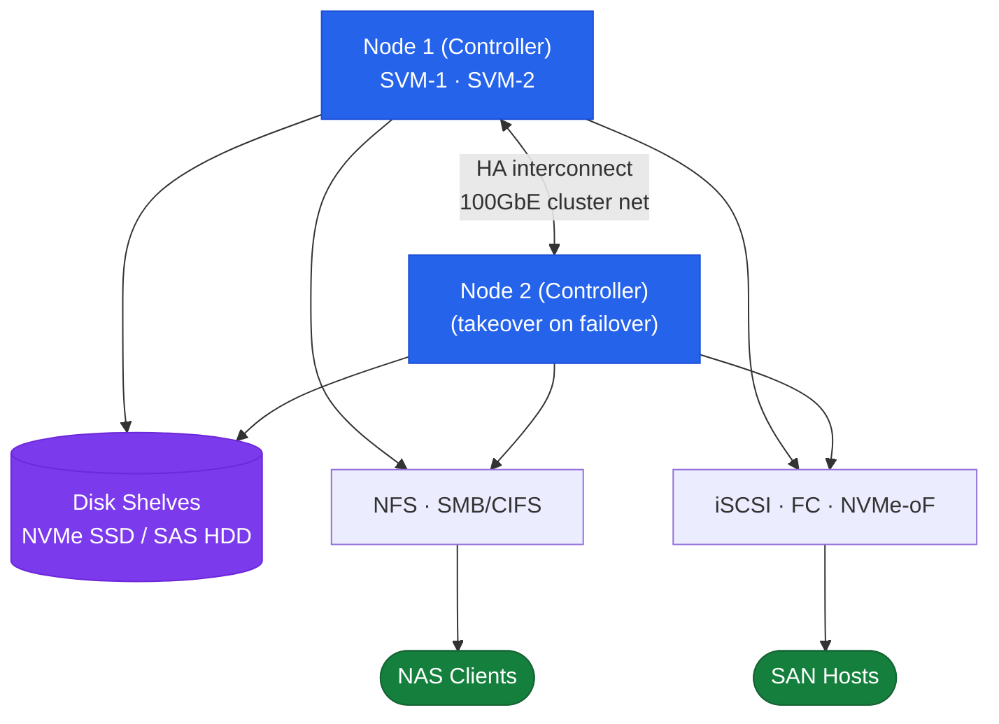

# ONTAP — Architecture

<div class="kb-summary">
ONTAP architecture reference — HA topology, WAFL filesystem engine, SVM design, cluster networking, protocol stack, and data protection built-ins.
</div>
```
┌───────────────────────────────────── NetApp ONTAP — Architecture ─────────────────────────────────────┐
│                                                                                                       │
│   ┌───────────────────────────────────────────────────────────────────────────────────────────────┐   │
│   │ ONTAP architecture overview: enterprise unified storage operating system for NAS, SAN, and ob │   │
│   │                    Protocols: NFS v3/v4.1 · SMB · iSCSI · FC · NVMe-oF · S3                   │   │
│   │                Key components: System Manager, ONTAP CLI, SnapMirror, FlexClone               │   │
│   │          Design principles: HA, scalability, non-disruptive operations, and security          │   │
│   └───────────────────────────────────────────────────────────────────────────────────────────────┘   │
│                                                                                                       │
│    Design → deploy → configure → validate → monitor → optimise                                        │
│                                                                                                       │
│                  ▼                                ▼                                ▼                  │
│                                                                                                       │
│   ┌─────────────────────────────┐  ┌─────────────────────────────┐  ┌─────────────────────────────┐   │
│   │            Layer            │  │          Component          │  │            Notes            │   │
│   │           Cluster           │  │        HA node pairs        │  │          Scale-out          │   │
│   │             SVM             │  │        Virtual server       │  │       Protocol access       │   │
│   │          Aggregate          │  │         RAID groups         │  │         Storage pool        │   │
│   │           FlexVol           │  │         Thin volume         │  │        Data container       │   │
│   │          SnapMirror         │  │         Replication         │  │          Async/Sync         │   │
│   └─────────────────────────────┘  └─────────────────────────────┘  └─────────────────────────────┘   │
│                                                                                                       │
│                          ▼                                                 ▼                          │
│                                                                                                       │
│   ┌───────────────────────────────────────────────────────────────────────────────────────────────┐   │
│   │    Component     │     Purpose      │      Protocol     │       Auth       │      Notes       │   │
│   │       SVM        │ Tenant isolation │   All protocols   │  Kerberos/NTLM   │  Virtual server  │   │
│   │    SnapMirror    │  DR replication  │    SM protocol    │   Certificate    │  Async or sync   │   │
│   │    FlexClone     │  Instant clone   │      Internal     │    Admin role    │ Space-efficient  │   │
│   │      SM-BC       │ Zero-RPO active- │    SM protocol    │     Mediator     │     SAN only     │   │
│   └───────────────────────────────────────────────────────────────────────────────────────────────┘   │
│                                                                                                       │
│    Physical: AFF/FAS HA node pairs · cluster network · client access network · MetroCluster           │
│                                                                                                       │
│    Key terms:                                                                                         │
│                                                                                                       │
│    ONTAP              = NetApp storage OS; unified NAS, SAN, and object across AFF, FAS, ONTAP Select │
│    SVM                = Storage Virtual Machine; logical storage server with protocols, IP, and vol...│
│    Aggregate          = RAID group of disks; underpins FlexVols and FlexGroups within a node          │
│    FlexVol            = flexible thin-provisioned volume within an aggregate; most common container   │
│    FlexGroup          = scale-out volume spanning multiple aggregates; for very large NAS workloads   │
│    SnapMirror         = async or synchronous replication between ONTAP systems for DR and backup      │
│    SnapVault          = backup-oriented SnapMirror variant; independent retention at destination      │
│    FlexClone          = instant space-efficient writable clone of a volume or LUN from snapshot       │
│    Snapshot           = ONTAP space-efficient PiT copy; stored in .snapshot directory on NFS          │
│    ONTAP Mediator     = third-site quorum for SnapMirror SM-BC; prevents split-brain scenarios        │
│    SM-BC              = SnapMirror Business Continuity; synchronous zero-RPO active-active SAN repl...│
│    vserver            = ONTAP CLI name for SVM; vserver show and vserver nfs show are common commands │
│                                                                                                       │
└───────────────────────────────────────────────────────────────────────────────────────────────────────┘
```


<div class="kb-grid kb-grid-3">
<a class="kb-card" href="how-it-works/"><strong>How It Works</strong><span>HA topology, WAFL engine, cluster networking, SVM architecture, protocols, and data protection.</span></a>
<a class="kb-card" href="integrations/"><strong>Integrations</strong><span>VMware, SnapCenter, Active Directory, Veeam, REST API, and cloud integrations.</span></a>
<a class="kb-card" href="design-standards/"><strong>Design Standards</strong><span>Naming conventions, sizing guidelines, and configuration checklist.</span></a>
</div>

| Platform | Storage Type | Target Workload |
|---|---|---|
| AFF (All Flash FAS) | All-NVMe or all-SSD | Latency-sensitive databases, VDI, high-IOPS workloads |
| FAS (Fabric-Attached Storage) | Hybrid flash/disk | Capacity-optimised, mixed, file, and backup workloads |
| ONTAP Select | Software-defined on x86 | Edge, ROBO, dev/test; VMware or KVM hypervisor |


