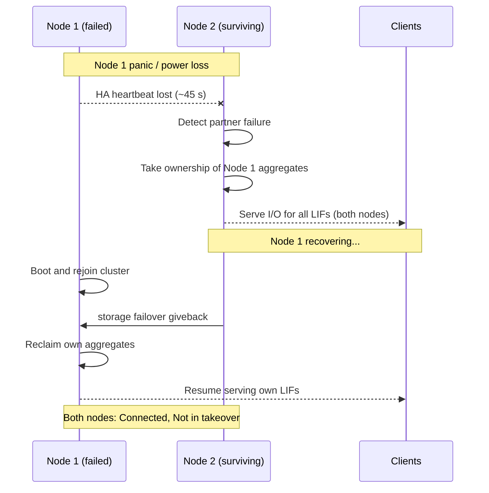
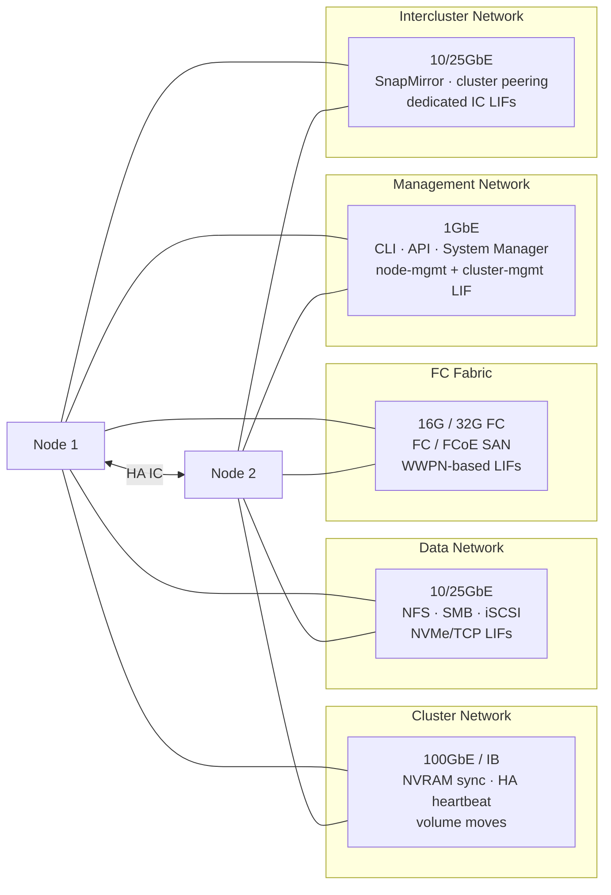
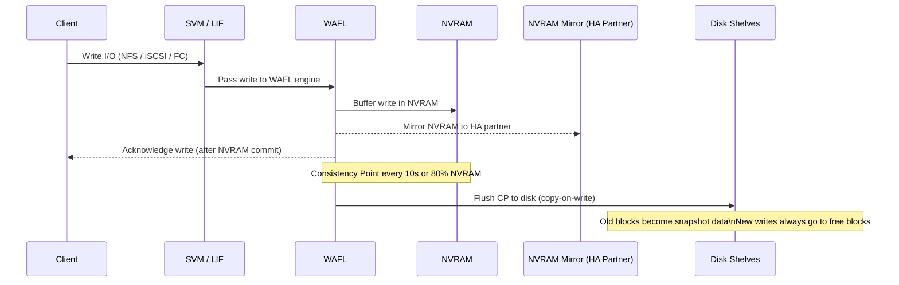
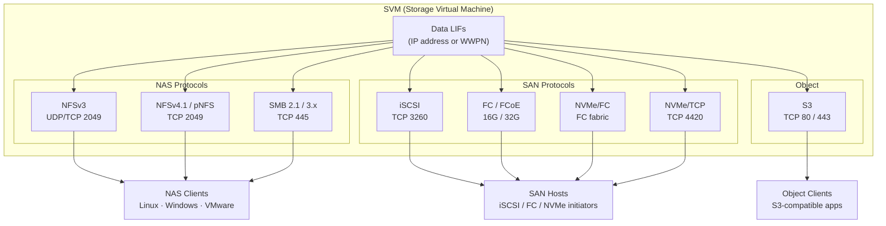

# ONTAP — Overview

## HA Pair Topology


## Overview

NetApp ONTAP is a clustered storage operating system that abstracts physical hardware into logical constructs, enabling non-disruptive operations, multi-protocol data access, and built-in data protection. The hierarchy flows from cluster → nodes → aggregates → SVMs → volumes, with data served across NFS, SMB/CIFS, iSCSI, FC, FCoE, NVMe/FC, and S3 protocols simultaneously from a single cluster.

ONTAP runs on three hardware forms:
- **AFF (All Flash FAS)** — all-NVMe or all-SSD arrays optimized for latency-sensitive workloads
- **FAS (Fabric-Attached Storage)** — hybrid flash/disk arrays for capacity-optimized or mixed workloads
- **ONTAP Select** — software-defined ONTAP running on commodity x86 servers (VMware or KVM hypervisor)

---

## HA Topology

ONTAP HA pairs are active-active: both nodes serve I/O simultaneously and each holds a full copy of the partner's NVRAM write log. In the event of a node failure, the surviving node performs an automatic storage failover (takeover) within ~45 seconds. Cluster interconnect links (100GbE or InfiniBand) carry the NVRAM mirroring and heartbeat traffic between HA partners.

```
  ┌──────────────────────────────────────────────────────────┐
  │                        Cluster                           │
  │                                                          │
  │   ┌─────────────┐  Cluster IC  ┌─────────────┐          │
  │   │   Node 01   │◄────────────►│   Node 02   │  HA Pair │
  │   │  (AFF A400) │              │  (AFF A400) │          │
  │   └──────┬──────┘              └──────┬──────┘          │
  │          │                            │                  │
  │          └────────────┬───────────────┘                  │
  │                       │                                  │
  │              Shared Disk Shelves                         │
  │              (NS224 NVMe or SAS)                         │
  └──────────────────────────────────────────────────────────┘
```

For larger clusters, multiple HA pairs share the same cluster network and management infrastructure but own separate aggregates. A 4-node cluster has two HA pairs; aggregates are not shared across pairs unless SyncMirror is used.

### HA Takeover / Giveback Sequence



### Takeover and Giveback

During an HA takeover, the surviving node takes ownership of the failed node's aggregates and continues serving I/O to all clients on both nodes' LIFs. The takeover node temporarily owns both sets of aggregates.

```bash
# Initiate a planned takeover (maintenance)
storage failover takeover -ofnode <node-to-take-over>

# Monitor takeover progress
storage failover show

# Return ownership after the node recovers
storage failover giveback -ofnode <node-name>

# Confirm healthy state after giveback
storage failover show
# Both nodes should show: Connected, Not in takeover
```

Takeover modes:

| Mode | Trigger | Notes |
|---|---|---|
| Automatic | Node panic, power loss, disk shelf loss | Occurs within ~45 seconds; requires `storage failover modify -enabled true` |
| Manual planned | `storage failover takeover` | Used for software upgrades and maintenance |
| Partial | Specific aggregate relocation | `storage aggregate relocation start` — moves aggregate without full node takeover |

---

## Cluster Networking



ONTAP uses separate physical or logical network paths for different traffic types:

| Network | Traffic | Speed | Notes |
|---|---|---|---|
| Cluster network | NVRAM sync, HA heartbeat, volume moves | 10/25/100GbE | Dedicated switch fabric; must be low-latency |
| Data network | NFS, SMB, iSCSI, NVMe/TCP LIFs | 10/25GbE+ | Client-facing; LIFs float across ports per failover group |
| FC fabric | FC and FCoE SAN traffic | 16G/32G FC | Dual-fabric zoning; LIFs represented as WWPNs |
| Management network | CLI, API, System Manager | 1GbE | Dedicated management port per node; cluster-management LIF |
| Intercluster network | SnapMirror, cluster peering | 10/25GbE | Dedicated intercluster LIFs per node; separate VLAN recommended |

### Logical Interface (LIF) Model

LIFs are the network endpoints that SVMs present to clients. A LIF has a home port (where it starts) and can migrate to other ports in the same failover group during planned or unplanned events.

```bash
# Show all LIFs with current and home locations
network interface show -fields lif,vserver,address,home-node,home-port,curr-node,curr-port,status-oper

# Show LIFs not on their home port (migrated due to failover)
network interface show -is-home false

# Revert all LIFs to their home ports after maintenance
network interface revert *

# Check a specific LIF's failover group (which ports it can migrate to)
network interface show -fields lif,failover-group,failover-policy
```

LIF failover policies determine which ports a LIF can migrate to:

| Policy | Behavior |
|---|---|
| `system-defined` | ONTAP chooses the best available port in the failover group |
| `broadcast-domain-wide` | Fails over to any port in the same broadcast domain |
| `local-only` | Never fails over; LIF stays on home port or goes offline |
| `disabled` | LIF stays on its configured port; no failover |

---

## Storage Hierarchy

```
Cluster
  └── Node(s)
        └── Aggregate(s)     ← physical RAID groups; owned by a node
              └── Volume(s)  ← logical containers; thin or thick provisioned
                    ├── Snapshots      ← point-in-time, read-only copies within the volume
                    ├── LUNs           ← block devices for iSCSI/FC (inside a volume)
                    ├── Qtrees/Shares  ← NFS exports and SMB shares
                    └── Files          ← NAS files served via NFS or SMB
```

### WAFL Write Path



### WAFL — Write Anywhere File Layout

WAFL is ONTAP's internal filesystem and I/O engine. All reads and writes to ONTAP volumes pass through WAFL. Key WAFL characteristics:

- **Copy-on-write**: WAFL never overwrites existing data blocks. New writes always go to free space; old blocks become the snapshot copy. This makes snapshot creation near-instant at any point in time.
- **Consistency point (CP)**: WAFL accumulates writes in NVRAM and flushes them to disk in batches called consistency points. CPs happen every 10 seconds or when NVRAM is ~80% full.
- **NVRAM mirroring**: The HA partner mirrors NVRAM content in real time over the cluster interconnect, ensuring that in-flight writes survive a node failure without data loss.
- **Deduplication and compression**: Storage efficiency operations are applied per-volume within WAFL. In-line compression happens at write time; background deduplication runs as a scheduled job.

### RAID-DP and RAID-TEC

ONTAP uses its own RAID implementations:

| RAID Type | Parity Disks | Survives | Typical Use |
|---|---|---|---|
| RAID-DP | 2 per RAID group | 2 simultaneous disk failures | Standard; AFF and FAS default |
| RAID-TEC | 3 per RAID group | 3 simultaneous disk failures | Large SATA aggregates; >20 disks per RAID group |

```bash
# Show RAID type for all aggregates
storage aggregate show -fields aggr-name,raidtype

# Show the RAID group structure of a specific aggregate
storage aggregate show-raidtree -aggregate <aggr_name>

# Show RAID group rebuild status
storage disk show -raid-state reconstructing
```

---

## SVM (Storage VM) Architecture

SVMs are the data access layer in ONTAP — analogous to virtual storage appliances within the cluster. Each SVM is isolated with its own:

- Namespace (junction path tree of volumes)
- Network interfaces (data LIFs with SVM-specific IP addresses)
- Protocol configuration (NFS, CIFS, iSCSI, FC independently per SVM)
- Security domain (export policies, CIFS ACLs, RBAC, audit)
- Name services (DNS, LDAP, NIS per SVM)

SVMs enable multi-tenancy: multiple teams, applications, or business units can share a single ONTAP cluster with strong isolation between their storage environments.

```bash
# List all SVMs with their state and protocols
vserver show -fields vserver,type,state,allowed-protocols

# Show the namespace (volume junction paths) for an SVM
volume show -vserver <svm> -fields volume,junction-path

# Show all LIFs on an SVM
network interface show -vserver <svm>
```

### SVM Types

| Type | Purpose |
|---|---|
| `data` | User-configured SVM; serves NAS and/or SAN data to clients |
| `admin` | The cluster management SVM; used for cluster-level administration |
| `node` | Per-node management SVM; used for node-level access and system functions |
| `system` | Internal ONTAP SVMs for cluster services; not user-configurable |

---

## Connectivity

| Layer | Detail |
|---|---|
| Cluster network | 10/25/100GbE dedicated switch fabric for intra-cluster traffic (NVRAM sync, HA heartbeat, volume moves) |
| Data network | 10/25GbE ports carrying NFS, SMB, iSCSI, and NVMe/TCP LIFs; LIF home ports assigned per node |
| FC fabric | 16G/32G FC HBAs with dual-fabric zoning for FC and FCoE SAN; LIFs represented as WWPNs |
| Management network | 1GbE dedicated management port per node plus the cluster-management LIF; used for CLI/API/System Manager access |
| Intercluster network | Dedicated intercluster LIFs on 10/25GbE for SnapMirror and cluster peering traffic |

---

## Data Protection Built-ins

ONTAP integrates data protection at every level of the hierarchy:

| Feature | Layer | Description |
|---|---|---|
| RAID-DP / RAID-TEC | Disk | Protects against simultaneous disk failures within an aggregate |
| HA takeover | Node | Automatic failover to partner node within ~45 seconds |
| Snapshots | Volume | Point-in-time recovery; near-instant; policy-driven |
| SnapMirror (async) | Volume/SVM | Asynchronous replication to a remote cluster for DR |
| SnapVault (XDP) | Volume | Long-term backup retention to a secondary cluster |
| SnapMirror Synchronous | Volume | Near-zero RPO replication with synchronous write confirmation |
| SnapMirror Business Continuity (SMBC) | Volume group | Zero RPO and zero RTO for SAN workloads; transparent failover |
| SyncMirror | Aggregate | RAID-level mirroring across disk pools (requires MetroCluster) |
| MetroCluster | Cluster | Stretch cluster across two data centers with synchronous mirroring |

---

## Protocol Stack



ONTAP serves data over six protocol families simultaneously from a single cluster:

| Protocol | Layer | Port | Notes |
|---|---|---|---|
| NFSv3 | NAS | UDP/TCP 2049 | Stateless; most compatible; widely used for VMware |
| NFSv4.1 / pNFS | NAS | TCP 2049 | Stateful; parallel NFS for scale-out; Kerberos support |
| SMB 2.1/3.0/3.1.1 | NAS | TCP 445 | Windows file sharing; SMB 3.0 supports encryption |
| iSCSI | SAN | TCP 3260 | Block storage over Ethernet; standard for IP SANs |
| FC / FCoE | SAN | N/A | Block storage over Fibre Channel; low latency |
| NVMe/FC | SAN | N/A | NVMe namespace access over FC fabric; AFF platforms |
| NVMe/TCP | SAN | TCP 4420 | NVMe namespace access over IP; ONTAP 9.10+ |
| S3 | Object | TCP 80/443 | Object storage via ONTAP S3 service; ONTAP 9.8+ |

---

## In this section

<div class="kb-grid kb-grid-3">
<a class="kb-card" href="components/"><strong>Components</strong><span>Core components, services, and technical specifications.</span></a>
<a class="kb-card" href="integrations/"><strong>Integrations</strong><span>Integration with other platforms and external systems.</span></a>
<a class="kb-card" href="standards/"><strong>Standards</strong><span>Sizing guidelines, design standards, and best practices.</span></a>
</div>
