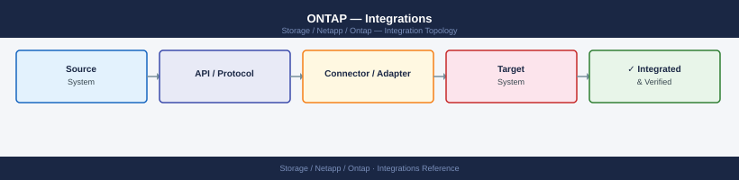

---
tags:
  - architecture
  - netapp
---
# ONTAP — Integrations

<div class="kb-summary">
Integrations reference covering VMware, SnapCenter Plugin, Active Directory / CIFS Authentication, Veeam Storage Integration (VeeamON / Direct Storage Access), ONTAP REST API and 2 more sections.

*Applies to: ONTAP 9.x*
</div>


## VMware

ONTAP integrates with VMware vSphere at multiple layers:

- **NFS datastores**: Mount ONTAP NFS exports directly as vSphere datastores; NFSv3 or NFSv4.1 (pNFS for parallel I/O); configure NFS export policy to allow ESXi management IPs
- **VMFS (iSCSI/FC)**: Present ONTAP LUNs as VMFS datastores via iSCSI or FC; use round-robin multipath policy on ESXi with ALUA enabled on ONTAP
- **VAAI (vStorage APIs for Array Integration)**: Enable VAAI-NAS (`vserver nfs modify -vserver <svm> -vstorage enabled`) and VAAI-SCSI for hardware offload of copy, zero, and compare operations — reduces ESXi CPU and network load significantly
- **vVols (Virtual Volumes)**: ONTAP supports vVols via the NetApp VASA Provider (part of ONTAP Tools for VMware); each VMDK is a separate ONTAP volume object with granular QoS and snapshot capability
- **ONTAP Tools for VMware vSphere**: vCenter plugin providing datastore provisioning, VAAI registration, VASA, and SRA (Site Recovery Adapter) for VMware SRM integration; deployed as an OVA

## SnapCenter Plugin

The SnapCenter Plug-in for VMware vSphere is deployed as a separate OVA and registered in vCenter. It provides VM-consistent and crash-consistent snapshot-based backup of VMs and vSphere datastores using ONTAP snapshots, and supports SnapVault replication for long-term retention. See the [SnapCenter section](../../snapcenter/index.md) for full coverage.

## Active Directory / CIFS Authentication

```bash
# Join an SVM to Active Directory for CIFS/SMB
vserver cifs create -vserver <svm> -cifs-server <netbios-name> -domain <domain.corp> -ou "OU=Servers,DC=domain,DC=corp"

# Verify CIFS domain join and DC connectivity
vserver cifs domain info -vserver <svm>

# Configure LDAP for NFS Kerberos and user mapping
vserver services name-service ldap create -vserver <svm> -client-config <ldap-config>
```


```text title="Expected output"
cluster1::> vserver cifs create -vserver svm1 -cifs-server NAS-SVM01 -domain domain.corp -ou "OU=Servers,DC=domain,DC=corp"
(no output — command completes silently)

cluster1::> vserver cifs domain info -vserver svm1
         Vserver: svm1
      CIFS Server: NAS-SVM01
        Domain/Workgroup: domain.corp
           Trusted Domains:
        Default Site: Default-First-Site-Name
             Preferred DCs:
                  dc1.domain.corp (192.168.1.50)
                  dc2.domain.corp (192.168.1.51)
    Authentication Style: domain
LDAP Signing Required: false
LDAP Sealing Required: false
Use Start TLS: false
Encryption Required: false

cluster1::> vserver services name-service ldap create -vserver svm1 -client-config ldap-default
(no output — command completes silently)
```

!!! warning "Common errors"
    **`Error: command failed: CIFS server creation failed. Reason: Failed to join domain "domain.corp". Check network connectivity to domain controllers.`** — Verify network connectivity to domain controllers and ensure the ONTAP cluster can resolve the domain name via DNS.
    **`Error: LDAP configuration "ldap-config" does not exist.`** — Create the LDAP client configuration first using `vserver services name-service ldap client-config create` before referencing it in the ldap create command.
## Veeam Storage Integration (VeeamON / Direct Storage Access)

Veeam Backup & Replication integrates with ONTAP via the Veeam Backup & Replication storage plugin, enabling:
- Direct NFS/iSCSI access to ONTAP snapshots for backup from storage snapshots (avoiding VM stun)
- SnapVault integration for secondary-target backup jobs
- Storage snapshot orchestration from the Veeam job engine

Register the ONTAP cluster in Veeam under Storage Infrastructure using the cluster-management LIF and a dedicated `vsadmin`-equivalent account with minimum required permissions.

## ONTAP REST API

ONTAP exposes a full RESTful API available at:

```text
https://<cluster-mgmt-lif>/api
```

- Interactive documentation at `https://<cluster-mgmt-lif>/docs/api`
- Authenticate with Basic Auth (over HTTPS) or OAuth2 tokens
- Use service accounts with minimum required RBAC roles for automation

```bash
# Example: list SVMs via REST API using curl
curl -sk -u admin:<password> https://<cluster>/api/svm/svms | python3 -m json.tool

# Example: list volumes
curl -sk -u admin:<password> "https://<cluster>/api/storage/volumes?fields=name,used,size" | python3 -m json.tool
```


```text title="Expected output"
{
  "records": [
    {
      "uuid": "550e8400-e29b-41d4-a716-446655440000",
      "name": "svm-prod-01",
      "state": "running",
      "subtype": "default"
    },
    {
      "uuid": "6ba7b810-9dad-11d1-80b4-00c04fd430c8",
      "name": "svm-dr-02",
      "state": "running",
      "subtype": "default"
    }
  ],
  "num_records": 2
}
{
  "records": [
    {
      "name": "vol_data_01",
      "used": 847288320,
      "size": 1099511627776
    },
    {
      "name": "vol_logs_02",
      "used": 214748365,
      "size": 549755813888
    },
    {
      "name": "vol_backup_03",
      "used": 0,
      "size": 2199023255552
    }
  ],
  "num_records": 3
}
```

!!! warning "Common errors"
    **`curl: (60) SSL certificate problem: self signed certificate`** — Add `-k` flag to skip certificate verification (already present in example; ensure both `-s` and `-k` flags are used together).
    **`curl: (7) Failed to connect to <cluster>: Name or service not known`** — Verify the cluster hostname or IP is correct and reachable from your network; check DNS resolution with `nslookup <cluster>`.
    **`jq: parse error: Invalid JSON text at line 1`** — Ensure the API endpoint is correct and the cluster is responding with valid JSON; test connectivity with `curl -sk -u admin:<password> https://<cluster>/api/cluster` first.
Python SDK (`netapp-ontap` package) and Ansible (`netapp.ontap` collection) provide higher-level abstractions for automation.

## Cloud Volumes ONTAP Integration

ONTAP on-premises clusters can peer with Cloud Volumes ONTAP (CVO) deployments in AWS, Azure, or GCP:
- Use intercluster LIFs and cluster peering for SnapMirror relationships to/from CVO
- FabricPool: tier cold data blocks from on-premises aggregates to object storage (S3/Azure Blob/GCS) transparently — configure via `storage aggregate object-store attach`
- BlueXP acts as the management plane for both on-premises ONTAP and CVO, providing unified capacity and replication views

## Monitoring Integration

| Tool | Integration Method |
|---|---|
| Prometheus / Grafana | ONTAP REST API metrics endpoint or NetApp Harvest (open source collector) |
| Splunk / Syslog | `vserver audit` for file events; EMS log forwarding via `event notification destination` |
| SNMP monitoring (Nagios, Zabbix) | SNMPv3 only; MIB files available from NetApp support site |
| NetApp Active IQ / BlueXP | AutoSupport-based; enabled by default; provides AI-driven health and capacity advisories |
| PagerDuty / OpsGenie | EMS email notifications forwarded via relay or webhook integrations |

---

## See also

- [Ontap — How It Works](../how-it-works/)
- [Ontap — Design Standards](../design-standards/)
