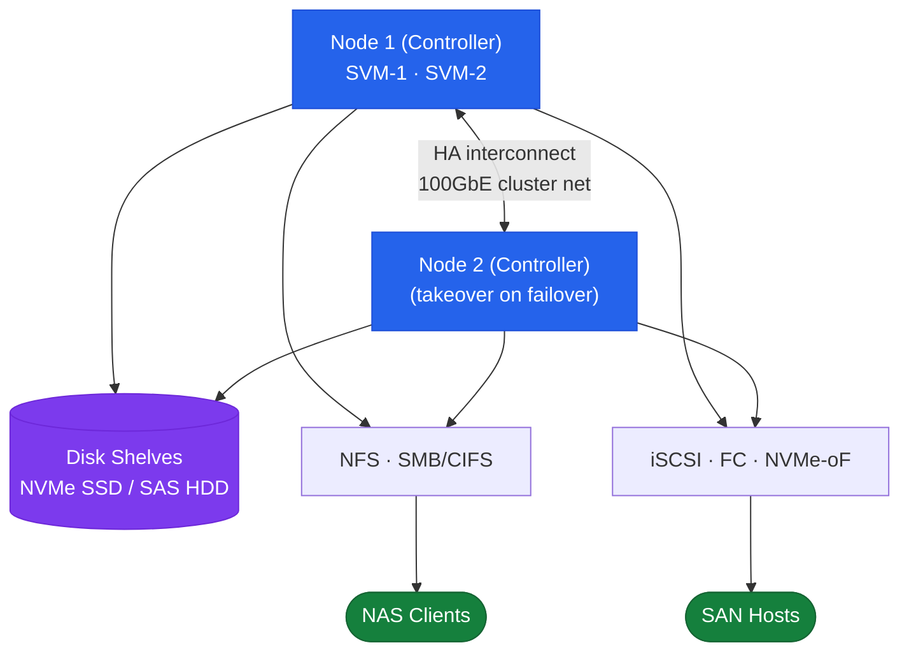

# ONTAP — Overview

## HA Pair Topology



## Overview

NetApp ONTAP is a clustered storage operating system that abstracts physical hardware into logical constructs, enabling non-disruptive operations, multi-protocol data access, and built-in data protection. The hierarchy flows from cluster → nodes → aggregates → SVMs → volumes, with data served across NFS, SMB/CIFS, iSCSI, FC, FCoE, NVMe/FC, and S3 protocols simultaneously from a single cluster.

## HA Topology

ONTAP HA pairs are active-active: both nodes serve I/O simultaneously and each holds a full copy of the partner's NVRAM write log. In the event of a node failure, the surviving node performs an automatic storage failover (takeover) within ~45 seconds. Cluster interconnect links (100GbE or InfiniBand) carry the NVRAM mirroring and heartbeat traffic between HA partners.

```
  ┌──────────────────────────────────────────────────────────┐
  │                        Cluster                           │
  │                                                          │
  │   ┌─────────────┐  Cluster IC  ┌─────────────┐          │
  │   │   Node 01   │◄────────────►│   Node 02   │  HA Pair │
  │   │  (AFF A400) │              │  (AFF A400) │          │
  │   └──────┬──────┘              └──────┬──────┘          │
  │          │                            │                  │
  │          └────────────┬───────────────┘                  │
  │                       │                                  │
  │              Shared Disk Shelves                         │
  │              (NS224 NVMe or SAS)                         │
  └──────────────────────────────────────────────────────────┘
```

For larger clusters, multiple HA pairs share the same cluster network and management infrastructure but own separate aggregates. A 4-node cluster has two HA pairs; aggregates are not shared across pairs unless SyncMirror is used.

## Connectivity

| Layer | Detail |
|---|---|
| Cluster network | 10/25/100GbE dedicated switch fabric for intra-cluster traffic (NVRAM sync, HA heartbeat, volume moves) |
| Data network | 10/25GbE ports carrying NFS, SMB, iSCSI, and NVMe/TCP LIFs; LIF home ports assigned per node |
| FC fabric | 16G/32G FC HBAs with dual-fabric zoning for FC and FCoE SAN; LIFs represented as WWPNs |
| Management network | 1GbE dedicated management port per node plus the cluster-management LIF; used for CLI/API/System Manager access |
| Intercluster network | Dedicated intercluster LIFs on 10/25GbE for SnapMirror and cluster peering traffic |
