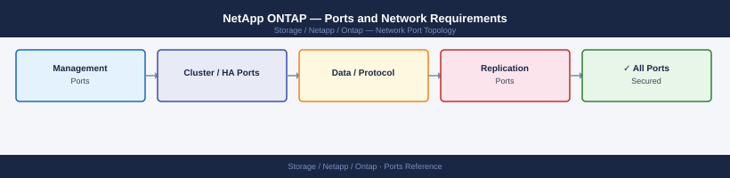

---
tags:
  - netapp
  - ontap
  - networking
  - firewall
  - ports
  - storage
---
# NetApp ONTAP — Ports and Network Requirements

<div class="kb-summary">
Firewall port reference for NetApp ONTAP clusters. Covers cluster management, data protocol LIFs (NFS, SMB, iSCSI, NVMe-oF), SnapMirror/SnapVault replication, AutoSupport, and Active Directory integration.

*Applies to: ONTAP 9.10+*
</div>


## Before you begin

- ONTAP uses Logical Interfaces (LIFs) — management, data, and intercluster LIFs have separate IPs, each on their own VLAN
- Apply firewall rules to LIF IPs, not node IPs — a node can have multiple LIFs with different firewall profiles
- The cluster interconnect (HA pair + switchless/switched cluster) uses dedicated cluster ports that never route to clients — no firewall needed
- SnapMirror/SnapVault replication uses intercluster LIFs; ensure these are reachable from the remote cluster's intercluster LIFs

---

## Inbound — Management Traffic

| Port | Protocol | Source | LIF Type | Purpose |
|---|---|---|---|---|
| 443 | TCP | Admin workstations, Ansible, automation | Cluster Mgmt LIF | HTTPS — System Manager UI, ONTAP REST API |
| 22 | TCP | Jump hosts | Cluster Mgmt LIF / Node Mgmt LIF | SSH — ONTAP CLI |
| 80 | TCP | Clients | Cluster Mgmt LIF | HTTP — redirects to 443 |
| 161 | UDP | Monitoring server | Node Mgmt LIF | SNMP polling |
| 162 | UDP | (outbound to monitoring) | Node Mgmt LIF | SNMP traps |
| 514 | UDP/TCP | (outbound to syslog) | Node Mgmt LIF | Syslog forwarding |

---

## Data Protocols — NFS

| Port | Protocol | Source | LIF Type | Purpose |
|---|---|---|---|---|
| 2049 | TCP/UDP | NFS client hosts | Data LIF (NAS) | NFS v3 and v4.1 data access |
| 111 | TCP/UDP | NFS client hosts | Data LIF (NAS) | rpcbind (portmapper) — required for NFSv3 |
| 635 | TCP/UDP | NFS client hosts | Data LIF (NAS) | NFS mountd (NFSv3 mount protocol) |
| 4045 | TCP/UDP | NFS client hosts | Data LIF (NAS) | NFS nlockmanager (file locking, NFSv3) |
| 4046 | TCP/UDP | NFS client hosts | Data LIF (NAS) | NFS statd (status monitor, NFSv3) |

For NFSv4.1/pNFS only port 2049 is required (no portmapper dependency).

---

## Data Protocols — SMB (CIFS)

| Port | Protocol | Source | LIF Type | Purpose |
|---|---|---|---|---|
| 445 | TCP | Windows clients, Linux SMB clients | Data LIF (NAS) | SMB — direct TCP (all current Windows) |
| 139 | TCP | Legacy Windows clients | Data LIF (NAS) | SMB over NetBIOS (legacy, avoid if possible) |
| 137 | UDP | Legacy clients | Data LIF (NAS) | NetBIOS name service |
| 138 | UDP | Legacy clients | Data LIF (NAS) | NetBIOS datagram service |

---

## Data Protocols — iSCSI (SAN)

| Port | Protocol | Source | LIF Type | Purpose |
|---|---|---|---|---|
| 3260 | TCP | iSCSI initiator hosts | iSCSI Data LIF | iSCSI block storage |

ONTAP iSCSI data LIFs are dedicated — do not serve NFS/SMB from the same LIF.

---

## Data Protocols — NVMe-oF / NVMe-TCP (ONTAP 9.10+)

| Port | Protocol | Source | LIF Type | Purpose |
|---|---|---|---|---|
| 4420 | TCP | NVMe/TCP host | NVMe-TCP Data LIF | NVMe over TCP fabric |
| 8009 | TCP | NVMe/TCP host | NVMe-TCP Data LIF | NVMe/TCP discovery |

---

## SnapMirror / SnapVault Replication (Intercluster LIFs)

| Port | Protocol | Source | Destination | Purpose |
|---|---|---|---|---|
| 11104 | TCP | Intercluster LIF | Remote intercluster LIF | SnapMirror intercluster communication (control) |
| 11105 | TCP | Intercluster LIF | Remote intercluster LIF | SnapMirror data transfer |
| 443 | TCP | Intercluster LIF | Remote cluster mgmt LIF | Cluster peering REST API (ONTAP 9.6+) |

---

## NDMP (Backup Integration)

| Port | Protocol | Source | LIF Type | Purpose |
|---|---|---|---|---|
| 10000 | TCP | Backup server (Veeam, Commvault, NBU) | Node Mgmt LIF or Data LIF | NDMP — backup agent protocol |

---

## AutoSupport (Outbound)

| Port | Protocol | Destination | Purpose |
|---|---|---|---|
| 443 | TCP | support.netapp.com | HTTPS AutoSupport (primary — preferred) |
| 80 | TCP | support.netapp.com | HTTP AutoSupport (fallback) |
| 25 | TCP | SMTP relay | Email AutoSupport |

---

## Active Directory / LDAP Integration

| Port | Protocol | Destination | Purpose |
|---|---|---|---|
| 389 | TCP | Active Directory DCs | LDAP — domain join, user lookup |
| 636 | TCP | Active Directory DCs | LDAPS (recommended) |
| 88 | TCP/UDP | Active Directory DCs | Kerberos (SMB and NFS Kerberos) |
| 445 | TCP | Active Directory DCs | SMB (domain join, machine account operations) |
| 3268 | TCP | Active Directory DCs | Global Catalog |
| 123 | UDP | NTP (domain controllers or NTP server) | Time sync — required for Kerberos ±5 min skew |

---

## Firewall Zone Summary

| From | To | Ports | Notes |
|---|---|---|---|
| Admin clients | Cluster Mgmt LIF | 443, 22 | System Manager + CLI |
| Monitoring | Node Mgmt LIF | 161 UDP | SNMP polling |
| NFS clients | NAS Data LIF | 2049, 111, 635, 4045 | Use NFSv4.1 to reduce portmapper deps |
| SMB clients | NAS Data LIF | 445 | Avoid 139 unless legacy required |
| iSCSI initiators | iSCSI Data LIF | 3260 | Per iSCSI VLAN |
| NVMe/TCP hosts | NVMe Data LIF | 4420, 8009 | ONTAP 9.10+ |
| Intercluster LIF | Remote intercluster LIF | 11104, 11105 | SnapMirror; bidirectional |
| Backup server | Node Mgmt or Data LIF | 10000 | NDMP |
| Cluster Mgmt LIF | support.netapp.com | 443 | AutoSupport |

---

## Verify

```bash
# From admin workstation — test management API
curl -sk -o /dev/null -w "%{http_code}" https://<cluster-mgmt-ip>/api/cluster

# From admin workstation — test SSH
ssh admin@<cluster-mgmt-ip> "version"

# From NFS client — test NFS mount path
showmount -e <data-lif-ip>

# From iSCSI host — test target portal
iscsiadm -m discovery -t sendtargets -p <iscsi-data-lif-ip>:3260

# From ONTAP CLI — verify intercluster LIF reachability (SnapMirror)
network interface show -role intercluster
cluster peer health show

# From ONTAP CLI — test AutoSupport
system node autosupport invoke -node * -type test
```


```text title="Expected output"
200
NetApp Release 9.13.1: Mon Jan 15 12:34:56 UTC 2024
Exports list on 192.168.1.50:
/vol/data_01           10.0.0.0/8
/vol/data_02           10.0.0.0/8
/vol/backup            192.168.0.0/16

Discovering targets for: 192.168.1.51:3260
192.168.1.51:3260,-1 iqn.1992-08.com.netapp:sn.a1b2c3d4e5f6

  Vserver Name: cluster1
  Role: intercluster
  Status: up
  Address: 192.168.100.10

Cluster Peer Health Status:
Cluster Name          Availability  Connectivity  Status
cluster2              Available     Connected     Healthy

AutoSupport invoke successful for node cluster1-01
AutoSupport invoke successful for node cluster1-02
```

!!! warning "Common errors"
    **`curl: (7) Failed to connect to 192.168.1.100 port 443: Connection refused`** — Verify the cluster management IP is correct and the ONTAP cluster is online and accessible from your workstation network.
    **`ssh: connect to host 192.168.1.100 port 22: No route to host`** — Confirm the management network routing and firewall rules allow SSH (port 22) from your admin workstation to the cluster management LIF.
    **`iscsiadm: No records found`** — Ensure the iSCSI data LIF IP is correct, the iSCSI service is enabled on the SVM, and the portal is listening on port 3260.
---

## See also

- [NetApp ONTAP — Architecture](../how-it-works/)
- [NetApp ONTAP — Operations](../../operations/)
- [NetApp ONTAP — Troubleshooting](../../troubleshooting/)
